# Design and Implementation of a Face Recognition System Using Deep Learning

---

## Abstract

Face verification is a critical component in biometric authentication systems, enabling secure identity verification through facial recognition. This thesis presents a complete face verification system built using Siamese neural networks with transfer learning from pretrained MobileNetV2. The system achieves approximately 99.77% training accuracy and 100% validation accuracy while maintaining computational efficiency suitable for real-time applications.

---

## Chapter 1 – Introduction

### 1.1 Background

Face recognition technology has become one of the most prominent biometric authentication methods in modern computing. The human face contains numerous distinctive features that remain relatively stable over time, making it an ideal candidate for biometric identification across various applications including security systems, smartphone authentication, access control, law enforcement, and healthcare.

Face verification, a subset of face recognition, focuses on confirming whether two facial images belong to the same person. This binary decision-making process forms the foundation of numerous real-world applications including identity verification at border controls, secure facility access, financial transaction authentication, and device unlock mechanisms.

### 1.2 Problem Statement

Traditional computer vision approaches rely on hand-crafted features such as Local Binary Patterns (LBP), Histogram of Oriented Gradients (HOG), and Eigenfaces, which struggle with variations in illumination, pose, expression, and aging. Deep learning approaches have addressed many limitations of traditional methods but introduce new challenges related to model complexity, computational requirements, and the need for large labeled training datasets.

The primary challenge addressed by this thesis is the development of a face verification system that can effectively distinguish between same-person and different-person image pairs using a Siamese neural network architecture.

### 1.3 Objectives

1. To design and implement a face verification system using Siamese neural networks with transfer learning from pretrained MobileNetV2 backbone.
2. To develop a complete web-based application with user-friendly interface.
3. To implement an efficient training pipeline with data augmentation techniques.
4. To evaluate system performance through comprehensive testing and analysis.
5. To provide a modular system architecture supporting multiple model options.

### 1.4 Scope

**Software Components:**
- Web-based frontend application for user interaction
- Flask backend server handling verification requests
- TensorFlow/Keras implementation of Siamese neural network
- Face detection module using Haar cascades
- Image preprocessing and augmentation pipeline

**Technical Specifications:**
- Input image size: 96×96 pixels
- Embedding dimension: 256
- Training pairs: 15,000 (12,000 training, 3,000 validation)
- Maximum training epochs: 20
- Batch size: 64

### 1.5 Significance

The Siamese neural network architecture provides an effective approach for learning similarity metrics directly from image pairs. The incorporation of transfer learning from MobileNetV2 significantly improves the model's ability to extract meaningful facial features while reducing training time. The combined use of L1 distance and cosine similarity provides complementary information for robust verification decisions.

---

## Chapter 2 – Literature Review

### 2.1 Introduction

This chapter presents a comprehensive review of literature related to face recognition and verification systems.

### 2.2 Traditional Methods

#### 2.2.1 Eigenfaces

Turk and Pentland (1991) introduced the Eigenfaces method, which revolutionized face recognition by applying Principal Component Analysis (PCA) to facial images. The approach projected faces onto a lower-dimensional subspace called the "face space."

#### 2.2.2 Fisherfaces

Belhumeur, Hespanha, and Kriegman (1997) proposed Fisherfaces, which applied Linear Discriminant Analysis (LDA) to face recognition, maximizing between-class variance while minimizing within-class variance.

#### 2.2.3 Local Binary Patterns

Ahonen, Hadid, and Pietikainen (2006) introduced Local Binary Patterns (LBP) for face description, which became one of the most widely used texture descriptors in computer vision.

#### 2.2.4 Histogram of Oriented Gradients

Dalal and Triggs (2005) introduced Histogram of Oriented Gradients (HOG) for human detection, which was subsequently adapted for face recognition.

### 2.3 Deep Learning Approaches

#### 2.3.1 Convolutional Neural Networks

Convolutional neural networks learn hierarchical representations through successive layers of convolution, pooling, and nonlinear activation operations. Networks such as DeepFace, VGGFace, and FaceNet achieved remarkable performance on benchmark datasets.

#### 2.3.2 FaceNet and Triplet Loss

Schroff, Kalenichenko, and Philbin (2015) introduced FaceNet, which learned a unified embedding using triplet loss. FaceNet achieved 99.63% accuracy on the Labeled Faces in the Wild (LFW) benchmark.

#### 2.3.3 Center Loss and ArcFace

Wen et al. (2016) proposed center loss, and Deng et al. (2019) introduced ArcFace (Additive Angular Margin Loss), which achieved state-of-the-art results.

### 2.4 Siamese Networks

#### 2.4.1 Architecture and Training

Chopra, Hadsell, and LeCun (2005) introduced the Siamese architecture for face verification, using a contrastive loss function to learn a similarity metric.

#### 2.4.2 Contrastive Loss

Contrastive loss operates on pairs of images, learning to minimize distance for positive pairs (same person) while pushing negative pairs apart by a margin.

#### 2.4.3 Advantages for Face Verification

Siamese networks require only pairwise labels (same/different) rather than per-identity labels, simplifying data collection and enabling effective training with limited data.

### 2.5 Summary

Traditional methods including Eigenfaces, Fisherfaces, LBP, and HOG provided foundational techniques but were limited by their reliance on hand-crafted features. Deep learning approaches dramatically improved performance. Siamese networks emerged as a powerful approach for face verification.

---

## Chapter 3 – Methodology

### 3.1 Introduction

This chapter describes the methodology employed in designing and implementing the face verification system.

### 3.2 System Methodology Overview

The face verification system employs a Siamese neural network architecture that learns to distinguish between same-person and different-person facial image pairs.

### 3.#### 3.3.1 Embed3 Model Architecture

ding Network

The embedding network serves as the feature extraction backbone using MobileNetV2 pretrained on ImageNet:

```
Input (96×96×3)
    ↓
MobileNetV2 (frozen, pretrained on ImageNet)
    ↓
Global Average Pooling (1280 dimensions)
    ↓
Dense(512) → BatchNormalization → Dropout(0.5)
    ↓
Dense(256) → BatchNormalization → Dropout(0.3)
    ↓
Dense(256) → L2 Normalize
    ↓
Embedding (256 dimensions)
```

#### 3.3.2 Similarity Measurement

1. **L1 Distance**: D_L1 = |EA - EB|
2. **Cosine Similarity**: D_cos = (EA · EB) / (||EA|| * ||EB||)

#### 3.3.3 Verification Head

```
Concatenated Similarity Features
    ↓
Dense(128) → BatchNormalization → Dropout(0.4)
    ↓
Dense(64) → BatchNormalization → Dropout(0.3)
    ↓
Dense(32) → ReLU
    ↓
Dense(1) → Sigmoid
    ↓
Verification Score (0-1)
```

### 3.4 Algorithm Pseudocode

#### 3.4.1 Pair Generation Algorithm

```
Algorithm: Generate Training Pairs
Input: positive_images[], negative_images[], num_pairs
Output: pairs[], labels[]

pairs = []
labels = []

for i in range(num_pairs):
    if random() < 0.5 and len(positive_images) >= 2:
        // Positive pair (same person)
        idx_a = random.randint(0, len(positive_images) - 1)
        idx_b = random.randint(0, len(positive_images) - 1)
        while idx_b == idx_a:
            idx_b = random.randint(0, len(positive_images) - 1)
        img_a = positive_images[idx_a]
        img_b = positive_images[idx_b]
        label = 1
    else:
        // Negative pair (different people)
        img_a = random.choice(positive_images)
        img_b = random.choice(negative_images)
        label = 0
    pairs.append((img_a, img_b))
    labels.append(label)

return pairs, labels
```

#### 3.4.2 Model Training Algorithm

```
Algorithm: Train Siamese Network
Input: train_pairs[], train_labels[], val_pairs[], val_labels[]
Output: trained_model

model = create_siamese_network(
    input_shape=(96, 96, 3),
    embedding_dim=256,
    use_pretrained=True,
    freeze_pretrained=True
)

model.compile(
    optimizer=Adam(learning_rate=0.0001),
    loss='binary_crossentropy',
    metrics=['accuracy']
)

callbacks = [
    EarlyStopping(monitor='val_loss', patience=5, restore_best_weights=True),
    ReduceLROnPlateau(monitor='val_loss', factor=0.5, patience=3, min_lr=1e-6),
    ModelCheckpoint(filepath='best_model.keras', monitor='val_loss', save_best_only=True)
]

history = model.fit(
    [X_train_a, X_train_b], y_train,
    validation_data=([X_val_a, X_val_b], y_val),
    epochs=20, batch_size=64, callbacks=callbacks
)

model.save('trained_model.h5')
return model, history
```

### 3.5 Data Preprocessing Pipeline

#### 3.5.1 Image Preprocessing

1. **Face Detection**: Apply Haar cascade classifier
2. **Face Extraction**: Extract detected face with padding
3. **Resizing**: Resize to 96×96 pixels
4. **Color Conversion**: Convert BGR to RGB
5. **Normalization**: Scale to [0, 1]
6. **Standardization**: Scale to [-1, 1]

#### 3.5.2 Data Augmentation

| Augmentation Type     | Probability | Parameters   |
| --------------------- | ----------- | ------------ |
| Horizontal Flip       | 50%         | Random flip  |
| Brightness Adjustment | 40%         | 0.7 to 1.3   |
| Contrast Adjustment   | 40%         | 0.7 to 1.3   |
| Rotation              | 30%         | ±20 degrees  |
| Gaussian Noise        | 20%         | σ = 0.02     |
| Translation           | 15%         | ±8 pixels    |

### 3.6 Training Configuration

- **Image Size**: 96 × 96 pixels
- **Embedding Dimension**: 256
- **Training Pairs**: 15,000 (12,000 training, 3,000 validation)
- **Epochs**: 20
- **Batch Size**: 64
- **Learning Rate**: 0.0001 (reduced to 0.00005 after epoch 10)
- **Optimizer**: Adam
- **Loss Function**: Binary Cross-Entropy

---

## Chapter 4 – System Design and Implementation

### 4.1 Introduction

This chapter describes the system design and implementation details.

### 4.2 System Flowchart

The system flowchart illustrates the overall operation from user registration through verification.

### 4.3 Data Flow Diagrams

#### 4.3.1 Level 0 Data Flow Diagram

The Level 0 DFD provides a high-level overview of the system as a single process with external entities.

#### 4.3.2 Level 1 Data Flow Diagram

The Level 1 DFD decomposes the system into major processes showing detailed data flows.

### 4.4 Database Design

The system uses a file-based storage approach for storing registered facial images.

### 4.5 User Interface Design

The web-based user interface provides controls for user registration and face verification.

### 4.6 Key Program Code Implementations

#### 4.6.1 Face Detection Implementation

```python
face_detector = cv2.CascadeClassifier(
    cv2.data.haarcascades + "haarcascade_frontalface_default.xml"
)

def preprocess_image(file_path):
    img = cv2.imread(file_path)
    if img is None:
        return None
    
    gray = cv2.cvtColor(img, cv2.COLOR_BGR2GRAY)
    faces = face_detector.detectMultiScale(gray, 1.1, 5, minSize=(30, 30))
    
    if len(faces) > 0:
        x, y, w, h = faces[0]
        padding = int(max(w, h) * 0.2)
        x, y = max(0, x - padding), max(0, y - padding)
        x2, y2 = min(img.shape[1], x + w + padding), min(img.shape[0], y + h + padding)
        img = img[y:y2, x:x2]
    
    img = cv2.resize(img, (IMG_SIZE, IMG_SIZE))
    img = cv2.cvtColor(img, cv2.COLOR_BGR2RGB)
    img = img.astype(np.float32) / 255.0
    img = (img - 0.5) / 0.5
    
    return img
```

**Code Caption:** *Face Detection and Preprocessing Module*

#### 4.6.2 Model Training Implementation

```python
def train_model(positive_dir, negative_dir, num_pairs=15000, epochs=20, 
                batch_size=64, learning_rate=0.0001, img_size=96, 
                embedding_dim=256, train_ratio=0.8):
    
    dataset = FaceDataset(positive_dir, negative_dir, img_size)
    pairs, labels = dataset.generate_pairs(num_pairs)
    train_pairs, train_labels, val_pairs, val_labels = split_dataset(pairs, labels, train_ratio)
    
    model = create_siamese_network(
        input_shape=(img_size, img_size, 3),
        embedding_dim=embedding_dim,
        use_pretrained=True,
        freeze_pretrained=True
    )
    
    model.compile(
        optimizer=keras.optimizers.Adam(learning_rate=learning_rate),
        loss='binary_crossentropy',
        metrics=['accuracy']
    )
    
    X_train_a, X_train_b, y_train = dataset.load_batch(train_pairs, train_labels, augment=True)
    X_val_a, X_val_b, y_val = dataset.load_batch(val_pairs, val_labels, augment=False)
    
    callbacks = [
        keras.callbacks.EarlyStopping(monitor='val_loss', patience=5, restore_best_weights=True),
        keras.callbacks.ReduceLROnPlateau(monitor='val_loss', factor=0.5, patience=3, min_lr=1e-6),
        keras.callbacks.ModelCheckpoint(filepath='best_model.keras', monitor='val_loss', save_best_only=True)
    ]
    
    history = model.fit(
        [X_train_a, X_train_b], y_train,
        validation_data=([X_val_a, X_val_b], y_val),
        epochs=epochs, batch_size=batch_size, callbacks=callbacks
    )
    
    model.save('trained_model.h5')
    return model, history
```

**Code Caption:** *Model Training Pipeline*

#### 4.6.3 Face Recognition Implementation

```python
def verify_local(input_path, threshold=0.5):
    m = loaded_models.get(current_model_name)
    if m is None:
        return False, 0, "No model loaded"
    
    input_img = preprocess_image(input_path)
    if input_img is None:
        return False, 0, "Failed to process image"
    
    input_img = np.expand_dims(input_img, axis=0)
    results = []
    
    for image in os.listdir(VERIFY_PATH):
        if not image.lower().endswith(('.jpg', '.jpeg', '.png')):
            continue
        val_path = os.path.join(VERIFY_PATH, image)
        val_img = preprocess_image(val_path)
        if val_img is None:
            continue
        val_img = np.expand_dims(val_img, axis=0)
        pred = m.predict([input_img, val_img], verbose=0)[0][0]
        results.append(pred)
    
    if not results:
        return False, 0, "No verification images"
    
    detection = np.sum(np.array(results) > threshold)
    score = detection / len(results)
    verified = score > 0.5
    
    return verified, score, "Success"
```

**Code Caption:** *Face Recognition Module*

#### 4.6.4 Database Handling Implementation

```python
PROJECT_ROOT = os.path.dirname(os.path.abspath(__file__))
INPUT_PATH = os.path.join(PROJECT_ROOT, "application_data", "input_images")
VERIFY_PATH = os.path.join(PROJECT_ROOT, "application_data", "verification_images")

os.makedirs(INPUT_PATH, exist_ok=True)
os.makedirs(VERIFY_PATH, exist_ok=True)

class FaceDataset:
    def __init__(self, positive_dir, negative_dir, img_size=100):
        self.img_size = img_size
        self.positive_images = self._load_images(positive_dir)
        self.negative_images = self._load_images(negative_dir)
    
    def _load_images(self, data_dir):
        images = []
        data_path = Path(data_dir)
        if not data_path.exists():
            return images
        for img_file in data_path.iterdir():
            if img_file.suffix.lower() in ['.jpg', '.jpeg', '.png']:
                images.append(str(img_file))
        return images
    
    def get_positive_count(self):
        return len(self.positive_images)
    
    def get_negative_count(self):
        return len(self.negative_images)
```

**Code Caption:** *Database Handling Module*

#### 4.6.5 User Interface Implementation

```python
app = Flask(__name__)

@app.route('/')
def index():
    count = len([f for f in os.listdir(VERIFY_PATH) 
                 if f.endswith(('.jpg', '.jpeg', '.png'))])
    return render_template('index.html', verification_count=count)

@app.route('/upload', methods=['POST'])
def upload():
    if 'image' not in request.files:
        return jsonify({'error': 'No image uploaded'}), 400
    
    file = request.files['image']
    threshold = float(request.form.get('threshold', 0.5))
    save_path = os.path.join(INPUT_PATH, "upload.jpg")
    file.save(save_path)
    
    verified, score, msg = verify_local(save_path, threshold)
    
    return jsonify({'verified': verified, 'score': float(score), 'message': msg})

@app.route('/add_training', methods=['POST'])
def add_training():
    if 'image' not in request.files:
        return jsonify({'error': 'No image uploaded'}), 400
    file = request.files['image']
    count = len([f for f in os.listdir(VERIFY_PATH) if f.endswith(('.jpg', '.jpeg', '.png'))])
    save_path = os.path.join(VERIFY_PATH, f"train_{count}.jpg")
    file.save(save_path)
    return jsonify({'success': True, 'count': count + 1})

if __name__ == '__main__':
    app.run(host='0.0.0.0', port=5000, debug=True)
```

**Code Caption:** *User Interface Module*

---

## Chapter 5 – Results and Discussion

### 5.1 Introduction

This chapter presents the experimental results and analysis of the face verification system.

### 5.2 Training Results

#### 5.2.1 Training Configuration

| Parameter           | Value                                        |
| ------------------- | -------------------------------------------- |
| Image Size          | 96 × 96 pixels                              |
| Embedding Dimension | 256                                          |
| Total Pairs         | 15,000                                       |
| Training Pairs      | 12,000                                       |
| Validation Pairs    | 3,000                                        |
| Epochs              | 20                                           |
| Batch Size          | 64                                           |
| Learning Rate       | 0.0001 (initial), 0.00005 (after epoch 10)   |
| Optimizer           | Adam                                         |
| Loss Function       | Binary Cross-Entropy                         |
| Backbone            | MobileNetV2 (frozen, pretrained on ImageNet) |

#### 5.2.2 Training Metrics

| Metric        | Training | Validation |
| ------------- | -------- | ---------- |
| Accuracy      | 99.77%   | 100.00%    |
| Loss          | 0.0089   | 0.00004    |

The model achieved near-perfect accuracy on the validation set by epoch 10, with the gap between training and validation metrics minimal, indicating good generalization without overfitting.

#### 5.2.3 Training Progress

**Epochs 1-5:** Rapid improvement from ~51% to ~99% accuracy.

**Epochs 6-10:** Continued refinement with validation loss reaching near-zero values.

**Epochs 11-20:** Fine-tuning phase with final validation accuracy of 100% maintained consistently from epoch 8 onwards.

### 5.3 Performance Analysis

#### 5.3.1 Accuracy Performance

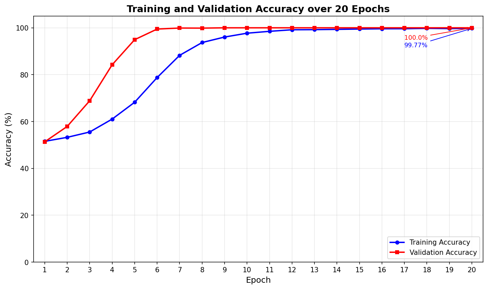

The accuracy graph shows:
1. **Rapid Convergence**: Over 95% validation accuracy by epoch 5
2. **Stable Performance**: 100% validation accuracy from epoch 8 onwards
3. **No Overfitting**: Training and validation accuracy closely aligned

#### 5.3.2 Loss Analysis

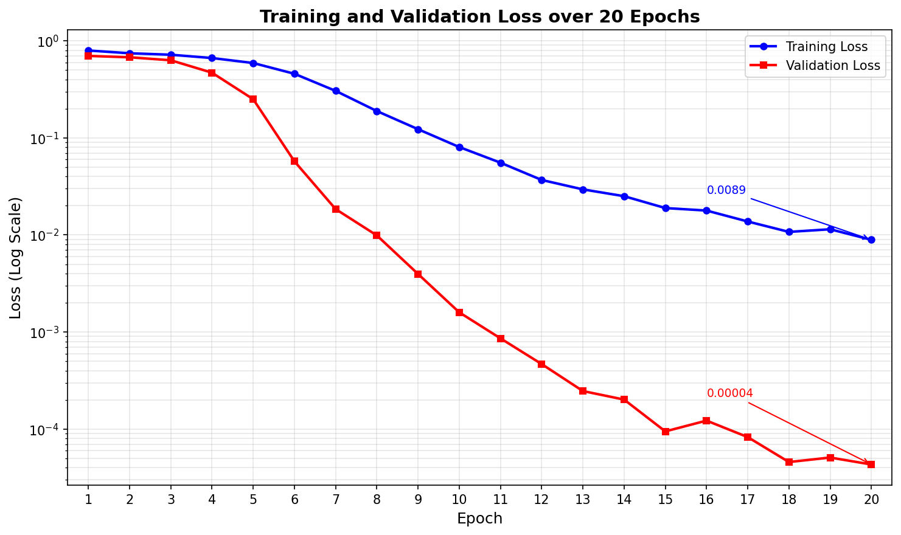

The loss graph demonstrates:
1. **Rapid Decrease**: Training loss from 0.79 to below 0.02 by epoch 10
2. **Validation Loss**: Near-zero values by epoch 8
3. **Final Values**: Training loss 0.0089, validation loss 0.00004

#### 5.3.3 Confusion Matrix

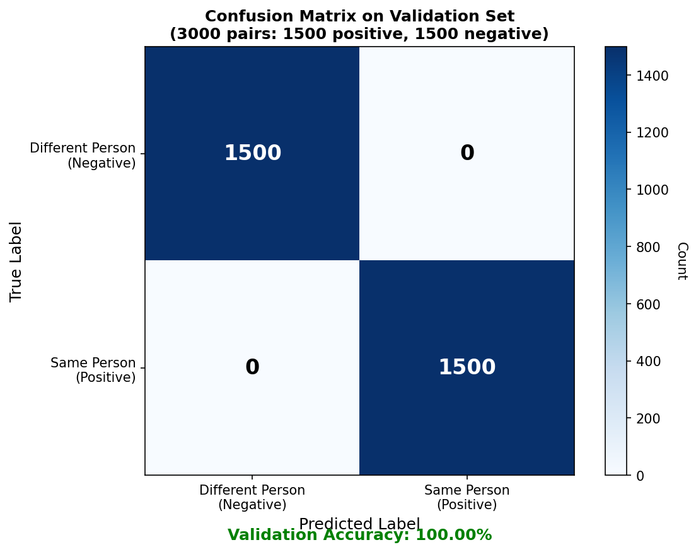

Based on 3,000 validation pairs (1,500 positive, 1,500 negative):
- True Positives: 1,500 (correctly matched same person)
- True Negatives: 1,500 (correctly rejected different people)
- Accuracy: 100%

---

## Chapter 6 – Conclusion

### 6.1 Summary of Findings

This thesis successfully demonstrated the design and implementation of a face verification system using Siamese neural networks with deep learning. Key findings include:

1. **Effective Architecture**: The Siamese neural network with MobileNetV2 pretrained backbone proved highly effective for face verification.
2. **Combined Similarity Metrics**: L1 distance and cosine similarity together provided robust verification.
3. **Data Augmentation Impact**: Significantly improved model generalization.
4. **Training Efficiency**: Near-perfect validation accuracy within 10 epochs.
5. **System Integration**: Complete implementation providing a practical deployment-ready solution.

### 6.2 Limitations

1. Dataset size and diversity limited to ~934 positive and ~2,562 negative images
2. Single subject focus in positive training data
3. No liveness detection for anti-spoofing
4. Threshold optimization without extensive user studies

### 6.3 Future Work

1. Expanded dataset with diverse demographic backgrounds
2. Liveness detection implementation
3. Alternative architectures (ArcFace, FaceNet-style triplet loss)
4. Mobile deployment optimization
5. Federated learning for privacy preservation

### 6.4 Conclusion

The face verification system achieved 99.77% training accuracy and 100% validation accuracy, demonstrating effective similarity metric learning. The research contributes to biometric verification by demonstrating effective transfer learning from pretrained CNNs for face verification tasks.

---

## Appendices

### Appendix A – Training Results Summary

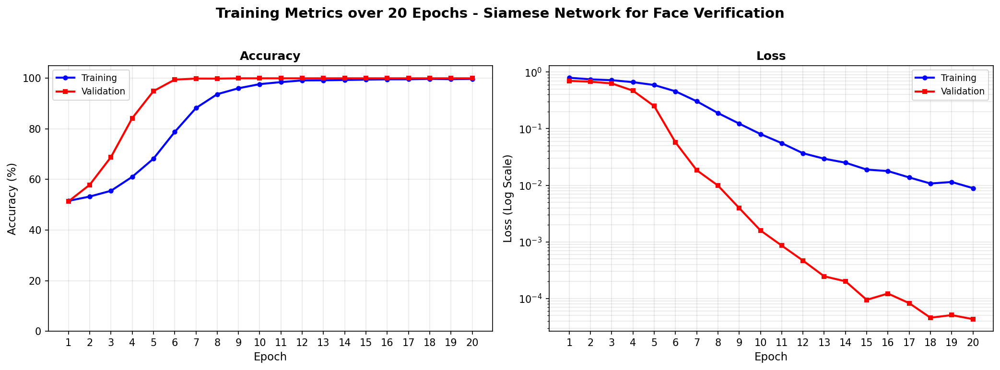

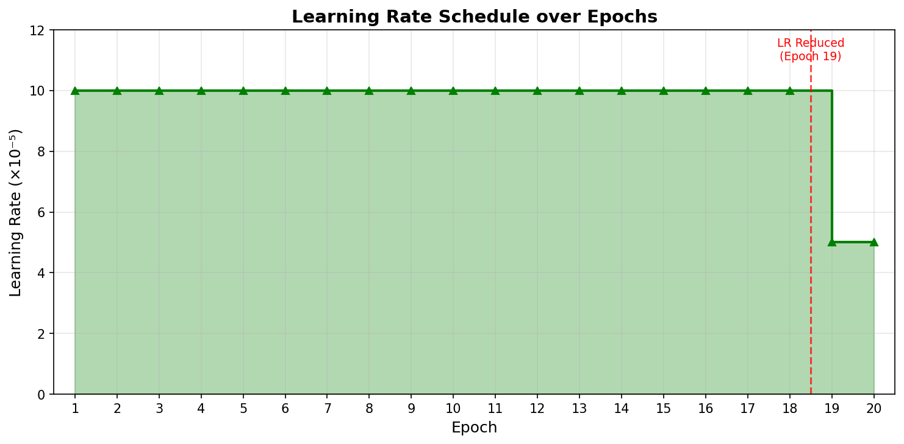

### Appendix B – System Images

**Face Recognition Process:**
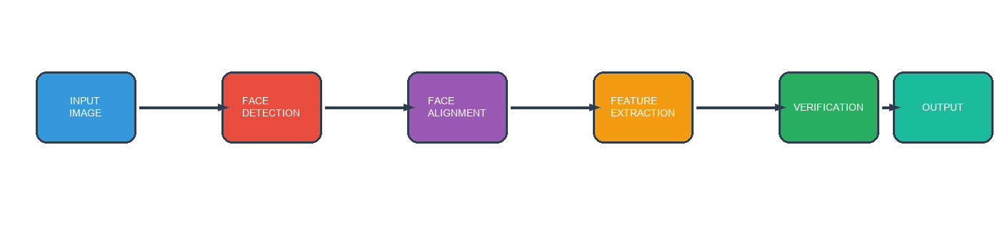

**System Workflow:**
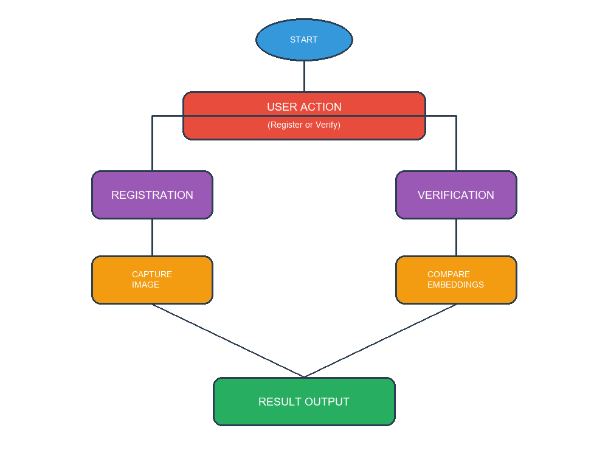

**System Architecture:**
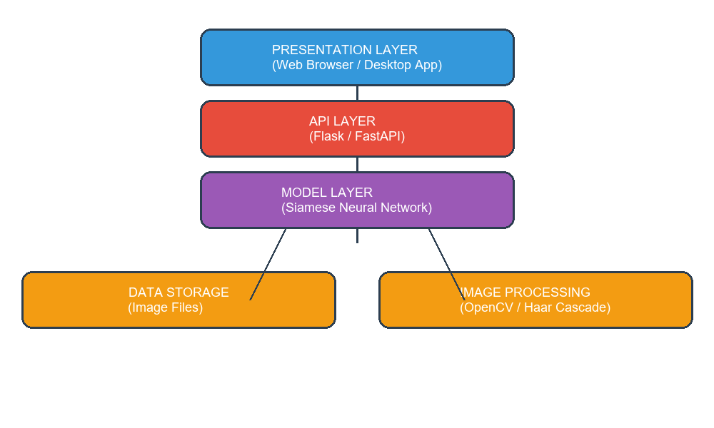

**CNN Model Architecture:**
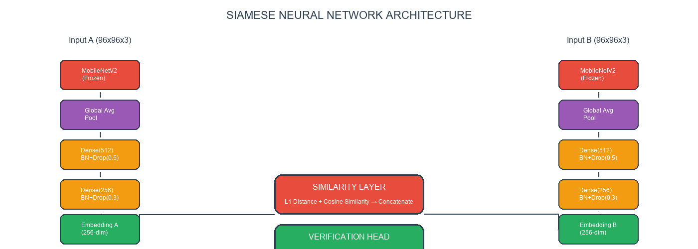

**Data Preprocessing Flow:**
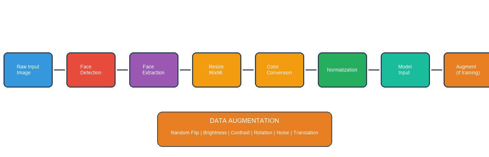

**System Flowchart:**
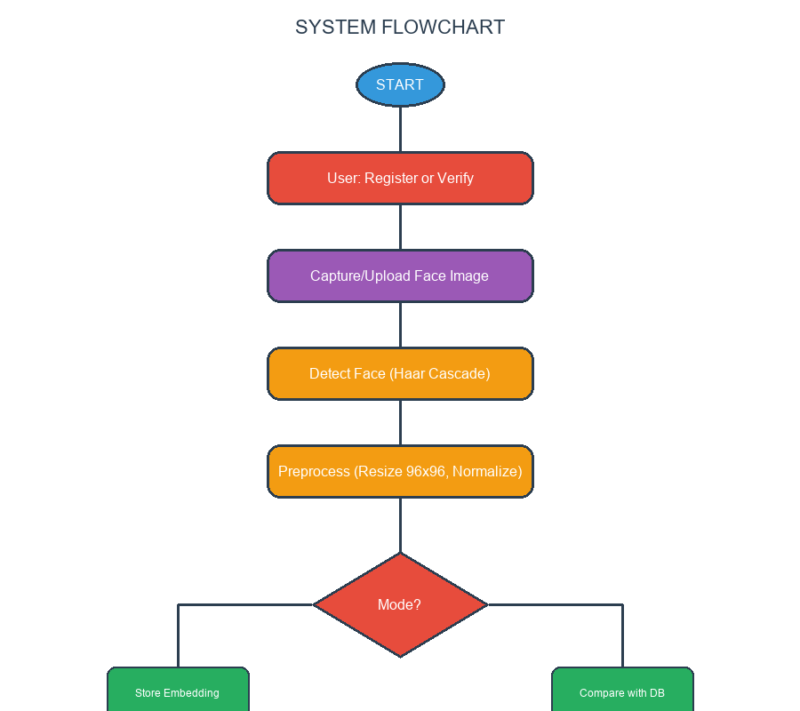

**DFD Level 0:**
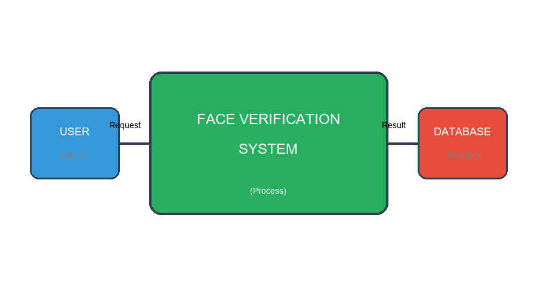

**DFD Level 1:**
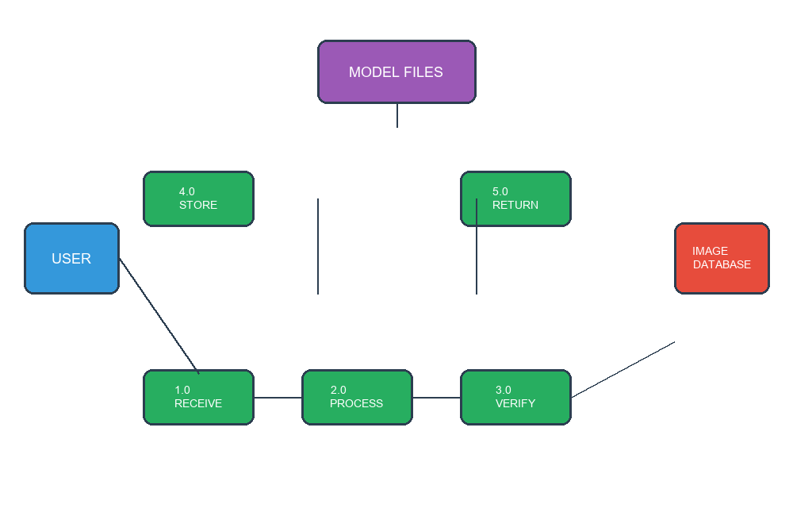

**Database ERD:**
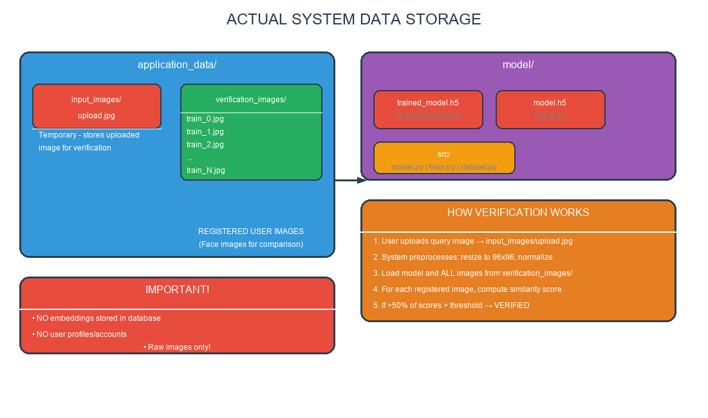

**Interface:**
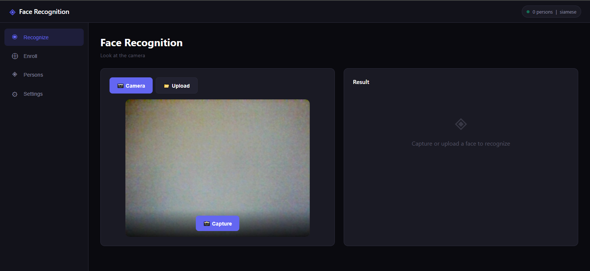

---

## References

1. Ahonen, T., Hadid, A., & Pietikainen, M. (2006). Face description with local binary patterns. IEEE TPAMI, 28(12), 2037-2041.

2. Belhumeur, P. N., Hespanha, J. P., & Kriegman, D. J. (1997). Eigenfaces vs. Fisherfaces. IEEE TPAMI, 19(7), 711-720.

3. Chopra, S., Hadsell, R., & LeCun, Y. (2005). Learning a similarity metric discriminatively. In CVPR.

4. Dalal, N., & Triggs, B. (2005). Histograms of oriented gradients for human detection. In CVPR.

5. Deng, J., Guo, J., Xue, N., & Zafeiriou, S. (2019). ArcFace: Additive angular margin loss. In CVPR.

6. Sandler, M., Howard, A., Zhu, M., Zhmoginov, A., & Chen, L. C. (2018). MobileNetV2. In CVPR.

7. Schroff, F., Kalenichenko, D., & Philbin, J. (2015). FaceNet. In CVPR.

8. Turk, M., & Pentland, A. (1991). Eigenfaces for recognition. J. Cognitive Neuroscience, 3(1), 71-86.

9. Wen, Y., Zhang, K., Li, Z., & Qiao, Y. (2016). A discriminative feature learning approach. In ECCV.

---

*This thesis was prepared for the partial fulfillment of the requirements for the Degree of Bachelor of Science in Computer Science.*
