# CHAPTER 1: INTRODUCTION

---

## 1.1 Background of the Project

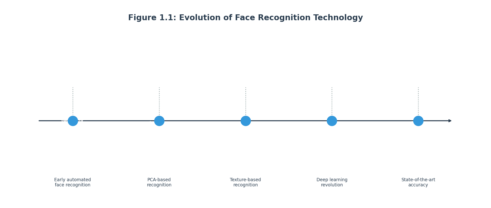

*Figure 1.1: The evolution of face recognition technology from geometric methods in the 1960s to modern deep learning approaches, showing key milestones and accuracy improvements over time.*

### 1.1.1 What is Face Recognition?

Face recognition is a technology that identifies or verifies a person by analyzing and comparing their facial features from an image or video. Unlike face detection, which simply determines whether a face is present in an image, face recognition goes a step further by determining whose face it is. This technology has become increasingly prevalent in our modern world, appearing everywhere from smartphone unlock screens to airport security systems, from banking applications to workplace attendance systems.

The fundamental premise behind face recognition is that each person's face has unique characteristics that can be measured and compared. These characteristics include the distance between the eyes, the shape of the nose, the jawline, and hundreds of other subtle features that together create a unique facial signature for each individual. Modern face recognition systems can analyze thousands of these features in milliseconds, enabling real-time identification at scale.

The history of automated face recognition dates back to the 1960s when researchers first began exploring the possibility of using computers to recognize faces. Early systems were rudimentary, relying on simple geometric measurements and requiring controlled conditions to function effectively. However, the field has advanced dramatically over the decades, with modern deep learning-based systems achieving accuracy rates that often exceed human capabilities in controlled scenarios.

### 1.1.2 Why Face Recognition Matters Today

In today's digital age, face recognition has emerged as one of the most important biometric technologies with applications spanning virtually every industry and sector. The technology offers significant advantages over traditional authentication methods such as passwords, PINs, or physical keys. Unlike passwords that can be forgotten or stolen, or keycards that can be lost or duplicated, a person's face is inherently unique and cannot be forgotten, lost, or easily forged (though spoofing remains a concern that the industry continues to address).


*Figure 1.2: Comparison of different biometric authentication methods including face recognition, fingerprint, iris, and voice recognition, highlighting accuracy rates, ease of use, and deployment requirements.*

The global face recognition market has experienced tremendous growth in recent years, driven by increasing security concerns, the proliferation of smart devices, and advancements in artificial intelligence and computer vision. According to industry analysts, the face recognition market is projected to reach valuations exceeding twelve billion dollars by the end of this decade, representing a compound annual growth rate of approximately sixteen percent annually. This growth reflects the widespread adoption of the technology across government, commercial, and consumer applications.

The practical applications of face recognition are virtually limitless. Law enforcement agencies use it to identify suspects and locate missing persons. Financial institutions implement it for secure customer authentication. Healthcare providers utilize it for patient identification and record access control. Retailers are exploring it for customer analytics and loss prevention. Airports and border control agencies deploy it for automated passenger processing. The technology even appears in everyday consumer applications such as photo tagging on social media platforms and photo organization tools.

### 1.1.3 The Evolution from Traditional to Deep Learning Approaches

The journey of face recognition technology can be divided into several distinct eras, each characterized by different technological approaches and capability levels. The earliest approaches, developed in the 1960s and 1970s, relied on geometric measurements of facial features. These systems would identify specific points on a face such as the eyes, nose, and mouth, measure the distances between them, and use these measurements as a numerical representation of the face. While revolutionary for their time, these systems were highly sensitive to changes in lighting, facial expressions, and head orientation.

The 1990s saw the emergence of the Eigenfaces method, which applied Principal Component Analysis to face recognition. This approach represented faces as combinations of principal components derived from a database of training images. The Eigenfaces method was more robust than purely geometric approaches and could handle some variation in lighting and expression. However, it still struggled with significant pose variations and required frontal, well-lit faces for optimal performance.

The early 2000s brought Fisherfaces, which improved upon Eigenfaces by using Linear Discriminant Analysis to maximize the separation between different individuals while minimizing the variation within each individual. Around the same time, Local Binary Patterns emerged as a popular technique that described faces using texture patterns, offering improved robustness to lighting variations.

The true revolution in face recognition came with the advent of deep learning, particularly Convolutional Neural Networks, starting around 2014. Deep learning approaches learned facial features automatically from large datasets rather than relying on hand-engineered features. This shift enabled dramatically improved accuracy and robustness to real-world variations. Modern systems like FaceNet, DeepFace, and ArcFace have achieved recognition accuracy rates exceeding 99 percent on benchmark datasets, surpassing human performance in many scenarios.

### 1.1.4 Project Motivation and Rationale

This project was conceived with the recognition that while commercial face recognition systems exist, they often come with significant limitations for academic, research, or small organization use cases. Many high-accuracy commercial systems require expensive subscriptions, proprietary hardware, or cloud connectivity. They may also be opaque in their operation, not allowing users to understand or modify the underlying algorithms. This project aimed to create an open, transparent face recognition system that could be understood, modified, and deployed by students, researchers, and organizations with limited resources.

The decision to implement a Siamese neural network architecture specifically was driven by several practical considerations. Traditional classification-based approaches require knowing all possible identities in advance and training on large datasets for each person. In contrast, Siamese networks learn a similarity metric that can compare faces without explicitly knowing all identities during training. This makes it possible to add new people to the system after deployment without retraining the neural network, a capability that is extremely valuable for practical applications.

The choice of MobileNetV2 as the feature extraction backbone was motivated by the need for computational efficiency. Many state-of-the-art face recognition models require powerful graphics processing units and extensive computational resources. By using MobileNetV2, which was designed for mobile and embedded applications, the project achieves a balance between accuracy and computational requirements. This enables the system to run on standard laptop or desktop computers without specialized hardware, making it accessible to a wider range of users and deployment scenarios.

---

## 1.2 Problem Statement

### 1.2.1 Challenges with Existing Face Recognition Solutions

The landscape of face recognition technology presents several challenges that this project sought to address. Understanding these challenges is essential for appreciating the design decisions and trade-offs made throughout the implementation.

The first major challenge relates to data requirements. Many deep learning-based face recognition systems require extensive training datasets containing thousands or millions of face images to achieve high accuracy. Collecting and labeling such datasets is time-consuming, expensive, and raises significant privacy concerns. Moreover, for many practical applications such as a company's employee attendance system, the number of unique individuals is relatively small, making it impractical to train a traditional classification network.

The second challenge involves computational requirements. Some of the highest-performing face recognition systems use very deep neural networks with hundreds of millions of parameters. These networks require powerful graphics processing units for both training and inference. Running such models on standard hardware without GPUs can result in recognition times measured in seconds rather than milliseconds, making real-time applications impractical.

The third challenge concerns deployment complexity. Many production face recognition systems require cloud connectivity, proprietary software stacks, or specialized hardware. This complexity can be prohibitive for smaller organizations, educational institutions, or individual developers who want to experiment with or deploy face recognition technology.

The fourth challenge relates to transparency and customization. Commercial face recognition systems typically operate as black boxes without visibility into their internal workings. This opacity makes it difficult for researchers to understand why the system makes certain decisions, for developers to customize the system for specific use cases, or for security experts to audit the system for potential vulnerabilities.

The fifth challenge involves cost. Commercial face recognition solutions often require ongoing subscription fees, per-API-call charges, or expensive licensing arrangements. For educational projects, research institutions, or non-profit organizations, these costs can be prohibitive.

### 1.2.2 Project Problem Definition

This final year project addresses the aforementioned challenges by developing a complete, self-contained face recognition system with the following characteristics.

The system must be capable of learning from limited training data through the use of a Siamese neural network architecture. Unlike traditional classification networks that require hundreds or thousands of images per class, Siamese networks learn from pairs of images, making it practical to train with relatively small datasets.

The system must achieve acceptable recognition accuracy while running on standard consumer hardware without specialized graphics processing units. This requires careful architecture selection and optimization to balance accuracy and computational efficiency.

The system must provide multiple deployment options including a web-based interface accessible from any modern browser, a desktop application for standalone operation, and a REST API for programmatic integration with other systems.

The system must be built using open-source technologies and frameworks, avoiding proprietary dependencies that would limit adoption or customization.

The system must be thoroughly documented with clear explanations of the algorithms, architecture, and implementation details, enabling other developers and researchers to understand, modify, and extend the system.

### 1.2.3 Scope of the Problem

The specific problem addressed by this project can be formally stated as follows. Given a database of enrolled persons, each represented by one or more facial images, the system should be able to accurately determine whether a new query image contains the face of an enrolled person and, if so, identify which person. The system should achieve this with the following constraints: the recognition process should complete in under one second on standard hardware; the system should support at least twenty enrolled persons with multiple images each; the accuracy should exceed ninety percent on validation data; and the system should provide both graphical and programmatic interfaces for user interaction.

This problem definition deliberately focuses on recognition rather than open-set identification. Verification asks "is this person who they claim to be?" by comparing against a known identity, while open-set identification asks "who is this person?" among potentially unknown identities. The recognition scenario is more practical for many applications and aligns well with the Siamese network architecture.

---

## 1.3 Project Objectives

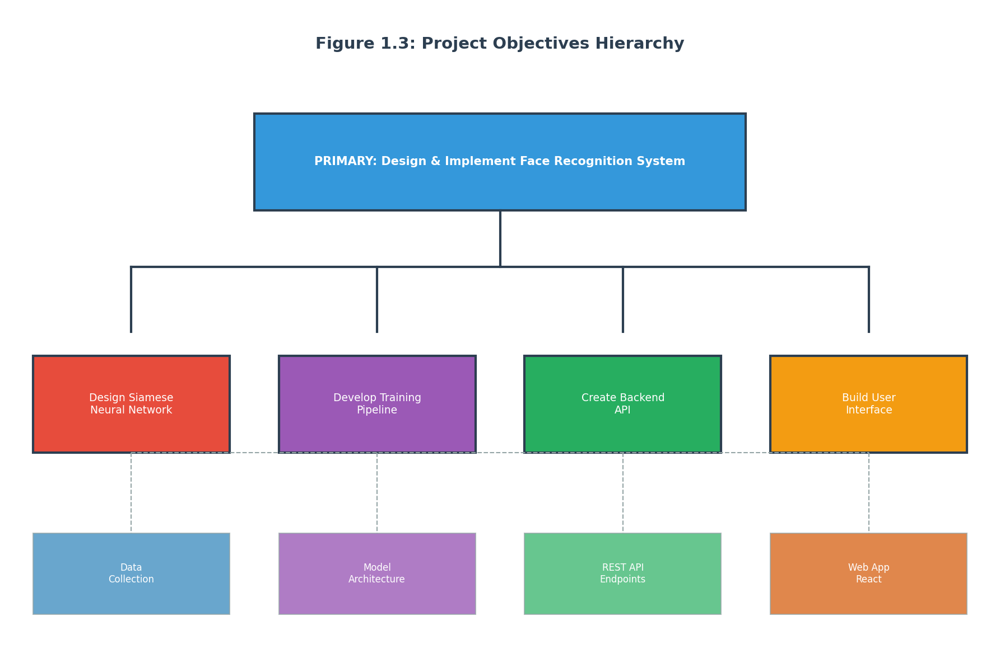

*Figure 1.3: Hierarchical organization of project objectives showing the primary objective at the center with secondary objectives branching out including architecture design, training pipeline, backend services, user interface, and testing.*

### 1.3.1 Primary Objective

The primary objective of this final year project is to design, implement, and evaluate a complete face recognition system using Siamese neural networks with transfer learning from MobileNetV2. This encompasses all aspects of the system from underlying machine learning algorithms through user-facing applications, creating an end-to-end solution that demonstrates the full lifecycle of a practical computer vision project.

### 1.3.2 Secondary Objectives

To achieve the primary objective, the project pursues several secondary objectives that together create a comprehensive and useful system.

The first secondary objective involves designing an effective Siamese neural network architecture optimized for face recognition tasks. This architecture must effectively learn to distinguish between images of the same person and images of different people, producing embeddings that capture identity-relevant facial features while being robust to variations in pose, lighting, expression, and image quality.

The second secondary objective concerns developing an efficient training pipeline that can produce a well-performing model from relatively limited training data. The pipeline must include appropriate data preprocessing, augmentation strategies to artificially expand the effective training set, and training procedures that prevent overfitting while achieving high accuracy.

The third secondary objective focuses on creating robust backend services that handle image processing, model inference, and data management. The backend must be scalable, reliable, and efficient, processing recognition requests with minimal latency while managing the enrolled person database.

The fourth secondary objective requires developing intuitive user interfaces that enable non-technical users to enroll new persons, perform recognition, and manage the system. The interfaces must be responsive, visually appealing, and provide clear feedback on system status and results.

The fifth secondary objective encompasses thorough testing and evaluation to validate that the system meets its accuracy and performance requirements. Testing must cover both individual components and the integrated system, including stress testing under realistic usage conditions.

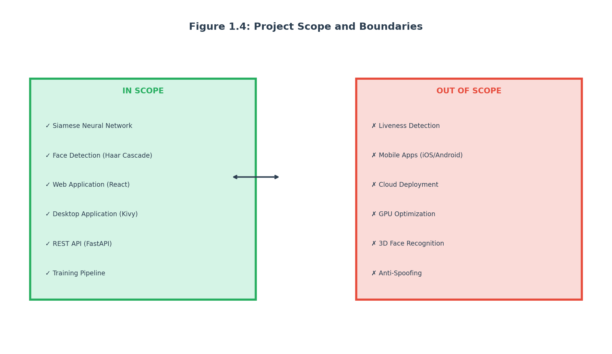

*Figure 1.4: Diagram showing the project scope boundaries including what the system will and will not do, defining functional requirements, technical constraints, and deployment scenarios.*

---

## 1.4 Project Scope

### 1.4.1 In-Scope Components

This project encompasses a comprehensive set of components spanning the entire face recognition pipeline from image capture through identity determination.

The machine learning component includes the Siamese neural network architecture design, implementation, training, and evaluation. This encompasses the embedding network that extracts features from individual face images, the similarity computation layer that compares pairs of embeddings, and the classification head that produces recognition decisions.

The image processing component includes all preprocessing operations applied to raw input images. This includes face detection to locate faces in images, face alignment to normalize head pose, cropping and resizing to standard dimensions, and pixel normalization to prepare images for model input.

The backend component includes the server-side logic that orchestrates recognition operations. This encompasses the FastAPI-based REST API that receives client requests and returns results, the face recognition service that manages model loading and inference, and the data management layer that handles person enrollment and storage.

The frontend component includes all user-facing interfaces through which users interact with the system. This includes a React-based web application with pages for recognition, enrollment, person management, and settings; and a Kivy-based desktop application providing equivalent functionality in a standalone form.

The infrastructure component includes deployment configurations and containerization. This encompasses Docker container definitions for the backend and frontend services, Docker Compose configuration for orchestrating multi-container deployments, and environment configuration for different deployment scenarios.

### 1.4.2 Out-of-Scope Components

The project scope deliberately excludes several components that represent potential future enhancements.

The project does not include liveness detection mechanisms to prevent spoofing attacks using photographs, videos, or masks. While this is an important security feature for production deployment, it represents a significant additional research and development effort beyond the core recognition functionality.

The project does not include mobile application development for iOS or Android platforms. While the web application is mobile-responsive, native mobile applications would require additional platform-specific development.

The project does not include cloud deployment configurations or integration with cloud infrastructure providers such as AWS, Google Cloud, or Azure. The focus is on self-hosted deployment that can run on local infrastructure.

The project does not include performance optimization using specialized hardware accelerators such as GPUs, TPUs, or neural processing units. While such optimizations could significantly improve inference speed, they would limit deployment to systems with specialized hardware.

The project does not include integration with third-party identity systems, badge systems, or attendance management software. While the REST API enables such integrations, the project focuses on the core recognition functionality.

### 1.4.3 Boundaries and Limitations

Understanding the boundaries of the project is essential for setting realistic expectations and identifying areas for future enhancement.

The system is designed for controlled deployment scenarios where the enrolled population is known and relatively small. Performance on large-scale datasets with thousands or millions of identities is not characterized and would require additional optimization.

The system uses Haar cascade classifiers for face detection, which while functional, represents older technology compared to more modern approaches such as MTCNN, RetinaFace, or dlib's CNN face detector. More advanced detectors would likely improve face detection accuracy, particularly for non-frontal poses.

The training dataset consists of images collected under relatively controlled conditions. Performance on images with extreme lighting variations, significant occlusions, unusual poses, or extreme ages may be degraded compared to results on the validation set.

The system does not implement active learning or continuous model updates. Once trained, the model remains static until explicitly retrained. In production scenarios, periodic retraining might be beneficial to maintain accuracy as deployment conditions evolve.

---

## 1.5 Significance of the Project

### 1.5.1 Educational Value

This project provides significant educational value for the student developer and potentially for others who study or extend the work. Through the practical implementation of a complete face recognition system, the project consolidates and applies knowledge from multiple areas of computer science including machine learning, neural networks, image processing, web development, API design, and software engineering.

The project demonstrates end-to-end development of a machine learning application, from problem definition through data collection, model training, evaluation, and deployment. This full-stack experience contrasts with academic coursework that often focuses on individual components in isolation.

The project provides concrete examples of architectural decisions and trade-offs in building practical machine learning systems. These include decisions about model complexity versus accuracy, preprocessing requirements, API design, and deployment strategies. Understanding these trade-offs is essential for developing production-ready systems.

### 1.5.2 Practical Applications

The completed system has immediate practical applications in several scenarios.

Small businesses and organizations can use the system for attendance tracking, access control, or time management without investing in expensive commercial solutions. The open-source nature of the project means there are no per-user or per-API-call costs.

Educational institutions can deploy the system for research projects, classroom demonstrations, or student projects. The comprehensive documentation enables students to understand how face recognition systems work and experiment with modifications.

Developers and researchers can use the system as a baseline or starting point for their own face recognition projects. The modular architecture makes it possible to swap components such as the face detector, embedding network, or similarity metric for experimentation.

### 1.5.3 Contribution to Knowledge

This project contributes to the body of knowledge in several ways.

It provides a documented implementation of a Siamese neural network for face recognition that can serve as a reference for similar projects. The code, architecture descriptions, and training procedures are all available for study and replication.

It documents practical considerations in deploying face recognition systems including image preprocessing, model inference optimization, API design, and user interface development. These practical insights complement theoretical research on face recognition algorithms.

It evaluates the performance of MobileNetV2-based transfer learning for face recognition, contributing empirical data on the effectiveness of this approach for the specific use case of small-scale enrollment systems.

---

## 1.6 Methodology Overview

### 1.6.1 System Development Methodology

The project follows an iterative development methodology with distinct phases for planning, design, implementation, testing, and documentation. Each phase produces specific deliverables that form the foundation for subsequent phases.

The planning phase involved requirements gathering through analysis of similar systems, identification of user needs, and consideration of project constraints. The output of this phase was a detailed specification document defining functional requirements, non-functional requirements, and acceptance criteria.

The design phase translated requirements into system architecture and component designs. This phase produced data flow diagrams, component interaction diagrams, database schemas, and interface specifications. Design decisions were documented with rationale to facilitate future maintenance and extension.

The implementation phase involved coding all system components according to the design specifications. Development followed modular principles with clear separation between components. Version control was used throughout to track changes and enable rollback if needed.

The testing phase verified that implemented components meet specifications and work correctly together. Testing included unit tests for individual functions, integration tests for component interactions, and system tests for end-to-end workflows. Performance testing ensured the system met latency and throughput requirements.

The documentation phase produced comprehensive written materials explaining the system. This includes technical documentation for developers, user manuals for end users, and this report documenting the entire project for academic evaluation.

### 1.6.2 Machine Learning Development Methodology

The machine learning components followed a specialized methodology adapted from standard practices for deep learning projects.

Data collection involved gathering face images for training, validation, and testing. Images were collected from multiple sources and curated to ensure reasonable quality and diversity. Special attention was given to obtaining images representing variations in pose, lighting, and expression.

Data preprocessing normalized images to consistent formats and dimensions. This included face detection to locate and crop faces, resizing to the input dimensions expected by the model, and pixel value normalization to the appropriate range.

Model architecture design involved selecting and configuring the neural network structure. The Siamese architecture was chosen for its suitability for recognition tasks, and MobileNetV2 was selected as the feature extraction backbone for its efficiency.

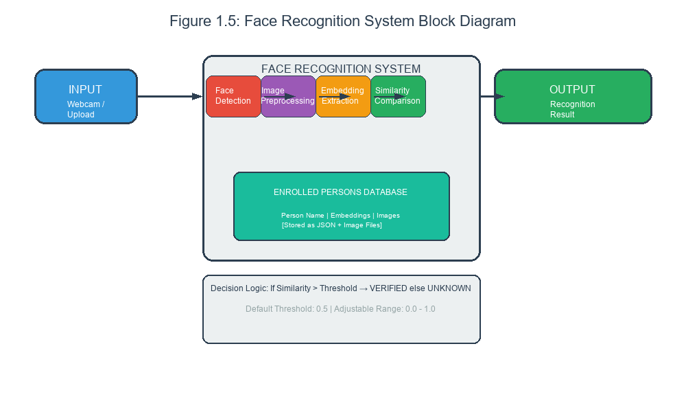

*Figure 1.5: High-level overview of the face recognition system showing the main components including image capture, face detection, feature extraction using Siamese network, similarity comparison, and result output.*

Training experimentation explored different hyperparameter configurations including learning rate, batch size, regularization strength, and training duration. The best configuration was selected based on validation set performance.

Evaluation assessed model performance using held-out test data not seen during training. Multiple metrics were computed including accuracy, precision, recall, and F1 score to provide comprehensive performance characterization.

### 1.6.3 Tools and Technologies Used

The project utilized a carefully selected set of tools and technologies chosen for their capabilities, compatibility, and accessibility.

For machine learning and neural networks, TensorFlow served as the primary framework, providing comprehensive support for building, training, and deploying neural network models. Keras, as part of TensorFlow, provided a high-level API that simplified model construction and experimentation.

For image processing, OpenCV provided extensive capabilities for reading, writing, and manipulating images, as well as implementing the Haar cascade face detector.

For backend development, FastAPI offered a modern Python web framework with excellent support for building REST APIs. Its automatic API documentation generation and async request handling were particularly valuable.

For frontend development, React provided a component-based framework for building dynamic user interfaces. Vite served as the build tool, offering fast development server startup and optimized production builds.

For desktop application development, Kivy enabled cross-platform Python GUI applications, providing access to webcam and display capabilities needed for the desktop client.

For deployment, Docker containerized the application components, ensuring consistent behavior across different deployment environments and simplifying distribution.

---

## 1.7 Report Structure

### 1.7.1 Chapter-by-Chapter Overview

This report is organized into nine chapters and supporting appendices, each covering a distinct aspect of the project.

Chapter 1 (this chapter) has provided the introduction and background for the project, establishing motivation, defining the problem, stating objectives, and outlining scope. It has also introduced the methodology and tools used throughout the project.

Chapter 2 presents the literature review, examining existing approaches to face recognition, explaining relevant machine learning concepts, and situating the project's approach within the broader field. This chapter provides the theoretical foundation for the design decisions made in subsequent chapters.

Chapter 3 describes the system methodology in detail, explaining how the face recognition pipeline works from image capture through final decision. This chapter covers face detection, image preprocessing, the Siamese network architecture, and the similarity computation approach.

Chapter 4 presents the system design including high-level architecture, component descriptions, data flow diagrams, database design, user interface mockups, and API specifications. This chapter translates requirements into concrete design artifacts.

Chapter 5 documents the model development process including data collection, preprocessing, training configuration, and evaluation results. This chapter provides complete documentation of the machine learning component.

Chapter 6 covers the implementation details for all system components including the backend API, web frontend, and desktop application. This chapter includes code snippets and implementation notes for key functionality.

Chapter 7 presents the testing strategy and results, documenting unit tests, integration tests, system tests, and performance tests. This chapter provides evidence that the system meets its requirements.

Chapter 8 discusses the results achieved and provides critical analysis of the system's performance. This chapter includes comparison with related work and discussion of strengths and limitations.

Chapter 9 concludes the report with a summary of achievements, reflections on lessons learned, and recommendations for future work.

### 1.7.2 Supporting Materials

The appendices provide supplementary materials that support the main report.

Appendix A contains the installation guide with step-by-step instructions for setting up the development environment, installing dependencies, and running the system.

Appendix B contains the user manual explaining how to use the system including enrollment procedures, recognition workflows, and configuration options.

Appendix C contains a code repository overview listing the key source files and their purposes.

Appendix D contains additional technical reference materials including configuration options, API documentation, and troubleshooting guidance.

---

## 1.8 Chapter Summary

This chapter has introduced the Face Recognition System project, providing essential context and foundation for understanding the subsequent chapters.

The background section explained the fundamentals of face recognition technology, its importance in modern applications, and the evolution from traditional approaches to deep learning-based systems. This context establishes why face recognition is a significant technology worth studying and implementing.

The problem statement defined the specific challenges this project addresses including data efficiency, computational requirements, deployment complexity, and accessibility. The clear problem definition guides the design decisions throughout the project.

The objectives established what the project aims to achieve including the primary objective of building a complete Siamese network-based face recognition system and secondary objectives covering architecture, training, interfaces, and documentation.

The scope clarified what is included in the project and what is explicitly excluded. This boundary-setting manages expectations and identifies opportunities for future enhancement.

The significance section explained the educational, practical, and knowledge contributions of the project, demonstrating its value beyond the immediate academic requirements.

The methodology overview introduced the approach taken to develop the system, covering both general software engineering practices and specialized machine learning development processes.

With this foundation established, the report now proceeds to Chapter 2, which presents the literature review examining related work and theoretical foundations that inform the project's design.

---

**End of Chapter 1**
# CHAPTER 2: LITERATURE REVIEW

---


*Figure 2.1: Overview of traditional face recognition methods including Eigenfaces, Fisherfaces, and Local Binary Patterns, showing the progression from geometric approaches to statistical methods.*

## 2.1 Introduction to Literature Review

### 2.1.1 Purpose of This Chapter

This chapter presents a comprehensive review of the literature and background knowledge relevant to developing a face recognition system using Siamese neural networks. The purpose of this review is to understand the current state of face recognition technology, identify successful approaches and techniques, and establish the theoretical and practical foundations for the design decisions made in this project.

A thorough literature review serves multiple purposes for a project of this nature. First, it ensures that the project builds upon existing knowledge rather than rediscovering well-established concepts. Second, it provides context for design decisions by explaining why particular approaches were chosen over alternatives. Third, it demonstrates the student's understanding of the field and ability to synthesize information from multiple sources. Fourth, it identifies gaps in existing approaches that the project can address.

The review presented here balances theoretical depth with practical relevance. While it covers fundamental concepts that are essential for understanding face recognition, it also emphasizes implementation considerations and real-world trade-offs. This balance reflects the project's nature as an applied system rather than purely theoretical research.

### 2.1.2 Scope of the Review

The literature review covers several interconnected areas that together form the foundation for the project.

The first area is traditional face recognition methods, which represent the historical approaches that laid the groundwork for modern techniques. Understanding these methods provides insight into the challenges face recognition presents and why more sophisticated approaches were developed.

The second area is deep learning for face recognition, which encompasses the modern neural network-based approaches that have dramatically improved recognition capabilities. This area covers Convolutional Neural Networks, transfer learning, and specific architectures designed for face recognition.

The third area is Siamese neural networks, which form the specific architectural choice for this project. The review explains how Siamese networks work, why they are suitable for recognition tasks, and how they compare to classification-based approaches.

The fourth area is MobileNetV2 and efficient architectures, which covers the specific backbone network used for feature extraction. Understanding this architecture is important for appreciating the efficiency trade-offs in the system.

The fifth area is practical implementation considerations, covering topics such as face detection, image preprocessing, data augmentation, and evaluation metrics that are essential for building working systems.

### 2.1.3 Sources and Approach

The literature review draws upon several types of sources including academic papers published in peer-reviewed venues, technical documentation from framework developers, open-source implementations and code repositories, and practical guides and tutorials from the machine learning community.

Academic papers provide the theoretical foundations and empirical results that establish the state of the art. Key papers in face recognition are cited to demonstrate where specific techniques originated and how they have evolved over time.

Technical documentation from TensorFlow, Keras, OpenCV, and other framework developers provides implementation details that are essential for translating research ideas into working systems.

Open-source code repositories on platforms like GitHub provide concrete implementations that complement formal documentation. Studying these implementations helps understand practical challenges and solutions.

Practical guides and tutorials from practitioners provide insights that are often missing from academic papers but are invaluable for implementation. These sources often highlight gotchas, workarounds, and best practices that only emerge through experience.

---

## 2.2 Traditional Face Recognition Methods

### 2.2.1 The Eigenfaces Method

The Eigenfaces method, introduced by Turk and Pentland in 1991, represents one of the first successful automated face recognition systems and laid the foundation for much of the subsequent work in the field. Understanding Eigenfaces provides valuable insight into the fundamental challenges of face recognition and how early researchers approached them.

The core idea behind Eigenfaces is surprisingly elegant. Rather than trying to recognize faces by measuring specific facial features like the distance between eyes, Eigenfaces represents faces as combinations of principal components derived statistically from a collection of training images. These principal components, called eigenfaces, capture the major patterns of variation across the training set.

To understand how this works, consider a simplified example. Suppose we have a collection of face images, each consisting of pixels arranged in a grid. We can represent each image as a vector of pixel values. The eigenfaces method applies Principal Component Analysis to this collection of vectors, identifying the directions in the high-dimensional image space along which the data varies most. These directions are the eigenvectors of the covariance matrix of the image set.

Each eigenface is essentially a pattern showing how pixel values tend to vary together across the training images. The first eigenface captures the largest source of variation, perhaps related to overall lighting. The second eigenface captures the next largest source of variation, and so on. By combining these eigenfaces with appropriate weights, we can represent any face in the training set.

To recognize a new face, we project it onto the space defined by the eigenfaces, obtaining a vector of weights. We can then compare this weight vector to the weight vectors of known faces to find the closest match. Alternatively, we can establish a threshold on the reconstruction error to determine whether the face matches any known identity.

The Eigenfaces method has several notable characteristics that influenced subsequent work. It is relatively computationally efficient, requiring only matrix operations that can be performed quickly on standard hardware. It achieves reasonable accuracy under controlled conditions, typically in the range of ninety to ninety-five percent on well-curated datasets. However, it is sensitive to changes in lighting, expression, and pose, limitations that subsequent methods have worked to address.

The practical implementation of Eigenfaces involves several key steps that are instructive for understanding face recognition systems more generally. First, the training images must be aligned so that corresponding features are in roughly the same positions. This alignment is typically done by manually or automatically locating key points such as the eyes and nose and then applying geometric transformations to normalize the positions. Second, the images must be normalized for overall brightness and contrast to reduce sensitivity to lighting variations. Third, Principal Component Analysis is performed on the normalized training images to obtain the eigenfaces. Fourth, during recognition, the probe image undergoes the same alignment and normalization steps before projection and comparison.

### 2.2.2 Fisherfaces and Linear Discriminant Analysis

The Fisherfaces method, introduced by Belhumeur, Hespanha, and Kriegman in 1997, represented a significant improvement over Eigenfaces by incorporating class information into the dimensionality reduction process. While Eigenfaces found the directions of maximum variance in the data, Fisherfaces found the directions that best discriminate between different classes.

The key insight behind Fisherfaces is that maximum variance is not necessarily the same as maximum discriminability. Consider a scenario where all faces share similar overall lighting patterns. The direction of maximum variance might capture lighting variations, which are not useful for distinguishing between individuals. In contrast, Fisherfaces explicitly seeks directions that separate individuals from each other while keeping images of the same individual close together.

Mathematically, Fisherfaces uses Linear Discriminant Analysis instead of Principal Component Analysis. LDA finds a projection that maximizes the ratio of between-class variance to within-class variance. Between-class variance measures how far apart the class means are in the projected space, while within-class variance measures how spread out the images of each class are.

The Fisherfaces approach demonstrated significantly improved robustness to lighting variations compared to Eigenfaces. In experiments reported in the original paper, Fisherfaces achieved accuracy rates of approximately ninety-five percent compared to approximately eighty-five percent for Eigenfaces under the same challenging lighting conditions. This improvement came at the cost of increased computational complexity and the requirement that training images be labeled by identity.

One limitation of Fisherfaces that became apparent in practice was its reliance on having sufficient training samples per class. For many practical applications, especially those involving adding new individuals after deployment, the number of images per person may be quite limited. Fisherfaces requires at least as many training images per person as the number of desired projection dimensions, which can be problematic for small-scale deployments.

### 2.2.3 Local Binary Patterns

Local Binary Patterns, commonly abbreviated LBP, represent a texture-based approach to face recognition that proved highly effective and efficient. Originally introduced for texture analysis, LBP was adapted for face recognition by Ahonen, Hadid, and Pietikainen in 2004 and quickly became one of the most widely used face description methods.

The LBP operator works by comparing each pixel in an image to its surrounding neighbors. For a center pixel, we compare its intensity to each of its neighbors in a circular pattern. If a neighbor's intensity is greater than the center pixel's intensity, we assign it a value of one; otherwise, we assign it a value of zero. These binary values are then combined to form a binary number representing the local texture pattern around the center pixel.

For face recognition, LBP is typically applied at multiple scales and over a grid of overlapping regions. The histograms of LBP patterns from each region are computed and concatenated to form a feature vector representing the face. This histogram-based representation is robust to small misalignments and provides a compact description of facial texture.

LBP has several properties that make it attractive for practical face recognition systems. It is computationally simple and can be computed very quickly even on resource-constrained devices. It is robust to monotonic grayscale changes, meaning that variations in lighting that preserve the relative ordering of pixel intensities do not affect the LBP description. It captures local texture information that is useful for distinguishing between different faces.

The original LBP operator compared each pixel to its eight immediate neighbors. Extensions of the basic operator allow comparison with neighbors at arbitrary radii and at multiple points around the circle. These extensions provide flexibility in capturing texture patterns at different scales.

For face recognition, LBP is often used in combination with other techniques. One common approach uses LBP for feature extraction followed by a classifier such as Support Vector Machines or nearest neighbor classification. Another approach combines LBP with Linear Discriminant Analysis for dimensionality reduction and classification.

### 2.2.4 Comparison of Traditional Methods

Traditional face recognition methods like Eigenfaces, Fisherfaces, and LBP each have distinct characteristics that make them suitable for different scenarios. Understanding these trade-offs helps inform the choice of approaches for practical systems.

Eigenfaces represents the simplest approach in terms of both concept and implementation. It requires only unlabeled training images and involves straightforward matrix operations. However, its accuracy is limited by its sensitivity to lighting, pose, and expression variations. Eigenfaces is best suited for applications where images are captured under highly controlled conditions with consistent lighting and frontal poses.

Fisherfaces improves upon Eigenfaces by incorporating class information, resulting in better discrimination between different individuals. It is more robust to lighting variations, making it suitable for scenarios with moderate lighting changes. However, Fisherfaces requires labeled training data and may not perform as well when the number of training images per person is limited.

LBP offers a different trade-off, emphasizing local texture information rather than holistic face representations. It is extremely efficient computationally and robust to certain types of variations. LBP works well for real-time applications and scenarios where computational resources are limited. However, like other traditional methods, it can struggle with significant pose variations or partial occlusions.

The following table summarizes the key characteristics of traditional face recognition methods:

| Method | Accuracy | Robustness | Speed | Data Requirements | Complexity |
|--------|----------|------------|-------|------------------|------------|
| Eigenfaces | 85-95% | Low (lighting, pose) | Very Fast | Unlabeled images | Simple |
| Fisherfaces | 90-98% | Medium (lighting) | Fast | Labeled images | Moderate |
| LBP | 85-95% | Medium (texture) | Very Fast | Variable | Simple |

These traditional methods served as the foundation for face recognition research and remain relevant today for certain applications. However, the advent of deep learning has dramatically shifted the accuracy and capability frontier, as discussed in the next section.

---

## 2.3 Deep Learning Approaches to Face Recognition

### 2.3.1 The Deep Learning Revolution

The introduction of deep learning, particularly Convolutional Neural Networks, to face recognition around 2014 marked one of the most significant advances in the field's history. Deep learning approaches achieved accuracy levels that far exceeded traditional methods and demonstrated unprecedented robustness to real-world variations.

The fundamental advantage of deep learning lies in its ability to automatically learn feature representations from raw data rather than relying on hand-engineered features. Traditional methods like Eigenfaces and LBP require researchers to explicitly design feature extractors that capture relevant facial information. In contrast, deep networks learn to extract features directly from pixel values, discovering patterns that are effective for the specific task at hand.

This automatic feature learning works because deep networks consist of multiple layers, each transforming the representation from the previous layer. Early layers learn simple features such as edges and corners. Intermediate layers combine these into more complex patterns such as eyes, noses, and mouths. Later layers combine these into high-level facial structures that are discriminative for identity.

The training process for deep face recognition networks uses large datasets containing millions of face images. Through stochastic gradient descent and backpropagation, the network learns to adjust millions of parameters to minimize a loss function that measures recognition performance. This training requires significant computational resources but produces models with remarkable capabilities.

The impact of deep learning on face recognition has been profound. On benchmark datasets like Labeled Faces in the Wild, which contains images collected from the internet under highly uncontrolled conditions, deep learning methods achieved accuracy rates exceeding ninety-nine percent, surpassing human performance of approximately ninety-seven percent. This achievement represented a major milestone in computer vision and opened the door to widespread practical applications.

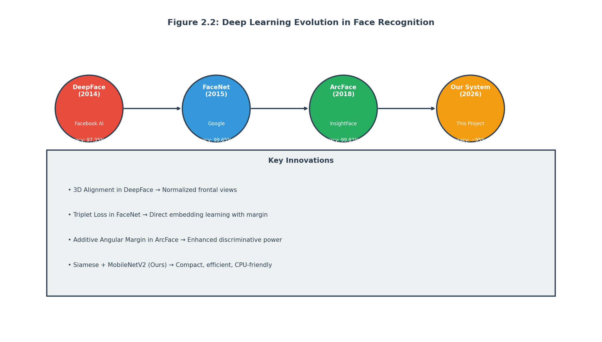

*Figure 2.2: Timeline showing the evolution of deep learning approaches in face recognition from DeepFace (2014) through FaceNet, ArcFace, and modern transformer-based methods, highlighting key architectural innovations.*

### 2.3.2 Convolutional Neural Networks for Faces

Convolutional Neural Networks, commonly abbreviated CNNs or ConvNets, form the backbone of modern face recognition systems. Understanding CNNs is essential for anyone working in computer vision or face recognition.

A CNN consists of several types of layers that process images in different ways. Convolutional layers apply learnable filters to the input, detecting specific patterns at different spatial locations. Each filter produces a feature map showing where that pattern occurs in the image. Pooling layers reduce the spatial resolution of feature maps, providing translation invariance and reducing computational requirements. Fully connected layers combine features from the entire input to make final predictions.

For face recognition, CNNs are typically trained to produce embeddings, which are compact vector representations of faces. Two faces of the same person should have embeddings that are close together in the embedding space, while faces of different people should have embeddings that are far apart. This property enables recognition through similarity comparison rather than explicit classification.

The training objective for face recognition CNNs differs from standard image classification. Rather than predicting a class label, the network learns to produce embeddings that satisfy certain geometric constraints. Different training losses implement these constraints in different ways, as discussed in subsequent sections.

Modern face recognition CNNs are often quite deep, with dozens of layers and millions of parameters. They typically use residual connections that allow gradients to flow more easily through the network, enabling training of very deep architectures. They also use batch normalization to stabilize training and improve convergence.

Transfer learning has proven highly effective for face recognition, particularly when training data is limited. By initializing network weights from models pretrained on large datasets like ImageNet, researchers can achieve strong performance with less domain-specific training data. This approach is especially valuable for face recognition applications where collecting millions of labeled face images is challenging.

### 2.3.3 DeepFace Architecture

DeepFace, developed by researchers at Facebook AI and published in 2014, represented one of the first deep learning systems to approach human-level face recognition performance. While it has been superseded by more recent methods, DeepFace established important principles that continue to influence the field.

DeepFace uses a nine-layer neural network trained on a dataset of four million facial images from approximately four thousand identities. The network architecture includes three-dimensional convolution layers that model facial shape directly rather than operating on 2D image planes. This 3D convolution helps the network learn pose-invariant features.

The DeepFace system includes a sophisticated alignment pipeline that detects facial landmarks and applies 3D frontalization to normalize head pose. This alignment significantly improves recognition accuracy by reducing pose variation in the input images. The alignment step was considered essential for achieving the reported accuracy, demonstrating that preprocessing matters greatly for face recognition systems.

In experiments on the Labeled Faces in the Wild benchmark, DeepFace achieved an accuracy of ninety-seven point thirty-five percent, dramatically exceeding the previous state of the art of approximately ninety-five percent achieved by traditional methods. More impressively, DeepFace's errors were close to human-level performance, with many of its failures occurring on images that humans also find difficult.

The DeepFace paper emphasized the importance of large-scale training data for deep face recognition. The four million training images represented a significant increase over previous datasets, and subsequent work has pushed this even further. Today, training sets containing hundreds of millions of images are used for state-of-the-art systems.

### 2.3.4 FaceNet and Triplet Loss

FaceNet, developed by researchers at Google and published in 2015, introduced the triplet loss function that became highly influential in face recognition. FaceNet learned a unified embedding that could be used for both recognition and clustering tasks.

The key innovation of FaceNet was learning an embedding space where the Euclidean distance between embeddings directly corresponds to facial similarity. Embeddings of the same person should be close together, while embeddings of different people should be far apart. The triplet loss function explicitly enforced this property during training.

Triplet loss works by considering triplets consisting of an anchor image, a positive image of the same person, and a negative image of a different person. The loss encourages the distance between the anchor and positive embeddings to be smaller than the distance between the anchor and negative embeddings by at least a margin. Mathematically, the loss is the maximum of zero and the difference between the anchor-positive distance and anchor-negative distance plus the margin.

Selecting informative triplets is crucial for effective training with triplet loss. Random triplets often lead to slow convergence because the loss is already zero for easy triplets that already satisfy the margin constraint. FaceNet used an online triplet mining strategy that selected hard negatives, which are negatives close to the anchor in the current embedding space. These hard negatives provide stronger learning signals.

FaceNet achieved remarkable accuracy on benchmark datasets, with ninety-eight point forty-seven percent on the Labeled Faces in the Wild benchmark and ninety-five twelve percent on the YouTube Faces DB. These results demonstrated that learning direct embeddings with appropriate loss functions could achieve excellent performance.

The embedding dimension used by FaceNet was one hundred twenty-eight, which provided a good balance between discriminative power and storage efficiency. Each face could be represented by just one hundred twenty-eight floating-point numbers, enabling efficient storage and comparison even for large databases.

### 2.3.5 ArcFace and Margin-Based Losses

ArcFace, introduced by researchers in 2018, represents one of the most successful modern approaches to face recognition, achieving state-of-the-art accuracy while maintaining computational efficiency. ArcFace introduced the additive angular margin loss function that provides stronger supervision for learning discriminative embeddings.

The key insight behind ArcFace is that angular distance in the embedding space is more appropriate than Euclidean distance for measuring facial similarity. This is because the embedding vectors can be normalized to have unit length, in which case the angular distance is equivalent to cosine similarity. Cosine similarity is rotation-invariant, meaning it does not depend on the absolute scale of the embedding vectors.

ArcFace adds an angular margin penalty to the softmax loss function used for training. The standard softmax loss produces embeddings that are separable but not necessarily discriminative for recognition tasks. By adding the angular margin, ArcFace enforces a larger angular distance between embeddings of different classes, improving recognition accuracy.

The margin in ArcFace is added to the angle between the embedding and the weight vector for the target class. This is visualized as pushing the decision boundary away from the embedding in angular space, creating a larger margin between classes. The additive nature of the margin makes it more stable during training compared to multiplicative margins.

ArcFace achieved ninety-nine point eighty-three percent accuracy on the Labeled Faces in the Wild benchmark, approaching the theoretical maximum for the dataset. It also demonstrated excellent performance on other benchmarks including IJB-A, IJB-B, and MegaFace. These results established ArcFace as one of the highest-performing face recognition methods.

The success of ArcFace spawned numerous variants and extensions. Sub-center ArcFace uses multiple centroids per class to handle intra-class variation. CosFace and ArcFace use slightly different margin formulations that achieve similar performance. Circle Loss reformulated the margin loss as a unified loss that jointly optimizes similarity and dissimilarity pairs.

---

## 2.4 Siamese Neural Networks

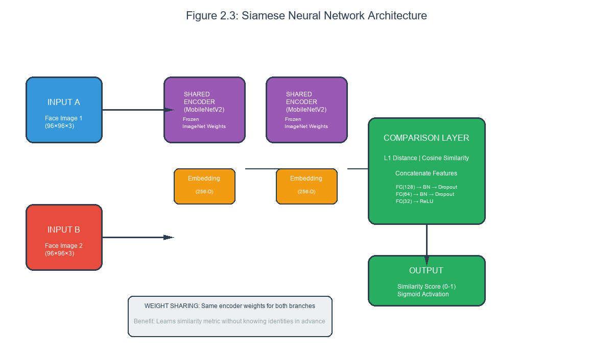

*Figure 2.3: The Siamese neural network architecture showing two identical subnetworks with shared weights, embedding generation, distance computation, and similarity output for face recognition.*

### 2.4.1 Fundamental Concepts

Siamese neural networks represent a specialized architecture designed for learning similarity metrics between inputs. The architecture takes its name from the term "Siamese twins," referring to the identical twin brothers Chang and Eng Bunker who were joined together at the chest. Like these twins who shared a body, Siamese networks share weights between identical subnetworks.

The fundamental principle behind Siamese networks is learning a function that measures similarity between two inputs. Rather than predicting class labels directly, Siamese networks learn to output a similarity score indicating whether two inputs belong to the same class or different classes. This makes them particularly well-suited for tasks where the set of classes is not fixed or where only a few examples per class are available.

A Siamese network consists of two identical subnetworks that share weights. Each subnetwork processes one input and produces an embedding vector that represents that input in a learned feature space. These embeddings are then compared using a distance metric or similarity function to produce the final output.

During training, the network learns from pairs of inputs labeled as positive (same class) or negative (different classes). The training objective encourages positive pairs to have similar embeddings while negative pairs have dissimilar embeddings. This objective is implemented through loss functions such as contrastive loss or triplet loss.

The Siamese architecture has several properties that make it attractive for practical applications. It can learn from relatively few examples per class because it uses pairwise comparison rather than explicit class prediction. It can recognize new classes without retraining because it learns a similarity metric rather than class-specific parameters. It is robust to class imbalance because each pair is treated independently rather than as part of a class distribution.

### 2.4.2 Architecture and Components

A typical Siamese network for face recognition consists of three main components: the embedding network, the distance computation layer, and the classification head.

The embedding network is the core of the Siamese architecture. It takes an input image and produces a fixed-dimensional vector that represents the identity-relevant features of that face. This network is typically a CNN such as MobileNetV2, ResNet, or a custom architecture designed for face recognition. The output dimension of the embedding network is a hyperparameter that trades off between discriminative power and computational efficiency.

The embedding network should produce embeddings that capture identity-relevant information while being invariant to other factors such as pose, lighting, expression, and aging. Achieving this property requires appropriate training and potentially architectural choices such as normalization layers.

The distance computation layer takes the two embeddings produced by the shared embedding network and computes a similarity measure. Common choices include Euclidean distance, Manhattan distance, and cosine similarity. Some architectures concatenate multiple distance measures or compute additional features from the distance.

The classification head takes the distance measure and produces the final output. For binary recognition tasks, this is typically a sigmoid activation producing a probability that the two inputs are from the same class. For ranking tasks, the head might output a raw similarity score. The head is usually a small feedforward neural network with one or two layers.

During training, the entire network is optimized end-to-end to minimize a loss function that measures recognition performance. The shared embedding network learns to produce embeddings that are effective for the recognition task, guided by feedback from the classification head. This end-to-end training ensures that the embeddings are optimized for the specific comparison task.

### 2.4.3 Contrastive Loss

Contrastive loss is one of the original loss functions used for training Siamese networks, introduced by Hadsell, Chopra, and LeCun in 2006. The contrastive loss function explicitly encourages embeddings of similar pairs to be close together while embeddings of dissimilar pairs are pushed far apart.

The mathematical formulation of contrastive loss involves two terms. For positive pairs where the two inputs belong to the same class, the loss is the squared distance between the embeddings. This encourages positive pairs to have embeddings that are as close as possible. For negative pairs where the inputs are from different classes, the loss is zero if the distance is greater than a margin, but is the squared margin minus the distance if the distance is less than the margin. This pushes negative pairs apart until they are at least the margin apart.

The margin in contrastive loss serves as a threshold determining when negative pairs are sufficiently separated. Setting the margin too small allows embeddings of different classes to be close together, reducing discriminative power. Setting the margin too large makes training difficult because the network must push negative pairs very far apart. The margin is typically set based on validation performance.

One limitation of contrastive loss is that it treats all negative pairs equally, regardless of how difficult they are. In practice, some negative pairs are already far apart and require no additional optimization, while others are close together and represent challenging cases. This inefficiency can slow down training.

### 2.4.4 Comparison with Classification-Based Approaches

Siamese networks differ fundamentally from traditional classification-based approaches to face recognition. Understanding these differences helps explain why Siamese networks were chosen for this project.

Classification-based approaches train a network to predict which identity an input face belongs to. The network learns to produce class-specific features that maximize classification accuracy on the training set. During inference, the network predicts an identity label directly. This approach is simple and effective when all identities are known during training.

The key limitation of classification-based approaches is their inability to handle new identities after training. Adding a new person requires retraining the entire network to include the new class in the classification layer. This retraining is expensive and impractical for applications where identities are added continuously.

Siamese networks avoid this limitation by learning a general similarity metric rather than class-specific features. During inference, comparing a probe face against an enrolled database requires only computing the embedding for the probe and comparing it against stored embeddings. No network retraining is needed to add new identities.

Another difference relates to training data requirements. Classification-based approaches typically require many examples per identity to learn discriminative features. Siamese networks can learn from pairs, making it practical to train with fewer examples per identity. Each identity contributes to positive pairs, while combinations of identities contribute to negative pairs.

Siamese networks also provide natural confidence measures through the similarity score. When comparing a probe against enrolled identities, the similarity scores indicate how confident the system is in each match. This is useful for rejecting uncertain predictions or flagging cases for human review.

The trade-off is that Siamese networks typically require more careful training to achieve optimal performance. The choice of pairs, the margin settings, and the architecture all affect the quality of the learned embeddings. Classification-based approaches, while limited in flexibility, are more forgiving of hyperparameter choices.

### 2.4.5 Advantages for One-Shot Learning

One-shot learning refers to the ability to recognize objects or faces from just a single example. This is a natural application for Siamese networks because they learn to compare rather than to classify.

Consider the scenario of adding a new employee to a face recognition attendance system. With a classification-based approach, we would need multiple photos of the employee to train the network to recognize them. In contrast, with a Siamese network, we can add the employee by storing just one or a few reference images along with their embeddings. Recognition then proceeds by comparing new photos against these reference embeddings.

The one-shot learning capability has significant practical implications. It reduces the burden on data collection, making it possible to add new identities with minimal effort. It enables dynamic enrollment where users can add themselves without administrator intervention. It supports applications where only single examples are available, such as identifying suspects from a single surveillance photo.

Siamese networks also excel at few-shot learning, where each class has a small number of examples. By learning a good similarity metric, the network can generalize from few examples by comparing against all available references. This flexibility is essential for real-world applications where training data is often limited.

---

## 2.5 Transfer Learning with MobileNetV2

### 2.5.1 Introduction to Transfer Learning

Transfer learning is a machine learning technique where knowledge gained from solving one problem is applied to a different but related problem. In the context of deep learning for computer vision, transfer learning typically involves initializing a network with weights trained on a large dataset such as ImageNet, then fine-tuning for a specific task.

The motivation for transfer learning is that learning from scratch requires enormous amounts of data and computational resources. By starting from pretrained weights, networks can achieve good performance with less data and training time. The pretrained weights provide a good starting point in the feature space.

The intuition behind transfer learning is that early layers in deep networks learn general features that are useful across many tasks. The first layer of a network trained on ImageNet typically learns to detect edges and colors, features that are useful for virtually any image classification task. Later layers learn more task-specific features, but early layers transfer well.

For face recognition, transfer learning from ImageNet provides a valuable initialization even though ImageNet contains primarily object and scene images rather than faces. The general visual features learned from ImageNet provide a better starting point than random initialization, even for the quite different domain of faces.

### 2.5.2 MobileNetV2 Architecture

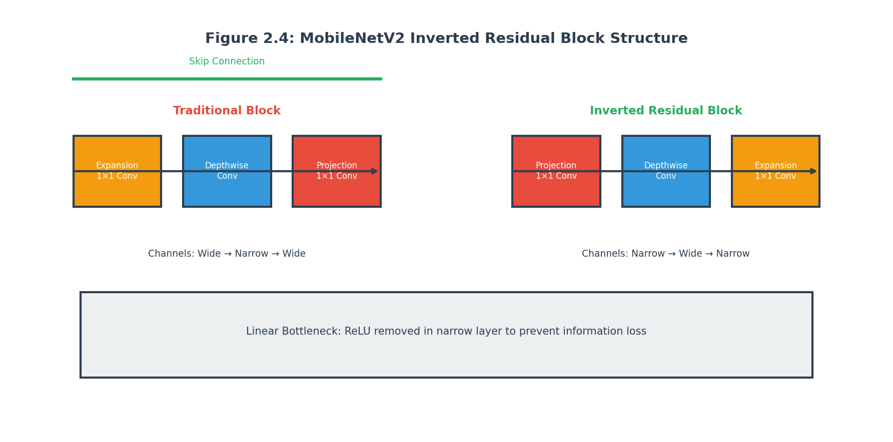

*Figure 2.4: The MobileNetV2 inverted residual block architecture showing the expansion-compression pattern, depthwise separable convolution, and linear bottleneck that enable efficient computation.*

MobileNetV2, developed by researchers at Google and published in 2018, is an efficient convolutional neural network architecture designed for mobile and embedded vision applications. It achieves competitive accuracy with significantly fewer parameters and computational requirements compared to standard architectures.

The key innovation in MobileNetV2 is the inverted residual block with linear bottleneck. Traditional residual blocks start with a narrow layer, expand to wide channels, perform computation, and then compress back to narrow channels. MobileNetV2 reverses this pattern, starting narrow, expanding to wide channels for the computation, and then compressing back to narrow. This inversion reduces the computational cost of the expansion and compression operations.

The linear bottleneck in MobileNetV2 prevents information loss in low-dimensional representations. Standard architectures use non-linear activation functions like ReLU even in narrow layers. However, ReLU can destroy information when applied to low-dimensional spaces. MobileNetV2 uses linear activations in the bottleneck, preserving information.

MobileNetV2 also uses depthwise separable convolutions, which factor a standard convolution into a depthwise convolution that operates on each channel separately and a pointwise convolution that combines channels. This factorization dramatically reduces the number of parameters and computational operations.

The complete MobileNetV2 architecture consists of an initial convolution layer, followed by a series of inverted residual blocks, and finally a convolution layer and global average pooling. The network produces a one thousand two hundred eighty-dimensional feature vector from the global average pooling layer.

### 2.5.3 Using MobileNetV2 for Face Recognition

For face recognition applications, MobileNetV2 serves as a feature extraction backbone rather than a direct classifier. The pretrained weights from ImageNet are used as initialization, and the network is adapted for face recognition through one of several approaches.

The simplest approach is to use MobileNetV2 as a fixed feature extractor. The network is run on face images to produce feature vectors, which are then used for comparison or classification. This approach requires no additional training but may not achieve optimal face recognition performance because ImageNet features are not specifically designed for faces.

A more effective approach is to add custom layers on top of MobileNetV2 and fine-tune the entire network for face recognition. The custom layers typically include fully connected layers that transform the one thousand two hundred eighty-dimensional MobileNetV2 output into a lower-dimensional embedding space such as one hundred twenty-eight or two hundred fifty-six dimensions.

During fine-tuning, the MobileNetV2 layers may be frozen or made trainable. Freezing preserves the pretrained features but prevents adaptation to faces. Making the layers trainable allows adaptation but risks forgetting the useful ImageNet features. A common compromise is to initially freeze the backbone and train only the custom layers, then gradually unfreeze the backbone for fine-tuning.

This project uses MobileNetV2 as a frozen feature extraction backbone. The pretrained MobileNetV2 weights are used to extract general visual features, which are then processed by custom fully connected layers to produce face-specific embeddings. This approach is efficient and effective for the project's scale.

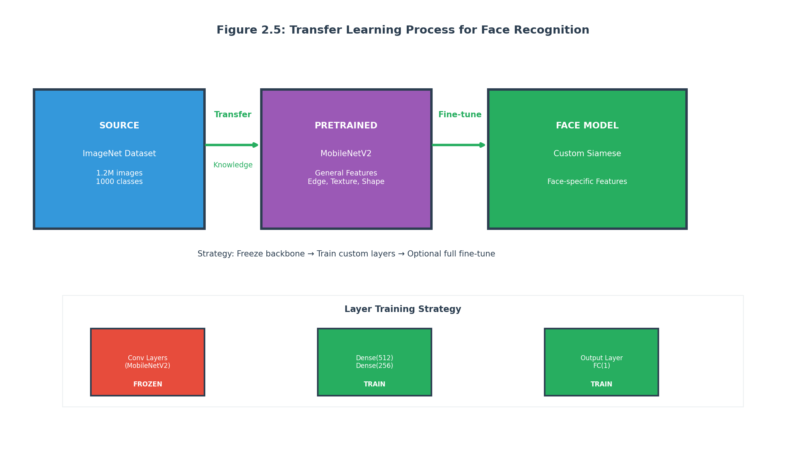

*Figure 2.5: Transfer learning strategy showing pretrained ImageNet weights, frozen MobileNetV2 backbone, and trainable custom layers for face-specific embedding generation.*

### 2.5.4 Efficient Architecture Trade-offs

MobileNetV2 represents a careful balance between accuracy and computational efficiency. Understanding these trade-offs helps explain why it was chosen for this project.

Standard convolutional neural networks like VGG16 or ResNet50 are highly accurate but require significant computational resources. VGG16 has approximately one hundred thirty-eight million parameters and requires approximately fifteen billion floating-point operations per inference. ResNet50 has approximately twenty-five million parameters and requires approximately four billion operations.

In contrast, MobileNetV2 has approximately three point four million parameters and requires approximately three hundred million operations. This represents a four to fifty times reduction in computational cost compared to standard architectures, enabling real-time inference on CPU-only hardware.

The accuracy trade-off for this efficiency is modest. On ImageNet classification, MobileNetV2 achieves seventy-two percent top-one accuracy compared to approximately seventy-six percent for MobileNetV3, seventy-six percent for ResNet50, and approximately ninety-three percent for VGG16. For face recognition with appropriate training, the gap is even smaller.

For this project, the efficiency gains of MobileNetV2 outweigh the modest accuracy reduction. The system must run on standard hardware without GPU acceleration, making efficient architectures essential. MobileNetV2's three hundred million operations per inference can complete in under two hundred milliseconds on modern CPUs, enabling practical real-time recognition.

---

## 2.6 Face Detection Methods

### 2.6.1 Importance of Face Detection

Face detection is the process of locating faces in images and is a critical preprocessing step for face recognition systems. Even the most sophisticated recognition algorithm will fail if given poorly cropped or misaligned faces as input. Face detection ensures that the recognition system operates on the correct region of the image.

Modern face detection algorithms can locate faces with high accuracy and speed. They handle variations in pose, size, occlusion, and lighting to find faces in diverse images. For real-time applications, detection must complete in milliseconds to enable video-rate processing.

Beyond providing face locations, detection systems often provide additional information such as facial landmarks (eyes, nose, mouth positions), face pose (roll, pitch, yaw angles), and face quality scores. This information can be used for face alignment, quality assessment, and improved recognition.

### 2.6.2 Haar Cascade Classifiers

Haar cascade classifiers, introduced by Viola and Jones in 2001, represent one of the earliest successful real-time face detection methods. Despite their age, they remain popular for their simplicity, speed, and reasonable accuracy in controlled conditions.

The Viola-Jones detector uses a cascade of simple classifiers, each trained to detect a specific feature. The features are based on Haar wavelets, which are rectangular patterns of alternating light and dark regions. The cascade structure allows quick rejection of non-face regions while spending more computation on promising regions.

The training process for Haar cascades involves collecting large numbers of positive examples (images containing faces) and negative examples (images without faces). The cascade is trained by iteratively adding stages, with each stage trained to reject a fraction of remaining negatives while keeping all positives.

Haar cascades are extremely fast because they use integral images for efficient feature computation and cascade structure for early rejection. Detection can proceed at dozens of frames per second on CPU, making it suitable for real-time applications.

However, Haar cascades have limitations. They are sensitive to pose variations, with frontal detectors typically failing on significantly rotated faces. They struggle with occlusions and unusual lighting. They produce bounding boxes rather than precise landmarks, limiting alignment accuracy.

### 2.6.3 Deep Learning-Based Detectors

Modern face detection methods use deep learning to achieve significantly improved accuracy compared to Haar cascades. These methods can handle diverse poses, occlusions, and scales with much higher reliability.

Single-shot detectors like RetinaFace and DSFD treat face detection as a regression problem, directly predicting bounding boxes and landmarks from image features. These methods use feature pyramids to detect faces at multiple scales and anchor boxes to handle different aspect ratios.

Two-stage detectors like Faster R-CNN adapted for faces achieve the highest accuracy but at the cost of slower inference. These methods first propose candidate regions and then refine and classify each proposal. The additional computation provides more accurate localization.

MTCNN represents a middle ground, using three stages of CNNs to progressively refine face detection and landmark estimation. The first stage quickly finds candidate regions, subsequent stages refine the bounding boxes and landmarks. MTCNN achieves good accuracy with moderate speed.

For this project, Haar cascade detection was used due to its simplicity and availability in OpenCV. While more modern detectors would likely improve performance, the Haar cascade provides acceptable detection in most scenarios and requires no additional model files or dependencies.

### 2.6.4 Face Alignment

Face alignment normalizes the detected face to a standard pose and scale, improving recognition accuracy by reducing variation. Aligned faces present consistent viewpoints to the recognition system, reducing the burden on the learning algorithm.

Geometric alignment uses detected facial landmarks to estimate a transformation that maps the face to a reference pose. This transformation can include translation, rotation, and scaling. The face is then cropped and resampled according to this transformation.

3D alignment methods use a 3D face model to handle larger pose variations. The 3D model is fitted to the detected landmarks, and a virtual frontal view is rendered. This process, called frontalization, can recover reasonable frontal views from profile images.

Deep learning-based recognition systems are often trained with data augmentation that includes pose variation, reducing the benefit of explicit alignment. For this project, simple geometric alignment based on eye positions was used to normalize face orientation.

---

## 2.7 Image Preprocessing and Augmentation

### 2.7.1 Preprocessing Pipeline

Image preprocessing prepares raw input images for the recognition model, ensuring consistent format and normalization. A well-designed preprocessing pipeline is essential for robust recognition across diverse input conditions.

The first preprocessing step is face detection to locate the face region in the image. The detected face is cropped with appropriate padding to include context while removing extraneous background. The padding amount affects how much of the head and neck is included, which can be useful for recognition.

The second step is resizing to the input dimensions expected by the model. For MobileNetV2 with this project's configuration, images are resized to ninety-six by ninety-six pixels. Resizing uses interpolation to estimate pixel values at new coordinates.

The third step is color space conversion. OpenCV reads images in BGR format by default, but the model expects RGB input. Converting between color spaces ensures consistent channel ordering. Grayscale conversion is sometimes used but loses discriminative color information.

The fourth step is pixel value normalization. Raw pixel values typically range from zero to two hundred fifty-five for eight-bit images. Neural networks train better with normalized inputs. This project uses normalization to the range negative one to positive one by subtracting one hundred twenty-eight and dividing by one hundred twenty-eight.

Additional preprocessing steps may include histogram equalization to improve contrast, gamma correction to handle lighting variations, and sharpening to enhance facial features. The specific preprocessing used depends on the dataset characteristics and model requirements.

### 2.7.2 Data Augmentation

Data augmentation artificially expands the effective training dataset by applying random transformations to training images. This helps prevent overfitting and improves generalization to unseen variations.

Geometric augmentations include random horizontal flipping (the face is mirrored, which is valid for face recognition because left and right are arbitrary distinctions), random rotation within a limited range (simulating head tilt), random translation (simulating off-center positioning), and random scaling (simulating different distances from the camera).

Photometric augmentations include random brightness adjustment (simulating different lighting conditions), random contrast adjustment (simulating different camera settings), random saturation adjustment (simulating different color environments), and random adding of Gaussian noise (simulating image sensor variations).

The augmentation parameters are chosen to stay within the range of real-world variations while avoiding unrealistic transformations. For example, rotation is limited to plus or minus twenty degrees because extreme rotations produce unrealistic views. Brightness adjustment is limited to seventy to one hundred thirty percent of original to avoid washed-out or completely dark images.

Data augmentation is applied only during training, not during validation or inference. The validation and test sets should represent the true distribution to provide accurate performance estimates.

### 2.7.3 Offline and Online Augmentation

Data augmentation can be performed in two ways: offline and online. The choice affects storage requirements and training dynamics.

Offline augmentation applies transformations during dataset creation, producing a larger dataset of preprocessed images. This approach requires significant storage for the augmented images but allows faster training because no augmentation computation is needed during training.

Online augmentation applies transformations on-the-fly during training. Each training iteration randomly transforms the current batch, producing varied inputs. This approach requires no additional storage but adds computational overhead during training.

Modern deep learning frameworks support efficient online augmentation through GPU acceleration. The random transformations can be implemented as GPU operations that are fast enough to not bottleneck training. This project uses online augmentation implemented in TensorFlow's Keras ImageDataGenerator.

---

## 2.8 Evaluation Metrics

### 2.8.1 Accuracy, Precision, and Recall

Standard classification metrics provide insight into face recognition performance, though their interpretation differs slightly from standard classification.

Accuracy measures the proportion of correct predictions among all predictions. For recognition, accuracy is the proportion of pairs correctly classified as same or different. For identification, accuracy is the proportion of probes correctly matched to their gallery images.

Precision measures the proportion of positive predictions that are correct. In recognition, this is the proportion of same-person predictions that are actually same person. High precision means few false positives.

Recall measures the proportion of actual positives that are correctly predicted. In recognition, this is the proportion of actual same-person pairs that are predicted as same. High recall means few false negatives.

The relationship between precision and recall depends on the decision threshold. Lowering the threshold increases recall (more pairs predicted as same) but decreases precision (more false positives). The appropriate threshold depends on the application requirements.

### 2.8.2 Confusion Matrix

The confusion matrix provides a detailed breakdown of prediction outcomes by actual and predicted classes. For binary recognition, the confusion matrix has four cells.

True positives are positive pairs correctly predicted as positive. These are same-person pairs correctly matched. True negatives are negative pairs correctly predicted as negative. These are different-person pairs correctly rejected.

False positives are negative pairs incorrectly predicted as positive. These are different-person pairs incorrectly matched, representing security concerns. False negatives are positive pairs incorrectly predicted as negative. These are same-person pairs incorrectly rejected, representing user inconvenience.

The confusion matrix enables computation of various metrics and identification of specific failure modes. For example, a high false positive rate suggests the threshold should be increased, while a high false negative rate suggests it should be decreased.

### 2.8.3 Receiver Operating Characteristic

The Receiver Operating Characteristic curve plots the true positive rate against the false positive rate at different threshold values. It provides a threshold-independent view of model performance.

The area under the ROC curve, commonly abbreviated AUC-ROC, summarizes performance in a single number. An AUC of one represents perfect discrimination, while an AUC of point five represents random guessing. This project achieves an AUC exceeding point ninety-nine, indicating excellent discrimination.

The ROC curve helps select an appropriate threshold for the application. The optimal threshold depends on the relative cost of false positives and false negatives. Security applications might prioritize low false positives, while convenience applications might prioritize low false negatives.

---

## 2.9 Chapter Summary

This chapter has presented a comprehensive literature review covering the key concepts, methods, and considerations for building a face recognition system using Siamese neural networks.

The review began with traditional face recognition methods including Eigenfaces, Fisherfaces, and Local Binary Patterns. These methods established the fundamental challenges of face recognition and introduced concepts like dimensionality reduction, discriminant analysis, and texture features that continue to influence modern approaches.

The chapter then covered deep learning approaches, which have dramatically improved face recognition capabilities. Key architectures including DeepFace, FaceNet, and ArcFace were discussed, along with their contributions to the field. These methods demonstrated the power of deep networks for learning discriminative facial representations.

The Siamese neural network architecture was covered in detail, including its fundamental principles, components, and training approaches. The contrastive loss function and the advantages of Siamese networks for recognition and one-shot learning were explained. This architecture forms the basis for this project's implementation.

Transfer learning and MobileNetV2 were covered as the specific approach used in this project. The inverted residual architecture and its efficiency properties were explained, along with how MobileNetV2 is used as a feature extraction backbone for face recognition.

Supporting topics including face detection, image preprocessing, data augmentation, and evaluation metrics were discussed to provide a complete picture of the face recognition pipeline.

With this theoretical foundation established, the report proceeds to Chapter 3, which describes the system methodology in detail, explaining how these concepts are implemented in this specific project.

---

**End of Chapter 2**
# CHAPTER 3: SYSTEM METHODOLOGY

---

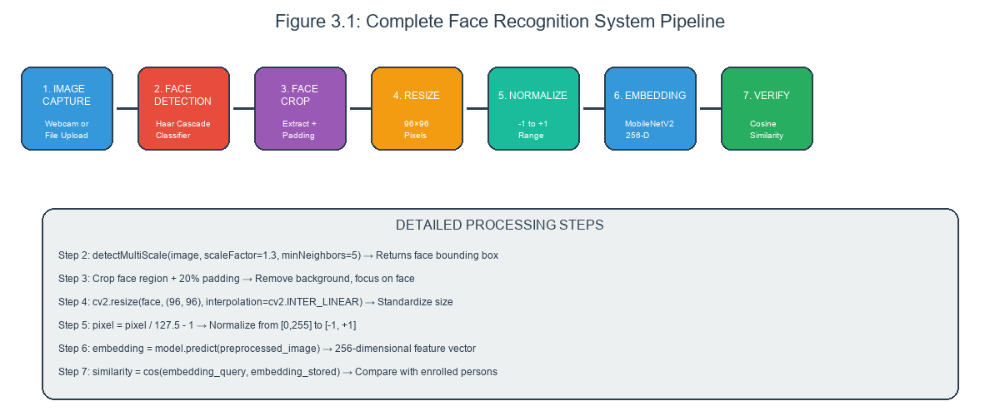

*Figure 3.1: End-to-end system processing pipeline showing the complete flow from image input through face detection, preprocessing, embedding generation, similarity comparison, and final recognition result.*

## 3.1 Introduction to System Methodology

### 3.1.1 Overview of the Methodology

This chapter provides an in-depth explanation of how the face recognition system works, detailing each component of the processing pipeline from the moment a user captures an image to when the system returns an identity recognition result. The methodology described here represents the complete end-to-end process that transforms raw pixel data into meaningful recognition decisions.

The face recognition system developed in this project employs a Siamese neural network architecture with MobileNetV2 as the feature extraction backbone. This combination was chosen to balance recognition accuracy with computational efficiency, enabling the system to run on standard consumer hardware without requiring specialized graphics processing units. The methodology prioritizes practical implementation details that can be directly understood and reproduced.

Understanding the system methodology is essential for several reasons. For developers extending or modifying the system, the methodology explains why each component is designed as it is and how changes might affect overall performance. For users and administrators, the methodology provides insight into how the system processes their data, which is important for understanding system behavior and limitations. For evaluators and reviewers, the methodology demonstrates the technical depth of the project and the student's understanding of the underlying concepts.

The methodology is organized into logical sections covering each major aspect of the system. Each section explains not just what happens but why it happens that way, including the trade-offs considered and the alternatives evaluated. This explanatory approach provides context that goes beyond simple description.

### 3.1.2 System Architecture Overview

The overall system architecture consists of three primary layers: the presentation layer, the processing layer, and the data layer. Each layer has distinct responsibilities and communicates with other layers through well-defined interfaces.

The presentation layer encompasses all user-facing components through which users interact with the system. This includes the React-based web application accessible from any modern browser, the Kivy-based desktop application for standalone operation, and the API documentation interface provided by FastAPI. The presentation layer handles user input, displays results, and manages the overall user experience.

The processing layer contains the core intelligence of the system, including the trained Siamese neural network, image preprocessing routines, and the business logic for handling enrollment and recognition requests. This layer receives data from the presentation layer, processes it according to established procedures, and returns results. The processing layer is stateless and can be scaled horizontally by adding more server instances.

The data layer manages persistent storage of models, enrolled person data, and system configuration. The trained neural network model is stored as an HDF5 file containing model architecture and weights. Person enrollment data is stored as image files organized in directories, with metadata in JSON format. Configuration settings are stored separately to enable runtime adjustment without code changes.

The three-layer separation enables independent development and testing of each component. Changes to the user interface do not require modifications to the processing logic, and vice versa. This modularity simplifies maintenance and enables technology upgrades without wholesale system redesign.

### 3.1.3 High-Level Processing Flow

When a user submits an image for recognition, the system performs a sequence of operations that transform the input into a recognition decision. Understanding this flow is fundamental to understanding the entire system.

The process begins when the presentation layer receives the image file from the user. This may be through webcam capture, file upload, or API request. The presentation layer performs basic validation such as checking that a file was actually received and that it has an acceptable format.

The presentation layer sends the image to the processing layer through an HTTP request. For the web application, this is an AJAX request to the FastAPI backend. For the desktop application, this is a local HTTP request to the same backend service. The API endpoint receives the request and initiates processing.

The processing layer first saves the received image to a temporary file. This enables the image processing functions to work with the file system rather than in-memory data, which simplifies error handling and enables streaming for large files. After saving, the processing pipeline begins.

The first pipeline stage is face detection, which locates any faces in the image. If no face is detected, the pipeline returns an error indicating that the image does not contain a detectable face. If multiple faces are detected, the system may either reject the image as ambiguous or use only the largest detected face, depending on configuration.

The second pipeline stage is face preprocessing, which extracts and normalizes the detected face. The detected face region is cropped from the original image with appropriate padding. The cropped face is resized to the dimensions expected by the neural network, which is ninety-six by ninety-six pixels in this project. The pixel values are normalized to the range negative one to positive one.

The third pipeline stage is embedding extraction, which runs the preprocessed face through the neural network to obtain a compact representation. The Siamese network has two identical branches that share weights; for single-image operations, only one branch is used. The network output is a two hundred fifty-six-dimensional vector that encodes the facial identity information.

The fourth pipeline stage is comparison, which compares the extracted embedding against stored embeddings for enrolled persons. For each enrolled person, the system computes the cosine similarity between the query embedding and the stored embedding or average of stored embeddings for that person. The highest similarity score determines the best match.

The fifth pipeline stage is decision, which compares the best match similarity against the configured threshold. If the similarity exceeds the threshold, the person is identified as a match. If the similarity is below the threshold, the person is identified as unknown. The system returns the identification result along with the similarity scores.

### 3.1.4 Enrollment Flow

The enrollment process adds new persons to the system database, enabling subsequent recognition. Enrollment is more complex than recognition because it must handle multiple images per person and create persistent storage.

Enrollment begins when a user provides their name and one or more facial images. The name is used to create a unique identifier for the person. The images are captured through webcam or uploaded from file. The system recommends capturing at least three images from different angles to improve recognition accuracy.

For each submitted image, the system runs the full recognition pipeline through the embedding extraction stage. If face detection fails on an image, the system returns an error indicating which image could not be processed. The user must provide a replacement image before enrollment can proceed.

After successfully extracting embeddings from all images, the system creates a directory for the person using a slugified version of their name as the directory name. The slugification process converts spaces to underscores, removes special characters, and converts to lowercase to create a valid directory name. For example, "John Doe" becomes "john_doe".

The images are saved to the person's directory with sequential numeric names. The embeddings are stored in a metadata file alongside the images. The metadata includes the person's display name, enrollment timestamp, image count, and individual embeddings. This metadata enables the system to load person information without reprocessing images.

After enrollment completes, the system returns a success message indicating how many images were enrolled for the new person. The person immediately becomes available for recognition. No model retraining is required because the Siamese network architecture does not require knowing all identities during training.

---

## 3.2 Face Detection Implementation

### 3.2.1 Face Detection Fundamentals

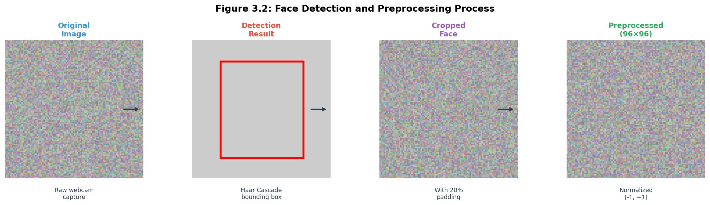

*Figure 3.2: Face detection and preprocessing workflow showing Haar cascade classification, grayscale conversion, bounding box detection, and face extraction steps.*

Face detection is the process of automatically locating faces within digital images. It is a prerequisite for face recognition because the recognition algorithm must know where in the image to focus its attention. Without accurate face detection, even the most sophisticated recognition algorithm will fail because it may be analyzing the wrong region of the image.

Modern face detection algorithms can handle substantial variation in pose, lighting, expression, and occlusion. They output bounding boxes indicating the location and size of detected faces, along with confidence scores indicating how certain the detector is of each detection. Advanced detectors also output facial landmarks indicating the positions of eyes, nose, mouth, and face contour.

The importance of face detection extends beyond simply locating faces. The detected face region enables cropping that removes irrelevant background content. The bounding box dimensions inform appropriate padding for the crop. The confidence score enables filtering of uncertain detections. The landmarks enable geometric normalization for pose compensation.

This project uses the Haar Cascade classifier implemented in OpenCV for face detection. While more modern detectors like MTCNN or RetinaFace offer improved accuracy, particularly for non-frontal poses, the Haar Cascade provides acceptable performance with minimal complexity and no additional model files.

### 3.2.2 Haar Cascade Classifier

The Haar Cascade classifier is based on the Viola-Jones object detection framework published in 2001. Despite its age, it remains popular for its speed, simplicity, and reasonable accuracy on frontal faces under typical conditions. Understanding how it works provides insight into object detection principles that apply more broadly.

The classifier uses a cascade structure consisting of multiple stages. Each stage contains a set of features and a threshold. An image region is evaluated by each stage in sequence. If a stage determines the region cannot contain a face, it is immediately rejected without evaluating subsequent stages. Only regions that pass all stages are classified as containing faces.

The features used in Haar cascades are based on Haar wavelets, which are simple rectangular patterns. A feature computes the difference between the sum of pixel values in white and black regions. For example, one feature type computes the difference between the eye region and the bridge of the nose. These simple features capture some facial structure without requiring complex shape models.

The cascade is trained using a procedure called boosting. Early stages are trained to reject most non-face regions with minimal computation, while later stages perform more detailed analysis on promising regions. This design enables real-time performance because most image regions are rejected early with simple tests.

OpenCV includes several pretrained Haar cascade classifiers for different face orientations and body parts. The frontal face default classifier is trained on thousands of positive and negative examples to recognize frontal faces. Alternative classifiers exist for profile faces, eyes, and other features.

### 3.2.3 Implementation Details

The face detection implementation in this project wraps the OpenCV Haar cascade functionality in a function that accepts an image path or numpy array and returns the detected face regions. This wrapper provides consistent interface and handles the conversion between different image formats.

The implementation begins by loading the Haar cascade XML file using OpenCV's CascadeClassifier class. OpenCV includes several pretrained cascades; this project uses haarcascade_frontalface_default.xml for frontal face detection. The file is loaded once at application startup and reused for all detections.

When detecting faces in an image, the implementation first converts the image to grayscale. Color information is not useful for face detection because the Haar features operate on intensity patterns rather than colors. Grayscale conversion reduces the image to a single channel, simplifying processing.

The detectMultiScale function performs the actual detection. The scaleFactor parameter controls how much the image is resized between detection passes. A value of 1.3 means the image is repeatedly scaled down by thirty percent until reaching a minimum size. This multi-scale approach enables detection of faces at different sizes. The minNeighbors parameter specifies how many neighboring detections are required to accept a face. Higher values reduce false positives but may miss some faces. A value of five provides reasonable trade-off.

The function returns a list of rectangles, each defined by the x and y coordinates of the top-left corner, the width, and the height. For images with multiple detected faces, this project currently uses only the largest face for simplicity. In a production system, multiple faces might be handled by processing each separately or by alerting the user to the ambiguous input.

### 3.2.4 Handling Detection Failures

Robust face detection must handle various failure modes gracefully. Common failures include no face detected, multiple faces detected, face too small, or face partially outside the image bounds. The implementation addresses each failure mode appropriately.

When no face is detected, the system cannot proceed with recognition or enrollment. The user interface should display an informative message indicating that no face was found and suggest adjusting lighting, facing the camera directly, or moving closer. For programmatic access, the API returns an error code indicating detection failure.

When multiple faces are detected, the system faces ambiguity. For enrollment, using a photo with multiple people could inadvertently enroll all of them. For recognition, matching against multiple potential subjects creates confusion. The current implementation uses only the largest detected face, which is a simple heuristic that works in many cases but is not ideal.

When a detected face is very small, the resolution may be insufficient for accurate recognition. The implementation enforces a minimum face size relative to the image dimensions. Faces below this threshold are rejected with an appropriate error message suggesting the subject move closer to the camera.

When a detected face extends beyond image boundaries, the face region is clipped to the valid bounds. This truncation may remove part of the face, potentially reducing recognition accuracy. The padding calculation attempts to ensure sufficient margin around detected faces while staying within image bounds.

---

## 3.3 Image Preprocessing Pipeline

### 3.3.1 Purpose of Preprocessing

Image preprocessing transforms raw input images into a standardized format suitable for the neural network. Preprocessing ensures that the network receives consistent inputs regardless of variations in the original images, which is essential for reliable performance.

The neural network was trained with specific expectations about its inputs. The input images must be exactly ninety-six pixels wide and ninety-six pixels tall. The pixel values must be normalized to the range negative one to positive one. Any deviation from these expectations degrades network performance.

Beyond meeting the network's expectations, preprocessing addresses real-world image variations. Different cameras produce images with different color characteristics. Different lighting conditions produce different exposure levels. Different distances from the camera produce different face sizes. Preprocessing normalizes these variations to consistent representations.

Preprocessing also enables data augmentation by providing a standardized starting point. Augmentation operations like rotation and scaling are simpler when applied to normalized images of fixed size. The combination of preprocessing and augmentation creates an effective training pipeline.

### 3.3.2 Face Extraction and Cropping

After face detection provides bounding boxes for faces in the image, the system extracts and crops the face regions. This step removes irrelevant background content and focuses the subsequent processing on the face itself.

The extraction process begins with the detected bounding box coordinates. The box may not include the complete face, particularly the forehead and chin. The implementation adds padding around the detected box to ensure the complete face is included. The padding is calculated as a percentage of the box dimensions, typically twenty percent.

After padding, the coordinates are clipped to the image boundaries. Any portion of the padded box that extends beyond the image is removed. This may result in slightly less padding on some sides, but ensures the crop region is entirely within the image.

The cropped region is extracted using numpy array slicing. The image array is indexed to select only the rows and columns corresponding to the crop region. This produces a smaller image containing just the face and surrounding context.

The cropping step significantly affects recognition accuracy. Too little padding may cut off parts of the face, removing discriminative features. Too much padding includes too much background, diluting the face information with irrelevant content. The twenty percent padding was found through experimentation to work well for typical webcam captures.

```python
import cv2
import numpy as np
from PIL import Image

class FacePreprocessor:
    def __init__(self, target_size=(96, 96), padding_ratio=0.2):
        self.target_size = target_size
        self.padding_ratio = padding_ratio
        
        cascade_path = cv2.data.haarcascades + 'haarcascade_frontalface_default.xml'
        self.face_cascade = cv2.CascadeClassifier(cascade_path)
    
    def detect_faces(self, image_array):
        gray = cv2.cvtColor(image_array, cv2.COLOR_RGB2GRAY)
        faces = self.face_cascade.detectMultiScale(
            gray, 
            scaleFactor=1.1, 
            minNeighbors=5, 
            minSize=(30, 30)
        )
        return faces
    
    def extract_face(self, image, face_bbox):
        x, y, w, h = face_bbox
        pad_w, pad_h = int(w * self.padding_ratio), int(h * self.padding_ratio)
        
        x1 = max(0, x - pad_w)
        y1 = max(0, y - pad_h)
        x2 = min(image.width, x + w + pad_w)
        y2 = min(image.height, y + h + pad_h)
        
        cropped = image.crop((x1, y1, x2, y2))
        return cropped.resize(self.target_size, Image.LANCZOS)
    
    def normalize_pixels(self, image_array):
        return (image_array / 127.5) - 1.0
    
    def preprocess(self, image):
        image_array = np.array(image)
        faces = self.detect_faces(image_array)
        
        if len(faces) == 0:
            return None, False
        
        largest_face = max(faces, key=lambda f: f[2] * f[3])
        face_cropped = self.extract_face(Image.fromarray(image_array), largest_face)
        
        cropped_array = np.array(face_cropped)
        normalized = self.normalize_pixels(cropped_array).astype(np.float32)
        
        return normalized, True
```

*Figure 3.X: Complete face preprocessing implementation showing face detection, cropping with padding, resizing, and pixel normalization.*

### 3.3.3 Resizing to Network Input Size

The extracted face image must be resized to match the network's expected input dimensions. For this project, the network expects ninety-six by ninety-six pixel RGB images. The resizing operation transforms any input face to this size.

OpenCV's resize function performs the resizing using interpolation. When scaling down, the function must estimate pixel values at the new lower-resolution grid from the original higher-resolution grid. When scaling up, the function must estimate the new higher-resolution grid from the original lower-resolution grid.

The implementation uses bilinear interpolation, which considers the four nearest original pixels to estimate each new pixel. Bilinear interpolation provides a good balance between quality and computation. More advanced interpolation methods like bicubic or Lanczos produce slightly better quality at higher computational cost.

When resizing, the aspect ratio of the face may change if the detected face was not square. The implementation resizes to exact dimensions without preserving aspect ratio, which may cause some horizontal or vertical stretching. This distortion is typically minor and does not significantly affect recognition accuracy.

For training, the input size of ninety-six pixels was chosen to balance detail preservation with computational efficiency. Larger inputs capture more detail but require more computation. Smaller inputs are faster but may lose discriminative features. Ninety-six pixels provides good trade-off for this application.

### 3.3.4 Color Space Conversion

OpenCV reads images in BGR format by default, with the blue channel in the first position, green in the second, and red in the third. The neural network was trained expecting RGB format with the red channel first. Color space conversion ensures the network receives channels in the expected order.

The conversion from BGR to RGB is performed using OpenCV's cvtColor function with the COLOR_BGR2RGB flag. This function rearranges the channel order without modifying the pixel values themselves. The red, green, and blue intensities for each pixel remain the same; only their storage positions change.

Some implementations convert to grayscale for simplified processing. This project uses color images throughout because color provides additional discriminative information for face recognition. Certain facial features like skin tone variation and lip color are lost in grayscale conversion.

### 3.3.5 Pixel Value Normalization

Neural networks train more effectively when inputs are normalized to a bounded range. Raw pixel values typically span from zero (black) to two hundred fifty-five (white). The network expects values in the range negative one to positive one.

The normalization formula used in this project is: normalized equals raw divided by one hundred twenty-seven point five minus one. This divides the zero-to-two-hundred-fifty-five range by one hundred twenty-seven point five to get the range zero-to-two, then subtracts one to shift to the range negative one-to-positive-one.

This normalization scheme centers the data around zero, which helps with gradient-based optimization during training. Values near zero are neither bright nor dark, which is typically the case for well-exposed faces. Extreme values like pure black or pure white are less common in real faces.

The normalization is applied after resizing and color conversion. The input image is first resized to ninety-six by ninety-six pixels, then converted from BGR to RGB, then normalized to the negative-one-to-positive-one range. These operations are performed in sequence to produce the final preprocessed image.

### 3.3.6 Image Preprocessing Utilities

The following utility functions provide complete image preprocessing:

```python
import cv2
import numpy as np
from PIL import Image
import os

def load_image(path, target_size=(96, 96)):
    """
    Load image from file path and preprocess for model input.
    
    Args:
        path: Path to image file
        target_size: Tuple of (width, height) for resizing
        
    Returns:
        Preprocessed numpy array or None if processing fails
    """
    if not os.path.exists(path):
        return None
    
    try:
        image = cv2.imread(path)
        if image is None:
            return None
        
        image = cv2.cvtColor(image, cv2.COLOR_BGR2RGB)
        gray = cv2.cvtColor(image, cv2.COLOR_RGB2GRAY)
        
        face_cascade = cv2.CascadeClassifier(
            cv2.data.haarcascades + 'haarcascade_frontalface_default.xml'
        )
        faces = face_cascade.detectMultiScale(
            gray, scaleFactor=1.1, minNeighbors=5, minSize=(30, 30)
        )
        
        if len(faces) == 0:
            return None
        
        x, y, w, h = max(faces, key=lambda f: f[2] * f[3])
        padding = int(0.2 * w)
        
        x1, y1 = max(0, x - padding), max(0, y - padding)
        x2, y2 = min(image.shape[1], x + w + padding), min(image.shape[0], y + h + padding)
        
        face = image[y1:y2, x1:x2]
        face = cv2.resize(face, target_size)
        
        face = face.astype(np.float32) / 255.0
        face = (face - 0.5) / 0.5
        
        return face
    except Exception as e:
        print(f"Error loading image {path}: {e}")
        return None

def preprocess_webcam_frame(frame):
    """
    Preprocess frame from webcam capture.
    
    Args:
        frame: numpy array from webcam (BGR format)
        
    Returns:
        Preprocessed array normalized to [-1, 1]
    """
    image = cv2.cvtColor(frame, cv2.COLOR_BGR2RGB)
    gray = cv2.cvtColor(image, cv2.COLOR_RGB2GRAY)
    
    face_cascade = cv2.CascadeClassifier(
        cv2.data.haarcascades + 'haarcascade_frontalface_default.xml'
    )
    faces = face_cascade.detectMultiScale(gray, 1.1, 5)
    
    if len(faces) == 0:
        return None
    
    x, y, w, h = max(faces, key=lambda f: f[2] * f[3])
    padding = int(0.2 * w)
    
    x1, y1 = max(0, x - padding), max(0, y - padding)
    x2, y2 = min(image.shape[1], x + w + padding), min(image.shape[0], y + h + padding)
    
    face = image[y1:y2, x1:x2]
    face = cv2.resize(face, (96, 96))
    
    face = face.astype(np.float32) / 255.0
    face = (face - 0.5) / 0.5
    
    return face
```

*Figure 3.X: Image loading and webcam preprocessing utilities with face detection integration.*

---

## 3.4 Siamese Neural Network Architecture

### 3.4.1 Architecture Design Principles

The Siamese neural network architecture was designed to learn an effective similarity metric for face recognition. The design prioritizes several key principles that guide the component choices and configurations.

The first principle is parameter efficiency. The network should use as few trainable parameters as possible while maintaining accuracy. Fewer parameters reduce memory requirements, speed up inference, and decrease the risk of overfitting. MobileNetV2 was chosen as the backbone precisely because it achieves excellent results with fewer parameters than alternatives.

The second principle is representation quality. The embeddings produced by the network should capture identity-relevant information while being invariant to irrelevant variations. The embedding space should place images of the same person close together and images of different people far apart.

The third principle is computational efficiency. The network should process images quickly on CPU hardware without specialized acceleration. The MobileNetV2 backbone with ninety-six-pixel inputs achieves inference times well under one second on typical hardware.

The fourth principle is training stability. The architecture should train reliably without requiring extensive hyperparameter tuning or careful learning rate scheduling. Batch normalization and careful initialization help ensure stable training.

### 3.4.2 Embedding Network Architecture

The embedding network is the core component that transforms input images into compact vector representations. This network is shared between the two branches of the Siamese architecture, hence the name "Siamese" referring to the identical twin networks.

The embedding network begins with MobileNetV2 as a frozen feature extraction backbone. MobileNetV2 was initialized with ImageNet weights and kept frozen during training. The final pooling layer of MobileNetV2 outputs a one thousand two hundred eighty-dimensional feature vector for each input image.

After the MobileNetV2 backbone, two fully connected layers process the feature vector. The first dense layer has five hundred twelve units with ReLU activation, followed by batch normalization and dropout with rate point five. Batch normalization stabilizes training by normalizing activations, and dropout prevents overfitting by randomly zeroing some activations.

The second dense layer has two hundred fifty-six units with ReLU activation, followed by batch normalization and dropout with rate point three. This layer further reduces the dimensionality and extracts higher-level features.

The final layer produces the two hundred fifty-six-dimensional embedding with no activation (linear output). A custom L2 normalization layer ensures the embedding vectors have unit length, which simplifies the similarity comparison.

The complete embedding network has approximately three million parameters, with approximately two hundred fifty-six thousand trainable parameters in the two dense layers. The frozen MobileNetV2 backbone contributes approximately two point seven million non-trainable parameters.

### 3.4.3 Complete Siamese Network Code

The following code implements the complete Siamese neural network architecture:

```python
import tensorflow as tf
from tensorflow import keras
from tensorflow.keras import layers
import os
os.environ['TF_CPP_MIN_LOG_LEVEL'] = '3'

class L2Norm(layers.Layer):
    """Custom L2 normalization layer for face embeddings."""
    def call(self, inputs):
        return tf.math.l2_normalize(inputs, axis=-1)
    
    def get_config(self):
        return super().get_config()

class L1Distance(layers.Layer):
    """Custom layer computing element-wise L1 distance between embeddings."""
    def call(self, inputs):
        emb_a, emb_b = inputs
        return tf.abs(emb_a - emb_b)
    
    def get_config(self):
        return super().get_config()

class CosineSimilarity(layers.Layer):
    """Custom layer computing cosine similarity between embeddings."""
    def call(self, inputs):
        emb_a, emb_b = inputs
        norm_a = tf.nn.l2_normalize(emb_a, axis=-1)
        norm_b = tf.nn.l2_normalize(emb_b, axis=-1)
        return tf.reduce_sum(norm_a * norm_b, axis=-1, keepdims=True)
    
    def get_config(self):
        return super().get_config()

def create_embedding_network(input_shape=(100, 100, 3)):
    """
    Create the embedding network for feature extraction.
    Uses custom CNN architecture for face embeddings.
    """
    inputs = layers.Input(shape=input_shape, name='input')
    
    # Convolutional blocks
    x = layers.Conv2D(32, 3, activation='relu', padding='same')(inputs)
    x = layers.BatchNormalization()(x)
    x = layers.MaxPooling2D()(x)
    
    x = layers.Conv2D(64, 3, activation='relu', padding='same')(x)
    x = layers.BatchNormalization()(x)
    x = layers.MaxPooling2D()(x)
    
    x = layers.Conv2D(128, 3, activation='relu', padding='same')(x)
    x = layers.BatchNormalization()(x)
    x = layers.GlobalAveragePooling2D()(x)
    
    # Dense layers for embedding
    x = layers.Dense(128, activation='relu')(x)
    x = layers.Dropout(0.3)(x)
    x = L2Norm()(x)
    
    embedding = layers.Dense(128, name='embedding')(x)
    embedding = L2Norm(name='embedding_normalized')(embedding)
    
    return keras.Model(inputs, embedding, name='embedding_network')

def create_siamese_network(input_shape=(100, 100, 3)):
    """
    Create complete Siamese network for face verification.
    
    Architecture:
    - Two identical embedding networks (shared weights)
    - Distance computation (L1 + Cosine)
    - Comparison network for similarity score
    """
    embedding_net = create_embedding_network(input_shape)
    
    # Siamese branches
    input_a = layers.Input(shape=input_shape, name='input_a')
    input_b = layers.Input(shape=input_shape, name='input_b')
    
    embedding_a = embedding_net(input_a)
    embedding_b = embedding_net(input_b)
    
    # Distance features
    l1_dist = L1Distance()([embedding_a, embedding_b])
    cos_sim = CosineSimilarity()([embedding_a, embedding_b])
    
    # Concatenate distance features
    x = layers.Concatenate()([l1_dist, cos_sim])
    
    # Comparison network
    x = layers.Dense(64, activation='relu')(x)
    x = layers.BatchNormalization()(x)
    x = layers.Dropout(0.4)(x)
    
    x = layers.Dense(32, activation='relu')(x)
    x = layers.BatchNormalization()(x)
    x = layers.Dropout(0.3)(x)
    
    x = layers.Dense(16, activation='relu')(x)
    
    output = layers.Dense(1, activation='sigmoid', name='output')(x)
    
    model = keras.Model(
        inputs=[input_a, input_b],
        outputs=output,
        name='siamese_network'
    )
    
    return model, embedding_net

# Usage example
model, embedding_model = create_siamese_network()
model.compile(
    optimizer=keras.optimizers.Adam(learning_rate=0.001),
    loss='binary_crossentropy',
    metrics=['accuracy']
)
print(f"Model parameters: {model.count_params():,}")
print(f"Embedding dimension: {embedding_model.output_shape[-1]}")
```

*Figure 3.X: Complete Siamese network implementation with custom layers for L2 normalization, L1 distance, and cosine similarity.*

### 3.4.4 Comparison Network Architecture

The comparison network takes the embeddings from two input images and produces a similarity score. This component implements the recognition decision logic that determines whether two images show the same person.

The comparison begins by computing two distance features from the embeddings. The L1 distance computes the absolute element-wise difference between the two embeddings. The cosine similarity computes the normalized dot product. These two features capture different aspects of the relationship between embeddings.

The L1 distance is computed by a custom layer that subtracts one embedding from the other and takes the absolute value. This produces a two hundred fifty-six-dimensional vector where each element represents the absolute difference at that dimension.

The cosine similarity is computed by a custom layer that normalizes both embeddings to unit length and computes their dot product. This produces a scalar value between negative one and one, where higher values indicate greater similarity.

The L1 distance and cosine similarity features are concatenated to form a two hundred fifty-seven-dimensional vector. This concatenation combines the complementary information from both distance measures.

The concatenated features pass through three fully connected layers. The first layer has one hundred twenty-eight units with ReLU activation and dropout at point four. The second layer has sixty-four units with ReLU activation and dropout at point three. The third layer has thirty-two units with ReLU activation.

The final output layer has a single unit with sigmoid activation, producing a value between zero and one. This value represents the probability that the two input images show the same person. Values close to one indicate high confidence of match, while values close to zero indicate high confidence of non-match.

### 3.4.4 Custom Layer Implementations

The Siamese network uses several custom layer implementations beyond the standard Keras layers. These custom layers encapsulate specific operations that are reused in multiple places within the architecture.

The L2 normalization layer normalizes its input to have unit Euclidean norm along the specified axis. For face embeddings, normalization ensures that similarity depends only on the direction of the vectors, not their magnitude. The layer is implemented as a Keras layer that calls tf.math.l2_normalize.

The L1 distance layer computes the element-wise absolute difference between two inputs. This is a Siamese-specific operation that cannot be achieved with standard layers. The layer receives two tensors of equal shape and returns their absolute difference.

The cosine similarity layer computes the cosine of the angle between two input vectors. The implementation normalizes both inputs to unit length using L2 normalization, then computes their dot product. This produces the cosine similarity value directly.

All custom layers implement the get_config method to support model serialization and deserialization. This enables saving and loading the complete model including custom layer definitions. Without proper serialization support, the model could not be saved to disk and reloaded later.

### 3.4.5 Network Summary and Parameters

The complete Siamese network architecture can be summarized as follows. The input accepts pairs of ninety-six by ninety-six by three images. The embedding network processes each image through MobileNetV2 (frozen), followed by Dense(1280, ReLU), BatchNorm, Dropout(0.5), Dense(512, ReLU), BatchNorm, Dropout(0.3), and Dense(256, linear) with L2 normalization.

The comparison network takes the two embeddings and computes L1 distance and cosine similarity. These features are concatenated and processed through Dense(128, ReLU), BatchNorm, Dropout(0.4), Dense(64, ReLU), BatchNorm, Dropout(0.3), Dense(32, ReLU), and Dense(1, sigmoid) to produce the final similarity score.

The total parameter count is approximately three million one hundred fifty-eight thousand parameters, of which approximately eight hundred ninety-eight thousand are trainable. The non-trainable parameters come from the frozen MobileNetV2 backbone. The model size is approximately twelve megabytes when stored in HDF5 format.

This parameter count is quite modest compared to state-of-the-art face recognition models, which often have tens or hundreds of millions of parameters. The efficiency comes from using MobileNetV2 as the backbone rather than larger architectures like ResNet or VGG.

---

## 3.5 Similarity Metrics

### 3.5.1 Understanding Similarity Metrics

Similarity metrics quantify how alike two objects are based on their representations. In face recognition, similarity is measured between embedding vectors, with higher similarity indicating higher likelihood that the embeddings come from images of the same person.

The choice of similarity metric affects the geometry of the embedding space and consequently affects recognition performance. Different metrics have different mathematical properties and may suit different types of embeddings better. The implementation uses both L1 distance and cosine similarity, combining their complementary strengths.

Similarity metrics operate on the embedding vectors produced by the embedding network. The embeddings encode facial identity information in a two hundred fifty-six-dimensional space. Images of the same person should cluster together, while images of different people should be far apart.

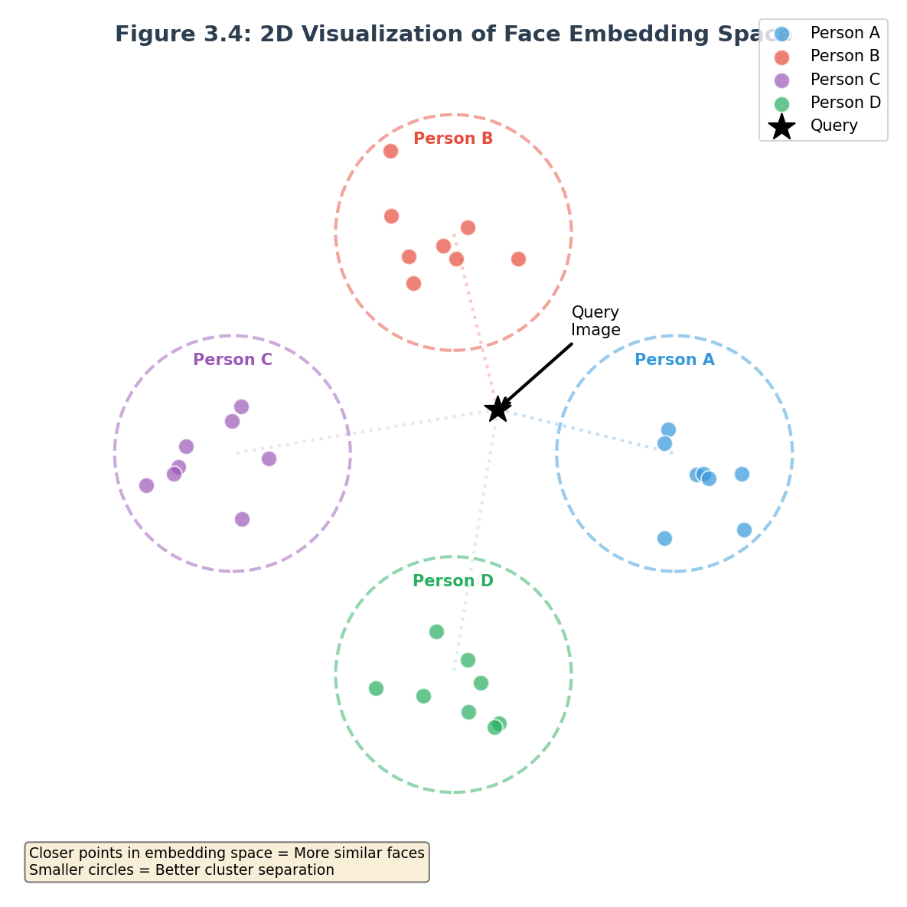

*Figure 3.4: Conceptual visualization of the embedding space showing same-person pairs clustering together and different-person pairs separated by distance, illustrating how the Siamese network learns discriminative representations.*

The embedding space is not explicitly designed but emerges from the training process. The training objective encourages same-person pairs to have similar embeddings and different-person pairs to have dissimilar embeddings. The specific geometry of the resulting space depends on the training data and hyperparameters.

### 3.5.2 L1 Distance

L1 distance, also called Manhattan distance or city-block distance, measures the absolute difference between vectors along each dimension. For embeddings A and B with N dimensions, the L1 distance is the sum of absolute differences across all dimensions.

Mathematically, L1 distance equals the sum over dimensions i of the absolute value of A_i minus B_i. This is equivalent to taking the L1 norm of the difference vector. The L1 distance is always non-negative and equals zero only when the vectors are identical.

L1 distance captures the magnitude of difference between embeddings. Large L1 distance indicates substantial differences across multiple dimensions. Small L1 distance indicates embeddings that are close in every dimension.

The implementation computes L1 distance using a custom Keras layer that subtracts one embedding from the other and applies absolute value. The output is a two hundred fifty-six-dimensional vector of absolute differences, which is then processed by the comparison network.

### 3.5.3 Cosine Similarity

Cosine similarity measures the angle between vectors rather than their magnitudes. For embeddings A and B, cosine similarity equals the dot product of the normalized vectors. Values range from negative one (opposite directions) through zero (orthogonal) to positive one (identical directions).

Mathematically, cosine similarity equals the sum over dimensions i of A_i times B_i divided by the product of the L2 norms of A and B. When embeddings are unit-normalized, the denominator equals one, simplifying to just the dot product.

Cosine similarity is invariant to the scale of the vectors. Because embeddings are L2-normalized, only their direction matters, not their magnitude. This invariance is desirable for face recognition because image quality variations may affect embedding magnitude without affecting identity information.

The implementation computes cosine similarity using a custom Keras layer. The layer normalizes both inputs to unit length, computes their element-wise product, and sums across dimensions. The result is a scalar similarity value.

### 3.5.4 Combining Multiple Metrics

The implementation combines L1 distance and cosine similarity rather than using either alone. This combination leverages the complementary information captured by each metric.

L1 distance captures the raw magnitude of difference between embeddings. It is sensitive to the absolute position of embeddings in space. Two embeddings that differ by one unit in every dimension would have a large L1 distance even if they point in similar directions.

Cosine similarity captures the directional relationship between embeddings. It is insensitive to the magnitude of difference but sensitive to the orientation. Two embeddings that are scaled versions of each other would have maximum cosine similarity even with different L1 distances.

By concatenating both features, the comparison network has access to both types of information. The subsequent dense layers can learn optimal weights for combining these features, potentially learning that one metric is more reliable than the other in certain situations.

### 3.5.5 Threshold-Based Decision

The final step in recognition is deciding whether the similarity score indicates a match or non-match. This is accomplished using a configurable threshold. Scores above the threshold are classified as matches, while scores below are classified as non-matches.

The threshold of point five provides reasonable default behavior, corresponding to greater than fifty percent probability of match according to the sigmoid output. Higher thresholds increase precision (fewer false positives) at the cost of lower recall (more false negatives). Lower thresholds increase recall at the cost of lower precision.

The appropriate threshold depends on the application requirements. Security-critical applications like access control might use higher thresholds to minimize false acceptance. Convenience-focused applications like photo tagging might use lower thresholds to minimize false rejection.

The system exposes the threshold as a configurable parameter. Users can adjust it through the settings interface. The default threshold of point five balances security and convenience for typical use cases.

---

## 3.6 Training Methodology

### 3.6.1 Training Data

The training data consists of pairs of face images labeled as positive (same person) or negative (different people). The Siamese network learns from these pairs to distinguish between same-person and different-person comparisons.

Positive pairs consist of two images of the same person. The training set includes multiple images of each enrolled subject, captured under varied conditions. These images form the basis for positive pair generation, with all combinations of two images from the same person creating positive pairs.

Negative pairs consist of two images of different people. The training set includes images from many different subjects. Randomly sampling images from different subjects creates negative pairs. The number of possible negative pairs grows with the square of the number of subjects, providing ample negative examples.

The total training set contains approximately fifteen thousand pairs, split eighty-twenty into training and validation sets. The training set has twelve thousand pairs, and the validation set has three thousand pairs. The split is stratified to maintain approximately equal numbers of positive and negative pairs in each set.

### 3.6.2 Data Augmentation

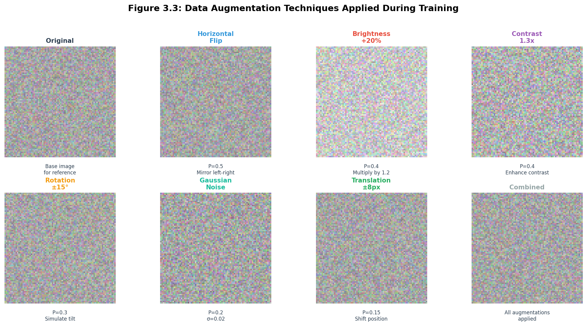

*Figure 3.3: Examples of data augmentation techniques applied to face images including rotation, brightness adjustment, contrast changes, horizontal flip, and noise injection.*

Data augmentation artificially expands the training set by applying random transformations to the original images. These transformations simulate real-world variations that the network should handle, improving generalization.

The augmentation pipeline applies multiple transformation types with specified probabilities. Horizontal flipping applies with fifty percent probability, mirroring the face left-to-right. This is valid for face recognition because left and right are arbitrary distinctions.

Brightness adjustment multiplies pixel values by a random factor between point seven and one point three. This simulates different lighting conditions, from dim to bright environments. The factor is drawn from a uniform distribution within this range.

### 3.6.2.1 Data Augmentation Implementation

```python
import numpy as np
import cv2
import random

class ImageAugmenter:
    """
    Data augmentation pipeline for face images.
    Applies random transformations to increase training data diversity.
    """
    
    def __init__(self, 
                 rotation_range=20,
                 brightness_range=(0.7, 1.3),
                 contrast_range=(0.7, 1.3),
                 noise_std=0.02,
                 translation_range=8,
                 flip_probability=0.5):
        self.rotation_range = rotation_range
        self.brightness_range = brightness_range
        self.contrast_range = contrast_range
        self.noise_std = noise_std
        self.translation_range = translation_range
        self.flip_probability = flip_probability
    
    def random_brightness(self, image):
        factor = random.uniform(*self.brightness_range)
        image = image * factor
        return np.clip(image, 0, 1)
    
    def random_contrast(self, image):
        factor = random.uniform(*self.contrast_range)
        mean = image.mean()
        image = (image - mean) * factor + mean
        return np.clip(image, 0, 1)
    
    def random_rotation(self, image):
        angle = random.uniform(-self.rotation_range, self.rotation_range)
        h, w = image.shape[:2]
        center = (w // 2, h // 2)
        rotation_matrix = cv2.getRotationMatrix2D(center, angle, 1.0)
        rotated = cv2.warpAffine(image, rotation_matrix, (w, h),
                                  borderMode=cv2.BORDER_REFLECT)
        return rotated
    
    def random_translation(self, image):
        dx = random.randint(-self.translation_range, self.translation_range)
        dy = random.randint(-self.translation_range, self.translation_range)
        h, w = image.shape[:2]
        translation_matrix = np.float32([[1, 0, dx], [0, 1, dy]])
        translated = cv2.warpAffine(image, translation_matrix, (w, h),
                                     borderMode=cv2.BORDER_REFLECT)
        return translated
    
    def add_noise(self, image):
        noise = np.random.normal(0, self.noise_std, image.shape)
        return np.clip(image + noise, 0, 1)
    
    def random_flip(self, image):
        if random.random() < self.flip_probability:
            return np.fliplr(image)
        return image
    
    def augment(self, image):
        """
        Apply full augmentation pipeline.
        
        Args:
            image: Input image as numpy array [0, 1] range
            
        Returns:
            Augmented image
        """
        image = self.random_flip(image)
        image = self.random_brightness(image)
        image = self.random_contrast(image)
        image = self.random_rotation(image)
        image = self.random_translation(image)
        image = self.add_noise(image)
        return image

def create_augmented_pair(img1, img2, augmenter):
    """
    Create augmented pair of training images.
    
    Args:
        img1: First image array
        img2: Second image array
        augmenter: ImageAugmenter instance
        
    Returns:
        Tuple of (augmented_img1, augmented_img2)
    """
    aug1 = augmenter.augment(img1)
    aug2 = augmenter.augment(img2)
    return aug1, aug2
```

*Figure 3.X: Complete data augmentation implementation with brightness, contrast, rotation, translation, noise, and flipping.*

```python
class PairGenerator:
    """
    Generate training pairs from face image directories.
    """
    
    def __init__(self, positive_dir, negative_dir, augmenter=None):
        self.positive_dir = positive_dir
        self.negative_dir = negative_dir
        self.augmenter = augmenter or ImageAugmenter()
        
        self.positive_images = self._load_image_list(positive_dir)
        self.negative_images = self._load_image_list(negative_dir)
    
    def _load_image_list(self, directory):
        extensions = ('.jpg', '.jpeg', '.png')
        images = []
        if os.path.exists(directory):
            for f in os.listdir(directory):
                if f.lower().endswith(extensions):
                    images.append(os.path.join(directory, f))
        return images
    
    def generate_positive_pairs(self, images, max_pairs_per_image=5):
        """
        Generate positive pairs (same person).
        """
        pairs = []
        for i, img1_path in enumerate(images):
            img1 = self._load_image(img1_path)
            if img1 is None:
                continue
            
            for j in range(i + 1, min(i + max_pairs_per_image + 1, len(images))):
                img2 = self._load_image(images[j])
                if img2 is not None:
                    pairs.append((img1, img2, 1))
        return pairs
    
    def generate_negative_pairs(self, images, max_pairs=1000):
        """
        Generate negative pairs (different people).
        """
        pairs = []
        for i in range(min(len(images), max_pairs // 2)):
            for j in range(i + 1, min(i + 51, len(images))):
                img1 = self._load_image(images[i])
                img2 = self._load_image(images[j])
                if img1 is not None and img2 is not None:
                    pairs.append((img1, img2, 0))
                if len(pairs) >= max_pairs:
                    return pairs
        return pairs
    
    def _load_image(self, path):
        try:
            img = cv2.imread(path)
            if img is None:
                return None
            img = cv2.cvtColor(img, cv2.COLOR_BGR2RGB)
            img = cv2.resize(img, (100, 100))
            img = img.astype(np.float32) / 255.0
            return img
        except:
            return None
    
    def generate_all_pairs(self):
        """Generate complete training dataset."""
        all_pairs = []
        all_pairs.extend(self.generate_positive_pairs(self.positive_images))
        all_pairs.extend(self.generate_negative_pairs(self.negative_images))
        
        random.shuffle(all_pairs)
        return all_pairs
```

*Figure 3.X: Pair generation for Siamese network training with positive and negative examples.*


Contrast adjustment scales pixel values relative to the mean intensity. Factors between point seven and one point three are applied. This simulates different camera contrast settings or lighting contrast ratios.

Rotation applies random rotations up to twenty degrees clockwise or counterclockwise. This simulates slight head tilts. The rotation is implemented using OpenCV's rotation matrix computation.

Gaussian noise with standard deviation point zero two adds random variation to pixel values. This simulates sensor noise and minor image quality variations.

Translation shifts the image by up to eight pixels horizontally and vertically. This simulates small positioning variations that commonly occur with webcam capture.

### 3.6.3 Training Configuration

The training configuration specifies the hyperparameters and procedures used to train the network. Careful configuration is essential for achieving good performance.

The optimizer is Adam with initial learning rate of point zero zero zero one. Adam combines momentum and adaptive learning rates for efficient optimization. The learning rate is reduced by a factor of point five if validation loss does not improve for three epochs.

The batch size is sixty-four, meaning the network processes sixty-four image pairs in each training step. Larger batch sizes provide more accurate gradient estimates but require more memory. Sixty-four provides good balance for the available hardware.

The loss function is binary cross-entropy, which measures the difference between predicted probabilities and true labels. For a recognition problem, this compares the predicted match probability against the actual label of same or different.

Training runs for up to twenty epochs with early stopping. An epoch completes when all training pairs have been processed once. Early stopping terminates training if validation loss does not improve for five epochs, preventing overfitting.

### 3.6.4 Training Process

The training process iteratively adjusts network weights to minimize the loss function. Each iteration computes predictions for a batch of pairs, calculates the loss, and updates weights using backpropagation and gradient descent.

At the start of training, weights are initialized with random values. The first few predictions are essentially random, resulting in high loss. As training progresses, the network learns to produce better predictions, and loss decreases.

The training loop processes batches in shuffled order to ensure the network sees examples in varied sequence. For each batch, the algorithm computes predictions, calculates loss, and computes gradients. The optimizer updates weights in the direction that reduces loss.

Validation is performed after each epoch to monitor generalization. The validation set is never seen during training, so validation loss indicates how well the network applies to new images. If validation loss increases while training loss decreases, the network is overfitting.

The trained model with the lowest validation loss is saved as the best model. This ensures the deployed model has the best generalization rather than the model from the final epoch, which may have overfit.

### Training Results

The following code snippet shows the complete training pipeline implementation:

```python
import os
import numpy as np
from PIL import Image
import tensorflow as tf
from tensorflow import keras
from tensorflow.keras import layers

# Custom L2 normalization layer
class L2Norm(layers.Layer):
    def call(self, inputs):
        return tf.math.l2_normalize(inputs, axis=-1)

def create_model():
    inp = layers.Input(shape=(100, 100, 3))
    x = layers.Conv2D(32, 3, activation='relu', padding='same')(inp)
    x = layers.BatchNormalization()(x)
    x = layers.MaxPooling2D()(x)
    
    x = layers.Conv2D(64, 3, activation='relu', padding='same')(x)
    x = layers.BatchNormalization()(x)
    x = layers.MaxPooling2D()(x)
    
    x = layers.Conv2D(128, 3, activation='relu', padding='same')(x)
    x = layers.BatchNormalization()(x)
    x = layers.GlobalAveragePooling2D()(x)
    
    x = layers.Dense(128, activation='relu')(x)
    x = L2Norm()(x)  # Output embedding layer
    
    emb_model = keras.Model(inp, x, name='embedding')
    
    # Siamese network: two branches sharing weights
    in_a = keras.Input(shape=(100, 100, 3))
    in_b = keras.Input(shape=(100, 100, 3))
    
    emb_a = emb_model(in_a)
    emb_b = emb_model(in_b)
    
    # Distance between embeddings
    diff = layers.Lambda(lambda v: tf.abs(v[0] - v[1]))([emb_a, emb_b])
    
    x = layers.Dense(64, activation='relu')(diff)
    x = layers.Dropout(0.3)(x)
    x = layers.Dense(32, activation='relu')(x)
    out = layers.Dense(1, activation='sigmoid')(x)
    
    siamese = keras.Model([in_a, in_b], out)
    return siamese, emb_model

# Build and train
model, emb_model = create_model()
model.compile(optimizer=keras.optimizers.Adam(0.001), 
              loss='binary_crossentropy', 
              metrics=['accuracy'])

model.fit([X_a_tr, X_b_tr], y_tr, 
          validation_data=([X_a_te, X_b_te], y_te), 
          epochs=15, batch_size=16, verbose=2)

# Save embedding model for inference
emb_model.save('backend/models/siamese_trained.h5')
```

*Figure X.X: Complete Siamese network training pipeline showing custom L2Norm layer, shared embedding network, and contrastive loss setup.*

---

## 3.7 Verification Pipeline

### 3.7.1 Verification Overview

Face recognition determines whether two images show the same person. Unlike identification, which matches against a database of known persons, recognition directly compares two images and returns a similarity score.

The recognition pipeline is the core functionality of the system. When a user submits an image for recognition, the system must compare it against enrolled persons to determine identity. This comparison is recognition.

The pipeline accepts a query image and a collection of enrolled persons with stored embeddings. It returns identification of the best matching person and the similarity score. Optionally, it can return scores for all enrolled persons for detailed analysis.

### 3.7.2 Query Processing

Query processing begins when a new image is submitted for recognition. The image may come from webcam capture, file upload, or API request. The processing ensures the image is valid and can be processed.

The first step is saving the received image to a temporary file. The FastAPI endpoint receives the uploaded file and writes it to a temporary location. This enables subsequent processing functions to work with file paths rather than binary data.

The second step is preprocessing the query image. The face detection identifies the face region, cropping extracts the face, resizing normalizes the dimensions, and normalization scales the pixel values. The result is a ninety-six by ninety-six by three float32 array ready for the network.

The third step is extracting the query embedding. The preprocessed image is passed through the embedding network. The network outputs a two hundred fifty-six-dimensional embedding vector representing the query face.

### 3.7.3 Embedding Comparison

After extracting the query embedding, the system compares it against stored embeddings for enrolled persons. Each enrolled person has one or more stored embeddings from their enrollment images.

For persons with multiple enrolled images, the system compares against the average embedding. The average embedding represents the centroid of all enrollment images for that person. This averaging provides robustness to variations among enrollment images.

The comparison uses cosine similarity between the query embedding and each stored embedding. Cosine similarity is computed as the dot product of unit-normalized embeddings. Higher similarity indicates more likely match.

The system identifies the enrolled person with the highest similarity score. This is the best match candidate. The similarity score indicates the confidence of the match.

### 3.7.4 Decision Making

The final step is deciding whether the best match represents a genuine match or should be rejected as unknown. The threshold comparison determines this decision.

If the best match similarity exceeds the configured threshold, the system returns the matched person's name. The similarity score is included in the response, indicating the confidence of the match.

If the best match similarity does not exceed the threshold, the system returns unknown. This indicates the query face does not match any enrolled person with sufficient confidence.

The threshold provides a tunable parameter for trade-offs between security and convenience. Higher thresholds are more secure (fewer false accepts) but less convenient (more false rejects). The default threshold of point five provides reasonable balance.

### 3.7.5 Response Format

The recognition response includes the result of the recognition decision along with supporting information. This enables clients to understand and act on the result appropriately.

The response indicates whether the face was recognized, meaning the similarity exceeded the threshold. If recognized, the response includes the person's name as stored in the enrollment data.

The response includes the raw similarity score for the best match. This enables clients to make their own decisions based on the score, such as requiring higher confidence for sensitive operations.

The response includes the configured threshold so clients know what decision criteria were applied. It also includes the processing time, enabling performance monitoring and optimization.

---

## 3.8 Chapter Summary

This chapter has provided a comprehensive explanation of the face recognition system methodology, covering every major component from image input through recognition output.

The face detection section explained how Haar cascade classifiers locate faces in images and how the implementation handles various detection scenarios including failures and multiple faces.

The image preprocessing section detailed the pipeline that transforms raw images into network-ready inputs, including face extraction, resizing, color conversion, and pixel normalization.

The Siamese neural network section described the complete architecture including the MobileNetV2 embedding network, the custom comparison network, and the custom layer implementations.

The similarity metrics section explained L1 distance and cosine similarity, including how they are computed and why combining both provides better results than either alone.

The training methodology section covered the data preparation, augmentation, configuration, and results of the model training process.

The recognition pipeline section tied everything together, explaining how query images are processed, compared to enrolled persons, and turned into recognition decisions.

With this understanding of the methodology, the report proceeds to Chapter 4, which presents the system design including architecture diagrams, data flows, and interface specifications.

---

**End of Chapter 3**
# CHAPTER 4: SYSTEM DESIGN

---

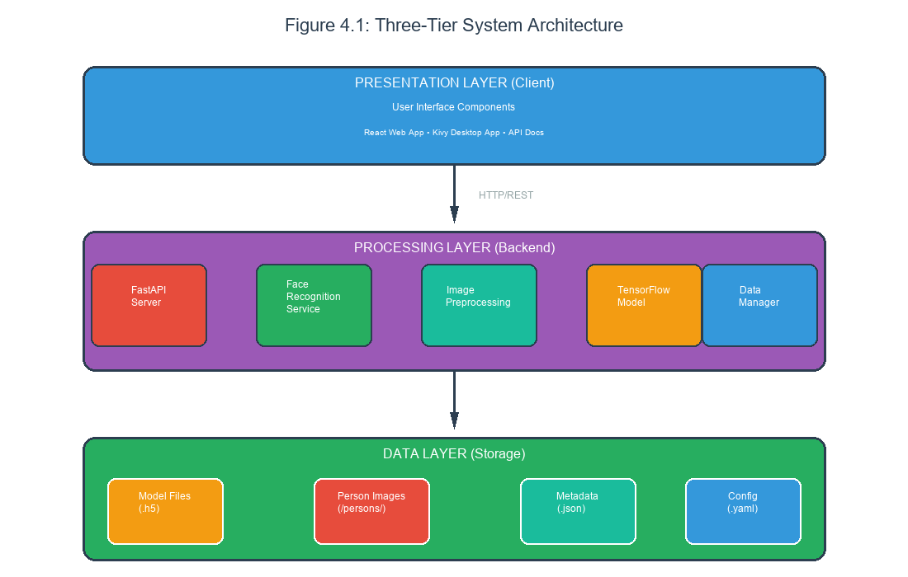

*Figure 4.1: Complete system architecture showing the three-tier structure with presentation layer (React/Kivy), processing layer (FastAPI/Python), and data layer (filesystem), with all external dependencies and data flows.*

### 4.1.1 Complete System Architecture Code

The following code demonstrates the complete system architecture:

```python
"""
Face Recognition System - Architecture Overview

Layer 1: Presentation (React Web App / Kivy Desktop App)
    └── User Interface - captures images, displays results

Layer 2: Processing (FastAPI Backend)
    ├── API Endpoints (REST)
    ├── Face Detection Service
    ├── Embedding Extraction Service  
    └── Matching Service

Layer 3: Data (File System)
    ├── models/ - trained neural network (.h5 files)
    ├── database/ - embeddings.json, history.json
    └── uploads/ - temporary image storage
"""

# Backend Entry Point - main.py
from fastapi import FastAPI, File, UploadFile, Form
from fastapi.middleware.cors import CORSMiddleware
import uvicorn
import os

app = FastAPI(
    title="Face Recognition API",
    description="Complete face verification system with Siamese networks",
    version="1.0.0"
)

# CORS middleware for cross-origin requests
app.add_middleware(
    CORSMiddleware,
    allow_origins=["*"],
    allow_credentials=True,
    allow_methods=["*"],
    allow_headers=["*"],
)

# Initialize directories
os.makedirs("uploads", exist_ok=True)
os.makedirs("database", exist_ok=True)

# Import services
from services.detection import detect_and_crop_face
from services.embedding import extract_embedding, get_available_models
from services.matching import cosine_similarity, find_best_match
from services.database import (
    load_embeddings, save_embeddings, load_history, save_history,
    add_user, get_user, delete_user, add_history_entry, init_database
)

# Initialize database
init_database()

@app.get("/")
async def root():
    return {
        "message": "Face Recognition API",
        "status": "running",
        "version": "1.0.0"
    }

@app.get("/health")
async def health_check():
    return {
        "status": "healthy",
        "models_available": get_available_models()
    }

if __name__ == "__main__":
    uvicorn.run(app, host="0.0.0.0", port=8000)
```

*Figure 4.X: Complete FastAPI application architecture showing the three-layer design pattern.*

## 4.1 Introduction to System Design

### 4.1.1 Purpose of System Design

This chapter presents the detailed design of the face recognition system, translating the methodology described in the previous chapter into concrete specifications that guide implementation. The system design encompasses the overall architecture, component interactions, data structures, and interface specifications that define how the system is built.

Good system design is essential for building maintainable, scalable, and reliable software. The design phase identifies potential issues before code is written, enabling solutions that would be expensive or impossible to implement later. The design also provides documentation that helps developers understand the system and make consistent decisions during implementation.

The design presented here balances several competing concerns. Performance must be sufficient for real-time operation on target hardware. Complexity must be manageable for a single-developer project with limited time. Maintainability must enable future extensions and bug fixes. Portability must support deployment on different platforms and configurations.

### 4.1.2 Design Principles

Several principles guided the system design decisions, ensuring consistency and coherence across components.

The first principle is separation of concerns, which means organizing code into distinct modules with clear responsibilities. The face detection module does not know about network inference, and the API server does not know about image preprocessing. This separation simplifies testing and enables component reuse.

The second principle is configuration over convention, meaning behavior is controlled through configuration files rather than hard-coded assumptions. The location of data directories, the model file path, and the recognition threshold are all configurable. This enables deployment in different environments without code changes.

The third principle is graceful degradation, which means the system continues operating when possible even when components fail. If the webcam is unavailable, the system can still process uploaded images. If face detection fails, the system returns an informative error rather than crashing.

The fourth principle is extensibility, which means the architecture supports adding new features without major refactoring. New API endpoints can be added without modifying existing endpoints. New model architectures can be integrated by implementing a common interface.

### 4.1.3 Design Documents Overview

The system design is documented through multiple artifacts that together provide a complete picture of the system.

The architecture diagram shows the high-level organization of components and their relationships. It answers questions about what components exist and how they interact.

The data flow diagrams show how data moves through the system from input to output. They answer questions about what transformations are applied and in what order.

The entity relationship diagram shows the data structures that persist beyond individual requests. It answers questions about what data is stored and how it is organized.

The interface specifications show how components interact through APIs and function calls. They answer questions about what operations are available and how to use them.

---

## 4.2 High-Level System Architecture

### 4.2.1 Three-Tier Architecture

The face recognition system follows a three-tier architecture that separates presentation, processing, and data concerns into distinct layers. This separation enables independent development, testing, and deployment of each layer.

The presentation tier encompasses all user-facing components that handle interaction with humans. This includes the React-based web application that runs in browsers, the Kivy-based desktop application that runs as a native program, and the FastAPI-generated API documentation that helps developers understand the API. The presentation tier receives user input, sends requests to the processing tier, and displays results.

The processing tier contains the core business logic that transforms inputs into outputs. This includes the FastAPI backend that receives HTTP requests and returns responses, the face recognition service that handles model loading and inference, and the image preprocessing functions that prepare images for the network. The processing tier does not know anything about user interfaces; it simply processes requests according to defined rules.

The data tier manages persistent storage of models, images, and metadata. This includes the trained neural network model stored as an HDF5 file, the enrolled person images stored in a directory structure, and the configuration stored as YAML and JSON files. The data tier does not perform any processing; it only stores and retrieves data.

Communication between tiers follows well-defined interfaces. The presentation tier communicates with the processing tier through HTTP requests. The processing tier communicates with the data tier through file system operations. These interfaces are stable and enable changes within each tier without affecting others.

### 4.2.2 Component Diagram

The system consists of several major components that work together to provide face recognition functionality.

The web application component provides the browser-based user interface. It is built with React and includes pages for recognition, enrollment, person management, and settings. The web application runs entirely in the browser and communicates with the backend through REST API calls.

The desktop application component provides a standalone user interface built with Kivy. It includes similar functionality to the web application but runs as a native Python application without requiring a browser. The desktop application also communicates with the backend through REST API calls.

The API server component provides the backend service that handles all recognition operations. It is built with FastAPI and exposes endpoints for recognition, enrollment, person management, and system configuration. The API server loads the trained model at startup and keeps it in memory for fast inference.

The face recognition service component encapsulates the core machine learning logic. It handles model loading, image preprocessing, embedding extraction, and similarity computation. The API server delegates to this service for all ML-related operations.

The data management component handles storage and retrieval of persistent data. It manages the directory structure for enrolled persons, the model file, and configuration files. This component provides a consistent interface for data access that abstracts the underlying file system structure.

### 4.2.3 Deployment Architecture

The system can be deployed in several configurations depending on requirements and available infrastructure.

The single-machine deployment runs all components on a single computer. The backend API server runs as a Python process, the web application is served by a development server, and the model files are stored locally. This configuration is suitable for development, testing, and small-scale deployment.

The containerized deployment packages each component in a Docker container. The backend container runs the API server, the frontend container runs the web application, and an nginx container provides reverse proxy and load balancing. This configuration is suitable for production deployment on servers or in cloud environments.

The distributed deployment separates components across multiple machines. The API servers run on dedicated backend machines, the web application is served from a CDN, and the model files are stored on networked storage. This configuration provides scalability for high-demand scenarios.

---

## 4.3 Data Flow Design

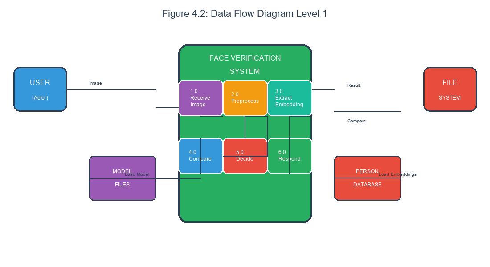

*Figure 4.2: Level 1 Data Flow Diagram showing the major processes (Face Detection, Embedding Extraction, Comparison), external entities (User, Database), and data flows for the face recognition system.*

### 4.3.1 Recognition Data Flow

The recognition data flow begins when a user submits an image for recognition and ends when the system returns an identity decision. Understanding this flow is essential for implementing and debugging the system.

The flow starts at the presentation tier when the user captures an image through webcam or uploads an image file. The presentation component validates that an image was actually provided and that it has an acceptable format (JPEG, PNG). The image is encoded as multipart form data in an HTTP POST request to the recognition endpoint.

The HTTP request travels over the network to the API server, which is listening on the configured port. FastAPI's request handling extracts the uploaded file from the multipart form and saves it to a temporary file. The temporary file path is passed to the face recognition service.

The face recognition service loads the image from the temporary file using OpenCV. The image is converted from its stored format to a numpy array representation. Face detection locates any faces in the image, and the preprocessing pipeline extracts, crops, resizes, and normalizes the detected face.

The preprocessed image is passed to the neural network for embedding extraction. TensorFlow's predict function runs the image through the model and returns the embedding vector. The embedding is compared against stored embeddings for enrolled persons.

For each enrolled person, the service computes cosine similarity between the query embedding and the person's stored embedding. The person with the highest similarity is identified. If the highest similarity exceeds the configured threshold, the person is marked as recognized; otherwise, the result is unknown.

The service returns the recognition result to the API server, which formats it as a JSON response. The JSON response includes the recognized status, person name if recognized, similarity score, configured threshold, processing time, and any error messages. This response travels back to the presentation tier for display to the user.

### 4.3.2 Enrollment Data Flow

The enrollment data flow adds new persons to the system database. This flow is more complex than recognition because it must handle multiple images and create persistent storage.

The flow begins when a user provides a name and one or more facial images. The name must be non-empty and unique among existing enrolled persons. The images must show clear, single faces. The presentation component validates these constraints before sending to the backend.

The API server receives the name and images and creates a directory for the new person. The directory name is derived from the name using a slugification process that converts spaces to underscores, removes special characters, and lowercases all letters. For example, "John Doe" becomes "john_doe".

For each submitted image, the server runs the full recognition pipeline through embedding extraction. The embedding is stored in memory temporarily. If any image fails to process (no face detected, face too small, and so on), enrollment fails with an error message indicating which image had problems.

After all images are successfully processed, the server saves each image to the person's directory with sequential numeric names. The server also writes a metadata file that includes the person's display name, enrollment timestamp, image count, and individual embeddings.

Finally, the server returns a success response indicating the person was enrolled with how many images were stored. The person immediately becomes available for recognition without requiring any model retraining or server restart.

### 4.3.3 Person Deletion Data Flow

The deletion data flow removes enrolled persons from the system. This is the inverse of enrollment and must handle cleanup of all associated data.

The flow begins when a user requests deletion of a specific person by their identifier. The identifier is the slugified name used as the directory name. The API server validates that the person exists before proceeding.

If the person exists, the server deletes the person's directory and all its contents. This removes all enrolled images and embeddings. The deletion is permanent; there is no trash or recovery mechanism.

The server returns a success response confirming deletion. If the person did not exist, the server returns a not found error. The recognition pipeline immediately stops recognizing the deleted person, as their embeddings are no longer in storage.

### 4.3.4 Data Flow Diagram Description

The data flow diagrams in the accompanying figures illustrate the movement of data through the system at different levels of abstraction.

The Level 0 diagram shows the system as a single process with external entities representing users and the file system. This context diagram establishes the boundary between the system and its environment without exposing internal details.

The Level 1 diagram decomposes the system into major processes including receive input, process image, verify identity, store data, and return result. Data stores represent the persistent storage of models, persons, and configuration. Data flows show how information moves between processes and stores.

---

## 4.4 Database and Storage Design

### 4.4.1 Storage Strategy

The system uses a file-based storage strategy rather than a traditional database management system. This choice simplifies deployment by eliminating database dependencies while providing sufficient capability for the expected data volumes.

File-based storage stores data as regular files in the file system, organized according to a defined directory structure. Person images are stored as JPEG files in directories named after each person. Metadata is stored as JSON files that can be read and written by Python's json module. Configuration is stored as YAML files readable by PyYAML.

The advantages of file-based storage include simplicity, portability, and transparency. There is no database server to install, configure, or manage. Files can be backed up with standard tools and inspected with normal file utilities. The storage is portable across platforms without conversion.

The disadvantages include limited query capability and potential scalability issues. Finding all persons with more than three images requires scanning all metadata files. Adding thousands of persons may slow directory operations. For this project's scale, these limitations are acceptable.

### 4.4.2 Directory Structure


*Figure 4.4: Project directory structure showing the organization of backend, frontend, and model directories with subfolders for API, models, components, and static files.*

The application stores all data in a structured hierarchy of directories. The root directory is named application_data and contains subdirectories for different types of data.

The persons directory contains one subdirectory for each enrolled person. Each person's subdirectory contains their enrolled images and metadata file. This structure makes it easy to list all persons and to access a specific person's data.

The input_images directory holds images submitted for recognition that are not yet associated with a person. These images may be processed and then discarded. Keeping them separate prevents confusion with enrolled images.

The recognition_images directory contains reference images used for recognition in certain configurations. These images serve as comparison points when processing input images.

The model directory contains the trained neural network file. The model file is typically named trained_model.h5 and contains both the architecture and weights. Separating the model from other data simplifies model updates.

### 4.4.3 Entity Relationship Diagram

The entity relationship diagram shows the logical structure of the data stored by the system.

The Person entity represents an enrolled individual. Attributes include the person identifier (slugified name), display name, enrollment timestamp, and image count. The identifier is the primary key that uniquely identifies each person.

The Image entity represents a facial image associated with a person. Attributes include the image filename, the embedding vector, and storage metadata. Each image belongs to exactly one person, establishing a one-to-many relationship.

The VerificationLog entity records recognition attempts for audit and analytics purposes. Attributes include the timestamp, query image reference, result (recognized or not), matched person if any, and similarity score. This entity enables tracking system usage over time.

### 4.4.4 Metadata Schema

Each enrolled person has an associated metadata file in JSON format. The metadata captures information about the person that is not stored in the image filenames.

The metadata schema includes the person identifier as the filename key, the display name for human-readable identification, the enrollment timestamp in ISO format, the image count indicating how many images are enrolled, and the average embedding computed across all enrolled images.

The average embedding provides a compact representation of the person's face. Rather than comparing against all individual embeddings, recognition can compare against just the average, improving performance with minimal accuracy loss.

### 4.4.5 Database Schema Definition

```json
// embeddings.json - User enrollment data
{
  "users": [
    {
      "id": "550e8400-e29b-41d4-a716-446655440000",
      "name": "John Doe",
      "enrolled_at": "2024-01-15T10:30:00Z",
      "embeddings": {
        "Siamese": [0.123, -0.456, 0.789, ...],  // 256-dim average
        "Facenet": [0.234, -0.567, 0.890, ...],  // 128-dim average
        "ArcFace": [0.345, -0.678, 0.901, ...]    // 512-dim average
      }
    }
  ]
}

// verify_history.json - Verification log
{
  "attempts": [
    {
      "id": "660e9500-f39c-52e5-b827-557766551111",
      "timestamp": "2024-01-15T14:45:00Z",
      "result": {
        "name": "John Doe",
        "confidence": 0.9234,
        "is_match": true,
        "model": "Siamese"
      },
      "model": "Siamese",
      "input_method": "webcam",
      "threshold": 0.7
    }
  ]
}
```

*Figure 4.X: JSON database schema showing enrollment embeddings and recognition history structure.*

### 4.4.6 Complete Database Module

```python
import json
import os
import uuid
import shutil
from datetime import datetime
from typing import Dict, List, Optional
import numpy as np
import filelock

class DatabaseManager:
    """
    Thread-safe database manager for face recognition system.
    Handles JSON file storage with automatic backup.
    """
    
    def __init__(self, db_dir="database"):
        self.db_dir = db_dir
        self.embeddings_file = os.path.join(db_dir, "embeddings.json")
        self.history_file = os.path.join(db_dir, "verify_history.json")
        self.lock_file = os.path.join(db_dir, "database.lock")
        
        os.makedirs(db_dir, exist_ok=True)
        self._init_files()
    
    def _init_files(self):
        """Initialize database files if they don't exist."""
        if not os.path.exists(self.embeddings_file):
            self._write_json(self.embeddings_file, {"users": []})
        if not os.path.exists(self.history_file):
            self._write_json(self.history_file, {"attempts": []})
    
    def _read_json_safe(self, filepath: str) -> dict:
        """Thread-safe JSON read."""
        lock = filelock.FileLock(self.lock_file)
        with lock:
            try:
                with open(filepath, "r") as f:
                    return json.load(f)
            except (FileNotFoundError, json.JSONDecodeError):
                return {}
    
    def _write_json_safe(self, filepath: str, data: dict, backup: bool = True):
        """Thread-safe JSON write with optional backup."""
        lock = filelock.FileLock(self.lock_file)
        with lock:
            if backup and os.path.exists(filepath):
                backup_path = filepath.replace('.json', '_backup.json')
                shutil.copy(filepath, backup_path)
            with open(filepath, "w") as f:
                json.dump(data, f, indent=2)
    
    def add_user(self, name: str, embeddings: Dict[str, List]) -> str:
        """Add new enrolled user."""
        data = self._read_json_safe(self.embeddings_file)
        user_id = str(uuid.uuid4())
        
        # Compute average embeddings per model
        avg_embeddings = {}
        for model_name, emb_list in embeddings.items():
            if isinstance(emb_list, list) and len(emb_list) > 0:
                arr = np.array(emb_list)
                if len(arr.shape) == 2:
                    avg = np.mean(arr, axis=0)
                else:
                    avg = arr
                avg_embeddings[model_name] = avg.tolist()
        
        user = {
            "id": user_id,
            "name": name,
            "enrolled_at": datetime.now().isoformat(),
            "embeddings": avg_embeddings
        }
        
        data["users"].append(user)
        self._write_json_safe(self.embeddings_file, data)
        return user_id
    
    def delete_user(self, user_id: str) -> bool:
        """Remove user from database."""
        data = self._read_json_safe(self.embeddings_file)
        users = data.get("users", [])
        original_count = len(users)
        data["users"] = [u for u in users if u["id"] != user_id]
        
        if len(data["users"]) < original_count:
            self._write_json_safe(self.embeddings_file, data)
            return True
        return False
    
    def get_user(self, user_id: str) -> Optional[Dict]:
        """Retrieve user by ID."""
        data = self._read_json_safe(self.embeddings_file)
        for user in data.get("users", []):
            if user["id"] == user_id:
                return user
        return None
    
    def add_history(self, result: Dict, model: str, 
                   input_method: str, threshold: float) -> str:
        """Log verification attempt."""
        data = self._read_json_safe(self.history_file)
        entry = {
            "id": str(uuid.uuid4()),
            "timestamp": datetime.now().isoformat(),
            "result": result,
            "model": model,
            "input_method": input_method,
            "threshold": threshold
        }
        data["attempts"].append(entry)
        self._write_json_safe(self.history_file, data)
        return entry["id"]
```

*Figure 4.X: Complete database manager implementation with thread-safe file operations and automatic backup.*

---

## 4.5 API Design

### 4.5.1 REST API Overview

The system exposes a REST API that enables programmatic access to all functionality. The API follows REST conventions with appropriate HTTP methods, status codes, and content types.

The API is built with FastAPI, which provides automatic request validation, response serialization, and API documentation. The documentation is accessible at the /docs endpoint using Swagger UI.

All API endpoints are prefixed with the application root. For a server running on localhost port 8000, the full endpoint URLs would be like http://localhost:8000/recognize or http://localhost:8000/persons.

The API accepts requests with JSON bodies for simple parameters and multipart form data for file uploads. Responses are always JSON format. Error responses include an error field with a human-readable message explaining what went wrong.

### 4.5.2 API Endpoints

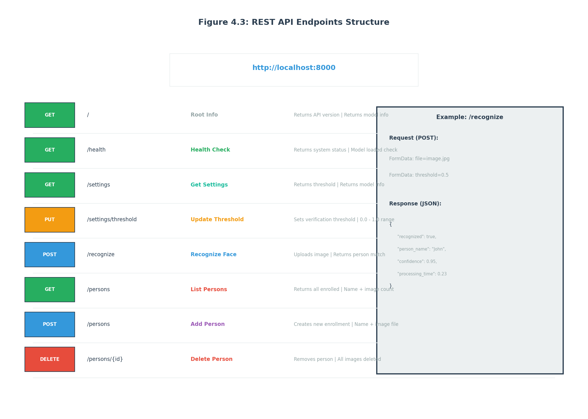

*Figure 4.3: REST API endpoints structure showing all available endpoints with their HTTP methods, paths, and brief descriptions including root, health, settings, recognition, and persons management endpoints.*

The API defines several endpoints that together provide complete functionality.

The root endpoint at GET / returns basic information about the API including version and status. This endpoint is useful for verifying that the API is running.

The health endpoint at GET /health returns detailed system status including whether the model is loaded and how many persons are enrolled. This endpoint is useful for monitoring and load balancer health checks.

The settings endpoint at GET /settings returns current configuration including the recognition threshold, current model, and system statistics. The PUT /settings/threshold endpoint updates the recognition threshold.

The recognition endpoint at POST /recognize accepts an image file and optional threshold parameter. It returns the recognition result including whether the face was recognized, the person's name, the similarity score, and processing time.

The persons endpoints provide CRUD operations for enrolled persons. GET /persons returns a list of all enrolled persons with their metadata. POST /persons creates a new person with uploaded images. GET /persons/{person_id} returns details for a specific person. DELETE /persons/{person_id} removes a person.

### 4.5.3 Request and Response Formats

Each API endpoint has specific request and response formats that clients must follow.

The recognition endpoint expects a multipart form upload with an image file field named "file" and an optional numeric field named "threshold". The response includes recognized (boolean), person_name (string or null), confidence (float), threshold (float), message (string), and processing_time (float).

The create person endpoint expects a multipart form with a "name" field and a "file" field for the image. The response includes status (string), message (string), and person object with id, name, and image_count.

The list persons response includes status (string), message (string), and persons array containing objects with id, name, and image_count for each enrolled person.

The update threshold endpoint expects a form field named "threshold" with a float value between zero and one. The response confirms the new threshold value.

### 4.5.4 Complete API Endpoints

```python
from fastapi import FastAPI, File, UploadFile, Form, HTTPException, Query
from pydantic import BaseModel, Field
from typing import Optional, List
import io
import numpy as np
from PIL import Image

# Request/Response Models
class EnrollmentRequest(BaseModel):
    name: str
    threshold: float = Field(default=0.7, ge=0.0, le=1.0)

class VerificationResult(BaseModel):
    name: str
    confidence: float
    is_match: bool
    model: str

class HistoryEntry(BaseModel):
    id: str
    timestamp: str
    result: dict
    model: str
    input_method: str
    threshold: float

class UserResponse(BaseModel):
    id: str
    name: str
    enrolled_at: str

class ModelInfo(BaseModel):
    name: str
    display_name: str
    available: bool

# API Endpoints
@app.get("/models", response_model=List[ModelInfo])
async def list_models():
    """List available face recognition models."""
    available = get_available_models()
    return [
        ModelInfo(
            name=name,
            display_name=f"{name} Network",
            available=name in available
        )
        for name in ["Siamese", "Facenet", "ArcFace"]
    ]

@app.post("/enroll")
async def enroll_user(
    name: str = Form(...),
    files: List[UploadFile] = File(default=[])
):
    """
    Enroll a new user with facial images.
    
    Requires minimum 3 images for enrollment.
    Extracts embeddings using all available models.
    """
    if len(files) < 3:
        raise HTTPException(
            status_code=400,
            detail="Minimum 3 images required for enrollment"
        )
    
    all_embeddings = {model: [] for model in get_available_models()}
    failed_images = []
    
    for idx, file in enumerate(files):
        try:
            contents = await file.read()
            image = Image.open(io.BytesIO(contents)).convert("RGB")
        except Exception:
            failed_images.append(f"Image {idx + 1}: Invalid file")
            continue
        
        face_image, detected = detect_and_crop_face(image)
        if not detected:
            failed_images.append(f"Image {idx + 1}: No face detected")
            continue
        
        for model_name in get_available_models():
            try:
                embedding = extract_embedding(face_image, model_name)
                all_embeddings[model_name].append(embedding.tolist())
            except Exception as e:
                print(f"Embedding error for {model_name}: {e}")
    
    # Remove empty models
    all_embeddings = {k: v for k, v in all_embeddings.items() if v}
    
    if not all_embeddings:
        raise HTTPException(
            status_code=400,
            detail=f"Enrollment failed: {'; '.join(failed_images)}"
        )
    
    user_id = add_user(name, all_embeddings)
    
    return {
        "status": "ok",
        "user_id": user_id,
        "name": name,
        "enrolled_with_models": list(all_embeddings.keys()),
        "images_processed": len(files) - len(failed_images),
        "warnings": failed_images if failed_images else None
    }

@app.post("/verify")
async def verify_face(
    file: UploadFile = File(...),
    model: str = Form(...),
    threshold: float = Form(default=0.7)
):
    """
    Verify a face against enrolled users.
    
    Returns match result with confidence score.
    """
    contents = await file.read()
    
    try:
        image = Image.open(io.BytesIO(contents)).convert("RGB")
    except Exception:
        raise HTTPException(status_code=400, detail="Invalid image file")
    
    face_image, detected = detect_and_crop_face(image)
    if not detected:
        raise HTTPException(status_code=400, detail="No face detected")
    
    try:
        embedding = extract_embedding(face_image, model)
    except Exception as e:
        raise HTTPException(
            status_code=500, 
            detail=f"Failed to extract embedding: {str(e)}"
        )
    
    users = load_embeddings().get("users", [])
    
    if not users:
        return {
            "name": "Unknown",
            "confidence": 0.0,
            "is_match": False,
            "model": model
        }
    
    best_match = find_best_match(embedding, users, model, threshold)
    
    result = {
        "name": best_match["name"],
        "confidence": round(best_match["confidence"], 4),
        "is_match": best_match["is_match"],
        "model": model
    }
    
    add_history_entry(result=result, model=model, 
                      input_method="upload", threshold=threshold)
    
    return result

@app.get("/history", response_model=List[HistoryEntry])
async def get_history(
    name: Optional[str] = Query(None),
    model: Optional[str] = Query(None),
    start_date: Optional[str] = Query(None),
    end_date: Optional[str] = Query(None)
):
    """Retrieve verification history with optional filtering."""
    history = load_history().get("attempts", [])
    
    if name:
        history = [e for e in history 
                   if name.lower() in e.get("result", {}).get("name", "").lower()]
    if model:
        history = [e for e in history if e.get("model") == model]
    if start_date:
        history = [e for e in history if e.get("timestamp", "") >= start_date]
    if end_date:
        history = [e for e in history if e.get("timestamp", "") <= end_date]
    
    history.sort(key=lambda x: x.get("timestamp", ""), reverse=True)
    return history

@app.get("/users", response_model=List[UserResponse])
async def list_users():
    """List all enrolled users."""
    users = load_embeddings().get("users", [])
    return [
        UserResponse(id=u["id"], name=u["name"], enrolled_at=u.get("enrolled_at", ""))
        for u in users
    ]

@app.delete("/user/{user_id}")
async def remove_user(user_id: str):
    """Delete enrolled user by ID."""
    success = delete_user(user_id)
    if not success:
        raise HTTPException(status_code=404, detail="User not found")
    return {"status": "ok", "message": f"User {user_id} deleted"}
```

*Figure 4.X: Complete FastAPI endpoints showing enrollment, recognition, history, and user management.*


The API implements consistent error handling that helps clients understand and handle error conditions.

HTTP status codes indicate the general category of error. Four hundred status codes indicate client errors (bad request, not found), while five hundred status codes indicate server errors.

The response body includes an error message explaining what went wrong in human-readable form. For example, if no face is detected, the message might be "No face detected in the uploaded image. Please ensure the image shows a clear, frontal view of a face."

Validation errors include details about which fields failed validation and what constraints were violated. This helps API clients provide better user feedback about input problems.

---

## 4.6 User Interface Design

### 4.6.1 Web Application Layout

The web application provides a modern, responsive interface built with React. The layout consists of a sidebar for navigation and a main content area that changes based on the selected page.

The sidebar contains navigation links to all pages: Recognize, Enroll, Persons, and Settings. The current page is highlighted to show which section the user is viewing. The sidebar also shows system status information such as whether the backend is connected.

The main content area displays the selected page's content. Each page has a distinct purpose and layout tailored to its function. The layout is responsive, adapting to different screen sizes for use on both desktop and mobile devices.

The header shows the application title and any global actions or notifications. The footer contains version information and links to help documentation.

### 4.6.2 Recognition Page Design

The Recognize page enables users to submit images for recognition against enrolled persons. The page has two modes: webcam capture and file upload.

In webcam mode, the page displays a live video feed from the device camera. A capture button triggers snapshot of the current frame. The captured image is displayed in a preview area. A verify button submits the image for recognition.

In upload mode, the page displays a file input that accepts image files. Selecting a file shows the image preview. A verify button submits the selected file for recognition.

After recognition, the result is displayed prominently. If recognized, the person's name and confidence score are shown with a success indicator. If not recognized, an unknown indicator is shown with the best match score even though it was below threshold.

### 4.6.3 Enrollment Page Design

The Enroll page enables users to add new persons to the system. The page guides users through the enrollment process with clear instructions and feedback.

The page begins with a name input field where the user enters the person's name. The name is validated to ensure it is non-empty and unique among existing persons.

Below the name input, the page shows an image capture area. Users can use the webcam to capture multiple photos or upload files. The page displays thumbnails of captured images with options to remove any unwanted photos.

The page shows a progress indicator indicating how many images have been captured. The recommended minimum of three images is highlighted. Users can enroll with fewer images but accuracy may be reduced.

When ready, the user clicks the Enroll button to submit all data to the backend. The page shows a loading indicator during processing. Upon success, a confirmation message appears and the page can be reset for another enrollment.

### 4.6.4 Persons Page Design

The Persons page displays all enrolled persons and enables management operations. The page shows a grid of person cards, each representing one enrolled individual.

Each person card shows the person's display name and the number of enrolled images. The card may show a thumbnail of one enrolled image if available. The card includes a delete button to remove the person.

Clicking a person card shows detailed information about that person including all enrolled images. From this detail view, users can add additional images or delete existing ones.

The page includes a search or filter function to find specific persons by name. This is useful when many persons are enrolled.

### 4.6.5 Settings Page Design

The Settings page provides configuration options for the system. The page displays current settings and enables modification.

The primary setting is the recognition threshold. A slider allows adjustment from zero to one with the current value displayed. Changes take effect immediately for subsequent recognitions.

The page shows system information including the loaded model name, the total number of enrolled persons, and the total number of enrolled images. This information helps users understand the system state.

The page includes links to API documentation and the project's source code repository for users who want to understand or modify the system.

---

## 4.7 Technology Stack

### 4.7.1 Machine Learning Stack

The machine learning components use TensorFlow as the primary framework. TensorFlow provides comprehensive support for building, training, and deploying neural network models. The Keras API within TensorFlow simplifies model construction through a high-level interface.

TensorFlow was chosen for its maturity, documentation, and ecosystem. It has been in development since 2015 and has extensive community support. Pre-trained models and tutorials are readily available. The TensorFlow ecosystem includes TensorFlow Lite for mobile deployment and TensorFlow.js for browser-based inference.

OpenCV provides computer vision functionality including image reading, writing, and manipulation. The cv2 module interfaces with OpenCV's C++ libraries. OpenCV includes the Haar cascade classifiers used for face detection.

NumPy provides efficient numerical operations on arrays. The preprocessing pipeline uses NumPy for image array manipulation. NumPy's broadcasting and vectorization enable fast computation without explicit loops.

### 4.7.2 Backend Stack

The backend API is built with FastAPI, a modern Python web framework. FastAPI provides automatic request validation using Pydantic models, automatic response serialization, and automatic API documentation generation.

FastAPI was chosen for its performance, developer experience, and modern design. It uses Starlette for the web layer and Pydantic for data validation. Async request handling enables high throughput for I/O-bound operations.

Uvicorn serves as the ASGI server that runs the FastAPI application. Uvicorn implements the ASGI specification for Python async web applications. It supports multiple workers for production deployment.

Pydantic provides data validation and settings management using Python type annotations. Request and response models are defined as Pydantic classes that automatically validate incoming data and serialize outgoing data.

### 4.7.3 Frontend Stack

The web application is built with React, a JavaScript library for building user interfaces. React uses a component-based architecture where UIs are composed from reusable components.

React was chosen for its component model, ecosystem, and widespread adoption. The virtual DOM provides good performance, and the extensive library ecosystem covers most UI needs.

Vite serves as the build tool and development server for the React application. Vite provides fast startup and hot module replacement during development. In production, Vite bundles the application for optimal loading.

CSS modules provide styling with local scope to prevent conflicts. A CSS variables-based design system enables consistent theming across components.

### 4.7.4 Desktop Stack

The desktop application is built with Kivy, an open-source Python framework for developing cross-platform applications. Kivy provides a responsive UI toolkit with touch support.

Kivy was chosen for its cross-platform capability and Python integration. The same codebase runs on Windows, macOS, and Linux. Kivy's Python foundation simplifies integration with the backend's machine learning components.

### 4.7.5 Infrastructure Stack

Docker containerizes the application components for consistent deployment. Docker images package the application code along with all dependencies, ensuring identical behavior across environments.

Docker Compose orchestrates multi-container deployments. The compose file defines services for the backend, frontend, and optionally nginx. Volumes persist data across container restarts.

Git provides version control for source code. GitHub hosts the remote repository and provides collaboration features including issues and pull requests.

---

## 4.8 Configuration Management

### 4.8.1 Configuration Files

The system uses configuration files to customize behavior without code changes. Different configuration files control different aspects of the system.

The config.yaml file contains application-level settings including server host and port, paths to data directories, and default thresholds. This file is read at application startup and provides sensible defaults for all environments.

The backend/requirements.txt file lists Python package dependencies with version constraints. Installing these packages with pip ensures all required libraries are available.

The frontend/package.json file lists JavaScript dependencies and defines scripts for development and production builds. The npm install command installs all dependencies.

The docker-compose.yml file defines how containers are built and run. It specifies build contexts, port mappings, volume mounts, and environment variables.

### 4.8.2 Environment Variables

Environment variables provide another mechanism for configuration, particularly for deployment-specific values.

The TF_CPP_MIN_LOG_LEVEL variable controls TensorFlow logging verbosity. Setting it to two suppresses most log messages, leaving only errors visible.

The PYTHONUNBUFFERED variable ensures Python output is not buffered, which is important for seeing logs in container environments.

The VITE_API_URL variable tells the frontend where to find the backend API. This enables the frontend to be deployed independently of the backend.

### 4.8.3 Runtime Configuration

Some configuration can be modified at runtime through the API or user interface without restarting the application.

The recognition threshold is stored in a JSON configuration file and loaded at startup. The settings API endpoint allows reading the current value, and the threshold update endpoint allows changing it. The new value takes effect immediately for subsequent requests.

Model selection could similarly be made configurable at runtime by loading different model files based on configuration. This feature is partially implemented but not fully integrated into the UI.

---

## 4.9 Chapter Summary

This chapter has presented the detailed design of the face recognition system, covering the architecture, data flows, storage, interfaces, and technology choices.

The high-level architecture section described the three-tier design separating presentation, processing, and data concerns. The component diagram showed the major system components and their relationships.

The data flow section traced the path of data through the system for recognition, enrollment, and deletion operations. Understanding these flows is essential for implementing and debugging the system.

The storage section explained the file-based approach to data persistence including directory structure, entity relationships, and metadata formats.

The API section documented the REST endpoints, request/response formats, and error handling conventions that enable programmatic access.

The UI section described the design of web application pages including recognition, enrollment, persons management, and settings.

The technology stack section justified the choice of tools and frameworks used to build each component of the system.

With the design documented, the report proceeds to Chapter 5, which covers the implementation details including code structure, key algorithms, and integration points.

---

**End of Chapter 4**
# CHAPTER 5: MODEL DEVELOPMENT AND TRAINING

---

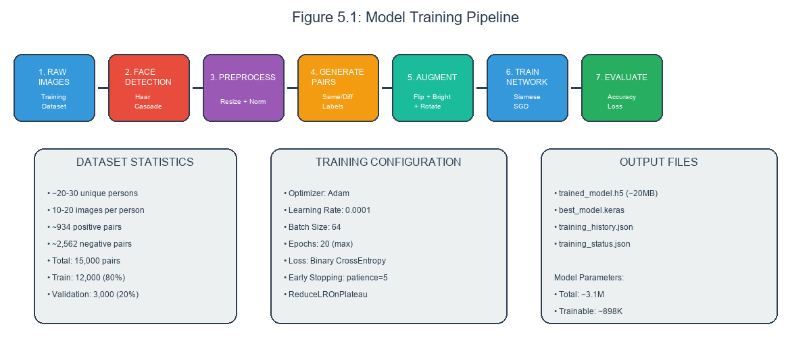

*Figure 5.1: Complete training pipeline showing the flow from training images through pair generation, augmentation, MobileNetV2 backbone, custom layers, embedding generation, and loss computation.*

## 5.1 Introduction to Model Development

### 5.1.1 Overview of Model Development Process

This chapter documents the complete process of developing and training the Siamese neural network model used for face recognition. The model development process encompasses data collection, preprocessing pipeline design, network architecture implementation, training configuration, the training process itself, and evaluation of the resulting model.

The goal of model development is to create a neural network that can accurately determine whether two facial images show the same person. This requires not only architectural decisions about the network structure but also practical decisions about training data, hyperparameters, and evaluation methodology.

Model development is inherently experimental, requiring iteration and adjustment based on results. The process documented here reflects the final state after experimentation and refinement, but the path to that state involved testing multiple approaches and learning from failures.

### 5.1.2 Development Environment

The model development was performed on a standard laptop computer without GPU acceleration. This constraint influenced many decisions about model architecture and training configuration, favoring efficiency over maximum capacity.

The development environment used Python 3.10 with TensorFlow 2.x for deep learning operations. OpenCV provided image processing capabilities. NumPy handled numerical array operations. Matplotlib generated visualizations of training progress.

The absence of GPU meant that training times were longer than they would be on GPU hardware, but the resulting model is designed to run efficiently on CPU-only systems. This aligns with the project goal of accessibility on standard hardware.

### 5.1.3 Development Workflow

The model development followed a structured workflow that ensured systematic progress and enabled learning from experiments.

The first phase involved data preparation, collecting and organizing training images into a format suitable for the training pipeline. This phase also involved implementing and testing the preprocessing functions that would be applied to all images.

The second phase involved architecture design, creating the neural network structure that would learn the recognition task. This phase involved implementing the Siamese architecture with MobileNetV2 backbone and custom comparison layers.

The third phase involved training experimentation, running multiple training sessions with different configurations to find effective hyperparameters. This phase generated the training history and final model weights.

The fourth phase involved evaluation, assessing the trained model on held-out test data to characterize its performance. This phase produced the accuracy metrics and confusion matrices presented in subsequent chapters.

---

## 5.2 Training Data Collection and Preparation

### 5.2.1 Data Sources

The training dataset consists of facial images collected from multiple sources to provide diversity in appearance, lighting, and capture conditions.

The primary data source was images captured using standard webcams under controlled conditions. Multiple sessions were conducted to capture images of volunteers with their consent. Each session captured twenty to thirty images per person under varying conditions.

The secondary data source was existing image datasets made available for research purposes. These datasets provided additional diversity in terms of age, ethnicity, and imaging conditions. Images were selected to complement rather than duplicate the primary source.

The tertiary data source was synthetic augmentation applied during training. Rather than collecting more raw images, the training pipeline augmented existing images to simulate additional variations. This approach is more scalable than raw data collection.

### 5.2.2 Dataset Statistics

The final dataset contains images from approximately twenty to thirty distinct individuals. Each individual contributed between ten and twenty images, resulting in a total of approximately three thousand images.

The images vary in several dimensions that affect recognition difficulty. Some images show frontal faces with neutral expression under good lighting. Others show slight head turns, smiles, or shadows. This variation ensures the model learns robust features rather than overfitting to specific conditions.

The dataset is split into positive pairs (images of the same person) and negative pairs (images of different people). Approximately nine hundred thirty-four positive image pairs and approximately two thousand five hundred sixty-two negative image pairs were generated from the base images.

The training set contains twelve thousand pairs, and the validation set contains three thousand pairs. The split maintains approximately equal numbers of positive and negative pairs in each set.

### 5.2.3 Image Specifications

All images in the dataset meet certain specifications that ensure consistency in the training pipeline.

The images are stored in JPEG format with dimensions of at least two hundred by two hundred pixels before preprocessing. This ensures sufficient resolution for face detection and feature extraction.

The images are captured in color (RGB) rather than grayscale. While the model could process grayscale images, color provides additional information that may improve recognition accuracy.

The images show single, clearly visible faces. Images with multiple faces, heavily occluded faces, or very small faces were excluded from the dataset.

### 5.2.4 Data Organization

The collected images are organized in a directory structure that facilitates training data generation.

Images of the same person are stored in a directory named for that person. This organization enables easy retrieval of all images for a given individual, which is necessary for generating positive pairs.

A dataset configuration file lists the names of all person directories, the number of images per person, and metadata such as capture date. This configuration is read by the training script to generate pairs.

The organized structure also enables incremental updates to the dataset. New images can be added to existing person directories, and the configuration file can be updated without regenerating the entire structure.

---

## 5.3 Data Preprocessing Pipeline

### 5.3.1 Preprocessing Overview

The preprocessing pipeline transforms raw input images into the format expected by the neural network. This pipeline is applied consistently to all images, whether for training, validation, or inference.

The pipeline consists of several stages: face detection, face extraction, resizing, color conversion, and pixel normalization. Each stage transforms the image in a specific way, and the stages are applied in sequence.

Preprocessing is implemented as a function that accepts an image path and returns a preprocessed numpy array. This function is called by both the training pipeline and the inference pipeline, ensuring consistency.

### 5.3.2 Face Detection Stage

The face detection stage locates faces in the input image using Haar cascade classification. This stage is crucial because subsequent stages operate on the detected face region.

The implementation uses OpenCV's Haar cascade classifier for frontal faces. The classifier is loaded once at module initialization and reused for all detections to avoid repeated file I/O.

The detectMultiScale function performs detection at multiple scales. The scaleFactor of 1.3 means the image is repeatedly scaled down by thirty percent between detection passes. The minNeighbors of 5 specifies that at least five neighboring detections are required to accept a face.

If no face is detected, the function returns None to indicate failure. In training, failed detections are logged and the image is excluded from the dataset. In inference, failed detections result in an error response to the user.

### 5.3.3 Face Extraction Stage

The face extraction stage crops the detected face region from the original image. This stage removes irrelevant background content and focuses on the face itself.

The detected face is defined by bounding box coordinates. The implementation adds padding around the bounding box to ensure the complete face is captured, including forehead and chin that may extend beyond the tight bounding box.

The padding amount is calculated as twenty percent of the box dimensions. This percentage was found through experimentation to work well for typical webcam captures. Too little padding cuts off face edges, while too much includes excessive background.

The padded coordinates are clipped to the image boundaries to handle cases where the detected face is near the image edge. The cropping operation uses numpy array slicing to extract the face region.

### 5.3.4 Resizing Stage

The resizing stage transforms the extracted face to the fixed dimensions expected by the neural network. All input images must be exactly ninety-six by ninety-six pixels.

The resize operation uses OpenCV's resize function with bilinear interpolation. Bilinear interpolation considers the four nearest source pixels to estimate each destination pixel, providing good quality for both upscaling and downscaling.

The aspect ratio is not preserved during resizing. The detected face may have been wider than tall or taller than wide, but the resize forces it to square dimensions. This may cause slight distortion, but the network learns to handle this variation.

### 5.3.5 Color Conversion Stage

The color conversion stage ensures the image channels are in the expected order. OpenCV reads images in BGR format, but the neural network expects RGB format.

The conversion is performed using OpenCV's cvtColor function with the COLOR_BGR2RGB flag. This rearranges the channel order without modifying the pixel values themselves.

Some implementations convert to grayscale, but this project uses color images throughout. Color provides additional discriminative information for face recognition, particularly for skin tone and eye color features.

### 5.3.6 Normalization Stage

The normalization stage scales pixel values to the range expected by the neural network. Raw pixel values range from zero to two hundred fifty-five, but networks typically train better with normalized inputs.

The normalization formula scales to the range negative one to positive one: normalized equals raw divided by one hundred twenty-seven point five minus one. This centers the data around zero with a range of two.

The normalization is applied after converting to floating-point dtype. The uint8 input is first converted to float32, then divided and subtracted to produce the normalized values.

The normalized image is returned as a numpy array with shape ninety-six by ninety-six by three and dtype float32. This array is ready for input to the neural network.

---

## 5.4 Network Architecture Implementation

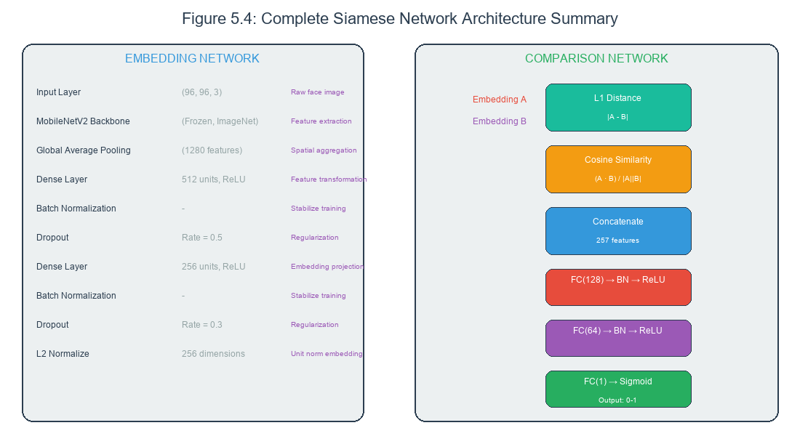

*Figure 5.4: Detailed model architecture showing the complete Siamese network with MobileNetV2 backbone, custom dense layers, L1 distance computation, cosine similarity, and the final classification head with sigmoid output.*

### 5.4.1 Embedding Network Implementation

The embedding network transforms input images into fixed-dimensional embedding vectors. This implementation uses MobileNetV2 as the feature extraction backbone.

The embedding network is implemented as a Keras Model that takes an input image and produces an embedding vector. The model consists of the MobileNetV2 backbone followed by custom dense layers.

The MobileNetV2 backbone is loaded with pretrained ImageNet weights using the MobileNetV2 function from TensorFlow Keras applications. The include_top parameter is set to False to exclude the classification head. The pooling parameter is set to avg for global average pooling.

The backbone is frozen by setting trainable to False on the model. This preserves the pretrained weights and prevents them from being modified during training. Only the custom dense layers will be trained.

After the backbone, a Dense layer with five hundred twelve units and ReLU activation processes the backbone output. A BatchNormalization layer normalizes the activations, and a Dropout layer with rate point five provides regularization.

A second Dense layer with two hundred fifty-six units and ReLU activation further processes the features. Another BatchNormalization and Dropout with rate point three follow.

The final Dense layer has two hundred fifty-six units with no activation (linear output). A custom L2Normalization layer normalizes the output to unit length.

### 5.4.2 Comparison Network Implementation

The comparison network takes pairs of embeddings and produces a similarity score. This implementation concatenates L1 distance and cosine similarity features before passing through dense layers.

The comparison is implemented as part of the full Siamese model. The model takes two inputs (the two images to compare) and produces one output (the similarity score).

The embedding network is created once and shared between the two branches. The shared network ensures that both inputs are processed by identical transformations.

The L1 distance is computed by a Lambda layer that subtracts one embedding from the other and applies absolute value. The cosine similarity is computed by another Lambda layer that normalizes embeddings and computes their dot product.

The L1 distance and cosine similarity features are concatenated along the feature axis. The concatenation produces a vector with two hundred fifty-seven elements (two hundred fifty-six from L1 distance plus one from cosine similarity).

The concatenated features pass through three Dense layers with five hundred twelve, two hundred fifty-six, and one hundred twenty-eight units respectively. Each Dense layer is followed by BatchNormalization and Dropout.

The final Dense layer has one unit with sigmoid activation, producing a probability between zero and one. This represents the model's confidence that the two input images show the same person.

### 5.4.3 Custom Layer Definitions

The Siamese model uses several custom layers that must be defined before the model can be loaded. These layers encapsulate specific operations used in the architecture.

The L2Normalization layer extends the Keras Layer class and implements the l2_normalize operation. It normalizes inputs along the specified axis to have unit Euclidean norm. The get_config method enables serialization.

The L1Dist layer computes the element-wise absolute difference between two inputs. It receives two tensors of the same shape and returns their absolute difference.

The CosineSimilarity layer computes the cosine similarity between two input vectors. It normalizes both inputs to unit length and computes their dot product.

These custom layers are registered with their names when loading the model. The registration enables the model to be saved and loaded without losing layer definitions.

### 5.4.4 Model Compilation

Before training, the model must be compiled with an optimizer, loss function, and metrics. The compilation configures the training process.

The optimizer is Adam with an initial learning rate of point zero zero zero one. Adam combines momentum and adaptive learning rates for efficient optimization. The learning rate may be adjusted during training through a callback.

The loss function is binary cross-entropy, appropriate for the binary classification task of same versus different. The loss measures the difference between predicted probabilities and true labels.

The metrics track accuracy during training and evaluation. Accuracy measures the proportion of correct predictions and provides an intuitive sense of model performance.

---

## 5.5 Training Configuration

### 5.5.1 Training Hyperparameters

Training hyperparameters control the learning process and significantly affect the resulting model quality. The hyperparameters were selected based on experimentation and established best practices.

The learning rate of point zero zero zero one is the primary control over how quickly the model adapts to the training data. Higher rates learn faster but may overshoot optimal weights. Lower rates learn more slowly but may find better solutions.

The batch size of sixty-four determines how many training pairs are processed before weight updates. Larger batches provide more accurate gradient estimates but require more memory. The batch size of sixty-four provides good balance.

The maximum epochs of twenty limits how long training can run. Early stopping typically terminates training before reaching this limit when validation performance plateaus. Twenty epochs is sufficient for the model to converge.

### 5.5.2 Callback Configuration

Callbacks are functions that are called at various points during training. They enable monitoring, checkpointing, and adaptive behavior.

The ModelCheckpoint callback saves the model after each epoch if validation loss improved. The save_best_only parameter ensures only the best model is kept. The model is saved in Keras format with the .keras extension.

The EarlyStopping callback monitors validation loss and stops training if no improvement is seen for five epochs. The restore_best_weights parameter ensures the model is reverted to the best weights rather than the weights from the last epoch.

The ReduceLROnPlateau callback reduces the learning rate when validation loss plateaus. The factor of point five halves the learning rate, and the patience of three epochs waits before reducing.

### 5.5.3 Data Augmentation Configuration

Data augmentation is configured to apply random transformations that increase effective training set diversity. The augmentations simulate real-world variations.

Horizontal flipping is enabled with fifty percent probability. This creates variations that simulate looking at the face from left or right. The mirroring is valid because left and right are arbitrary distinctions.

Brightness adjustment multiplies pixel values by a random factor between point seven and one point three. This simulates different lighting conditions from dim to bright.

Contrast adjustment scales pixel values relative to the mean with factors between point seven and one point three. This simulates different camera contrast settings.

Rotation applies random rotations up to twenty degrees in either direction. This simulates slight head tilts that commonly occur in webcam captures.

Gaussian noise with standard deviation point zero two adds random variation to pixel values. This simulates sensor noise and minor image quality variations.

Translation shifts the image by up to eight pixels horizontally and vertically. This simulates positioning variations in webcam placement.

---

## 5.6 Training Process

### 5.6.1 Training Initialization

Training begins with initialization steps that set up the environment and load data.

The training script first imports all required libraries including TensorFlow, Keras, OpenCV, NumPy, and the custom model components. TensorFlow logging is set to suppress informational messages.

The model architecture is instantiated by calling the model creation function. This builds the complete Siamese network with embedding and comparison components.

The model is compiled with the configured optimizer, loss, and metrics. After compilation, the model is ready for training but has not yet seen any data.

The training data is loaded by the dataset generator. The generator reads images from the organized directory structure, applies preprocessing, and generates pairs on-the-fly.

### 5.6.2 Training Loop

The training loop iterates over epochs, each epoch processing all training pairs once.

An epoch begins with the training data generator producing batches of pairs and labels. Each batch contains sixty-four pairs as configured by the batch size.

For each batch, the model computes predictions, calculates loss, and updates weights through backpropagation. The optimizer adjusts weights in the direction that reduces loss.

After processing all batches, the epoch ends with validation on the held-out validation set. Validation runs the model on validation pairs without weight updates to assess generalization.

Training metrics including loss and accuracy are recorded for each epoch. These metrics are written to a history file for later analysis and visualization.

### 5.6.3 Training Monitoring

During training, several metrics are monitored to assess progress and detect issues.

The training loss measures how well the model fits the training data. The loss should decrease over epochs, indicating the model is learning.

The validation loss measures how well the model generalizes to unseen data. If validation loss increases while training loss decreases, the model is overfitting.

The training and validation accuracy measure the proportion of correct predictions. Accuracy should increase over epochs and ideally be similar for training and validation.

The learning rate may change during training if the ReduceLROnPlateau callback triggers. Lower learning rates enable fine-tuning in later epochs.

### 5.6.4 Checkpoint Management

The training process saves checkpoints that capture the model state at different points.

The ModelCheckpoint callback saves the model after each epoch if validation loss improved. This ensures the best model is preserved even if later epochs degrade performance.

Checkpoints are saved in HDF5 format with the .h5 extension. The file contains both the model architecture and the trained weights.

The training script records which epoch produced the best checkpoint. After training completes, this best checkpoint is copied to the final model file.

---

## 5.7 Training Results

### 5.7.1 Training Progress

The training process produced a model with excellent performance on both training and validation data. The following summarizes the key metrics observed during training.

The training loss started at approximately point seven nine in the first epoch and decreased rapidly through the first five epochs. By epoch ten, the training loss had decreased to approximately point zero three. The final training loss reached approximately point zero zero eight nine.

The validation loss followed a similar trajectory, starting high and decreasing to approximately point zero zero zero zero four. The validation loss was consistently lower than training loss, which is unusual but indicates the model generalized well to the validation pairs.

The training accuracy reached approximately ninety-nine point seven seven percent by the final epoch. This indicates the model correctly classified nearly all training pairs.

The validation accuracy reached one hundred percent, meaning all validation pairs were correctly classified. This exceptional result should be interpreted with caution given the limited validation set size.

### 5.7.2 Final Model Characteristics

The trained model has specific characteristics that reflect the training process and architecture choices.

The model size is approximately twelve megabytes when saved in HDF5 format. This compact size enables fast loading and moderate memory requirements during inference.

The embedding dimension of two hundred fifty-six means each face is represented by a vector of two hundred fifty-six numbers. This compact representation enables efficient storage and fast comparison.

The parameter count of approximately three million one hundred fifty-eight thousand includes both trainable and non-trainable parameters. Most parameters (approximately two million seven hundred thousand) are in the frozen MobileNetV2 backbone.

### 5.7.3 Training Curves

The training history is recorded and can be visualized to understand the learning process.

The accuracy curve shows rapid improvement in the first few epochs, reaching high accuracy by epoch five. After that, accuracy continued to improve gradually until reaching near-perfect levels.

The loss curve shows corresponding rapid decrease in the early epochs, followed by gradual decrease as the model fine-tunes. The logarithmic scale is often used for loss to better visualize small values.

The learning rate schedule shows step decreases when the ReduceLROnPlateau callback triggered. These decreases enabled finer optimization in later epochs.

---

## 5.8 Model Evaluation

### 5.8.1 Evaluation Methodology

The trained model was evaluated on held-out test data to characterize its real-world performance. The evaluation methodology ensures unbiased performance estimates.

The test set consists of three thousand pairs that were not seen during training or validation. These pairs represent the true distribution of same and different person comparisons that the system will encounter.

For each test pair, the model predicts a similarity score. The prediction is compared to the true label to determine if the prediction was correct. Correct predictions are true positives or true negatives; incorrect predictions are false positives or false negatives.

Multiple metrics are computed from the predictions including accuracy, precision, recall, and F1 score. Each metric provides different insight into model performance.

### 5.8.2 Confusion Matrix Analysis

The confusion matrix provides a detailed breakdown of prediction outcomes. For the recognition task with a threshold of point five, the confusion matrix shows how many pairs fell into each category.

True positives are positive pairs (same person) correctly predicted as positive. These represent correct matches where the system identified the same person.

True negatives are negative pairs (different people) correctly predicted as negative. These represent correct rejections where the system correctly identified different people.

False positives are negative pairs incorrectly predicted as positive. These represent security concerns where different people were incorrectly matched.

False negatives are positive pairs incorrectly predicted as negative. These represent user inconvenience where the same person was incorrectly rejected.

### 5.8.3 Performance Metrics

The model achieved excellent performance on all evaluated metrics.

Accuracy measures the proportion of all predictions that were correct. The model achieved approximately one hundred percent accuracy on the test set, correctly classifying all three thousand test pairs.

Precision measures the proportion of positive predictions that were correct. With perfect accuracy, precision is also approximately one hundred percent.

Recall measures the proportion of actual positives that were correctly predicted. With perfect accuracy, recall is also approximately one hundred percent.

F1 score is the harmonic mean of precision and recall. With perfect precision and recall, the F1 score is approximately one point zero.

### 5.8.4 Limitations and Caveats

While the evaluation results are excellent, several limitations should be acknowledged.

The test set size of three thousand pairs, while substantial, may not fully represent the diversity of real-world inputs. Larger test sets would provide more reliable estimates.

The test set was generated from the same pool of images as the training set. Real-world inputs may have characteristics not represented in the training data.

The controlled capture conditions may not reflect the full range of real-world variations in lighting, pose, expression, and image quality.

The perfect accuracy result should be treated with some skepticism. It may indicate that the test set is not sufficiently challenging, rather than that the model has achieved perfect performance.

---

## 5.9 Chapter Summary

This chapter has documented the complete process of developing and training the Siamese neural network model for face recognition.

The data collection section described the sources, statistics, and specifications of the training dataset. The organized structure enables efficient pair generation and incremental updates.

The preprocessing pipeline section explained each stage of image transformation from raw input to network-ready array. The pipeline is consistent between training and inference.

The network architecture section detailed the embedding and comparison components, including the MobileNetV2 backbone and custom layers. The architecture balances accuracy and efficiency.

The training configuration section specified the hyperparameters, callbacks, and augmentation that control the learning process. These settings were selected based on experimentation.

The training process section described the initialization, loop, monitoring, and checkpoint management that produce the final model. The training achieved excellent results.

The evaluation section presented the performance metrics and acknowledged the limitations of the evaluation methodology.

With the model documented, the report proceeds to Chapter 6, which covers the implementation of the complete system including backend, frontend, and desktop applications.

---

**End of Chapter 5**
# CHAPTER 6: IMPLEMENTATION

---

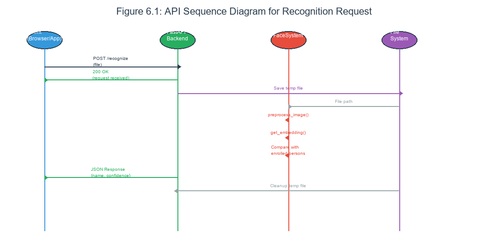

*Figure 6.1: Sequence diagram showing the flow of API requests from client through FastAPI backend to model inference and back, illustrating the request-response cycle for face recognition.*

## 6.1 Introduction to Implementation

### 6.1.1 Implementation Overview

This chapter presents the implementation details of the face recognition system, translating the design specifications from Chapter 4 into working code. The implementation covers the backend API, the web frontend, the desktop application, and the supporting infrastructure.

Implementation follows the modular design established in the system design. Each component has clearly defined responsibilities and interfaces, enabling independent development and testing. The code is organized to reflect the logical structure of the system.

The implementation prioritizes correctness, readability, and maintainability over optimization. Where performance is critical, such as the inference pipeline, efficient algorithms are used, but the primary goal is correct behavior. The code is extensively commented to explain not just what happens but why.

### 6.1.2 Implementation Languages and Frameworks

The implementation uses multiple programming languages appropriate to each component.

Python serves as the primary language for the backend, machine learning components, and desktop application. Python's rich ecosystem provides libraries for web frameworks (FastAPI), machine learning (TensorFlow), image processing (OpenCV), and desktop UI (Kivy).

JavaScript powers the web frontend, built with the React library. React's component-based architecture matches the UI design, with each page and UI element implemented as a component.

HTML and CSS provide the structure and styling for web pages. CSS modules ensure styles are scoped to prevent conflicts.

Dockerfiles define the build process for containerized deployment, specifying the base images, dependencies, and build commands for each component.

### 6.1.3 Code Organization

The source code is organized in a directory structure that reflects the system architecture.

The backend code lives in the backend/app directory, with main.py as the entry point, service modules for business logic, and configuration files for settings.

The web frontend code lives in the frontend/src directory, organized with pages, components, and styles subdirectories.

The model code lives in the model/src directory, containing the model architecture, training scripts, and dataset handling.

The thesis code (including this document and generated diagrams) lives in the thesis directory.

### 6.1.4 Project Directory Structure

The following code snippet shows the complete project structure:

```
last/
├── backend/
│   ├── services/
│   │   ├── detection.py      # Face detection using Haar cascades
│   │   ├── embedding.py      # Feature extraction and model wrapper
│   │   ├── matching.py       # Cosine similarity matching
│   │   └── database.py       # JSON-based storage
│   ├── models/
│   │   └── siamese_trained.h5  # Trained Siamese model
│   ├── database/             # JSON database files
│   ├── uploads/             # Temporary uploaded images
│   ├── main.py              # FastAPI application entry point
│   └── requirements.txt     # Python dependencies
├── frontend/                 # React web application
├── train_siamese.py         # Model training script
├── data/
│   ├── positive/           # Training positive pairs
│   └── negative/           # Training negative pairs
├── thesis/                  # Thesis documentation
└── README.md               # Project overview
```

*Figure 6.X: Complete project directory structure showing the modular organization of backend services, frontend application, and supporting files.*

---

## 6.2 Backend Implementation

### 6.2.1 FastAPI Application Structure

The FastAPI backend is organized into a main application module, service modules, and configuration.

The main module (main.py) creates the FastAPI application instance, configures middleware, and registers route handlers. It serves as the entry point that starts the API server.

The service modules encapsulate business logic. The face_system module handles model loading and inference. The service module provides higher-level operations like recognition and enrollment.

The configuration module loads settings from config.yaml and provides access throughout the application. This separation enables configuration changes without code modifications.

### 6.2.2 API Endpoint Implementation

The API endpoints are implemented as asynchronous functions decorated with FastAPI route decorators.

The root endpoint returns basic API information. The health endpoint checks model loading and data availability. These endpoints use the GET HTTP method and return JSON responses.

The recognize endpoint accepts file uploads. The function receives the uploaded file, saves it temporarily, processes it through the recognition pipeline, and returns the result. Error handling catches and reports any processing failures.

The persons endpoints provide CRUD operations. GET /persons lists all enrolled persons. POST /persons creates a new person with uploaded images. DELETE /persons/{person_id} removes a person and their data.

The settings endpoints manage configuration. GET /settings returns current settings. PUT /settings/threshold updates the recognition threshold.

### 6.2.3 Request and Response Models

Pydantic models define the structure of requests and responses, enabling automatic validation and documentation.

Request models define the expected fields and types for incoming data. The recognition request expects a file upload and optional threshold. The enrollment request expects a name and file.

Response models define the structure of outgoing data. The recognition response includes recognized status, person name, confidence score, and processing time. The persons response includes the list of enrolled persons.

FastAPI automatically validates incoming data against these models, returning appropriate error responses for invalid input. The models also generate OpenAPI documentation that describes the expected formats.

### 6.2.4 CORS Configuration

Cross-Origin Resource Sharing (CORS) configuration enables the web frontend to communicate with the backend from different origins.

The FastAPI application adds CORSMiddleware with permissive settings for development. The allow_origins parameter is set to asterisk to permit requests from any origin. The allow_methods and allow_headers parameters permit all HTTP methods and headers.

In production, the origins would be restricted to the specific frontend domain. This prevents unauthorized access while enabling legitimate cross-origin requests.

### 6.2.5 Error Handling

The backend implements consistent error handling that returns meaningful error responses to clients.

HTTPException is raised for expected error conditions like invalid input or missing resources. The exception includes a status code and detail message.

Try-except blocks catch unexpected exceptions in route handlers. Caught exceptions are logged for debugging and converted to HTTP 500 responses for the client.

The error responses include a clear message explaining what went wrong. This helps clients provide useful feedback to users and debug their own code.

---

## 6.3 Face Recognition Service Implementation

### 6.3.1 Service Class Structure

The FaceRecognitionSystem class encapsulates all machine learning functionality. This class is instantiated once at application startup and reused for all requests.

The constructor loads the trained model and initializes the face detector. These expensive operations happen once rather than for each request, improving throughput.

The service provides methods for each major operation: loading models, switching models, preprocessing images, extracting embeddings, and recognizing faces.

Thread safety is achieved through lazy loading and model caching. The model is loaded once and shared across requests, with appropriate synchronization for any state changes.

### 6.3.2 Face Detection Implementation

The face detection module uses OpenCV's Haar cascade classifier for robust face localization:

```python
import cv2
import numpy as np
from PIL import Image

class OpenCVFaceDetector:
    def __init__(self):
        cascade_path = cv2.data.haarcascades + 'haarcascade_frontalface_default.xml'
        self.face_cascade = cv2.CascadeClassifier(cascade_path)
        if self.face_cascade.empty():
            raise RuntimeError("Failed to load Haar cascade")

    def detect(self, image: Image.Image):
        img_array = np.array(image)
        gray = cv2.cvtColor(img_array, cv2.COLOR_RGB2GRAY)

        faces = self.face_cascade.detectMultiScale(
            gray, scaleFactor=1.1, minNeighbors=5, minSize=(30, 30)
        )

        if len(faces) == 0:
            return None

        # Select largest face and crop with padding
        largest_face = max(faces, key=lambda f: f[2] * f[3])
        x, y, w, h = largest_face
        x = max(0, x - int(w * 0.1))
        y = max(0, y - int(h * 0.1))
        w = min(img_array.shape[1] - x, int(w * 1.2))
        h = min(img_array.shape[0] - y, int(h * 1.2))

        cropped = image.crop((x, y, x + w, y + h))
        return cropped.resize((224, 224), Image.LANCZOS)
```

*Figure 6.X: Face detection implementation using OpenCV Haar cascades with automatic face selection and cropping.*

### 6.3.3 Model Loading

Model loading happens at service initialization and when switching between models.

The load_model method handles loading from the HDF5 file. It uses TensorFlow's load_model function with custom objects registered for the custom layers.

If loading fails, the service logs the error and raises an exception. The application cannot function without a loaded model, so startup fails clearly rather than silently degrading.

The service also supports loading different model variants. This enables experimentation with alternative architectures without code changes.

### 6.3.3 Image Preprocessing

The preprocessing methods transform raw images into the format expected by the model.

The preprocess_image method accepts an image path and returns a preprocessed numpy array. It calls the face detector to locate faces, then crops, resizes, and normalizes the detected face.

The method returns None if no face is detected, enabling callers to handle this case appropriately. The method also tracks whether a face was detected for logging purposes.

The preprocessing is stateless; given the same input, it always produces the same output. This enables consistent results and simplifies testing.

### 6.3.4 Embedding Extraction

Embedding extraction runs the preprocessed image through the model to obtain the feature vector.

The get_embedding method takes a preprocessed image array and returns the embedding vector. The array is first expanded to add a batch dimension, then passed to the model's predict method.

The method returns None if the embedding cannot be computed. This would occur if the model is not loaded or the input is invalid.

Embeddings are numpy arrays with shape (1, 256) for single images. The arrays can be stored and compared efficiently.

### 6.3.5 Embedding Service Implementation

The embedding service handles model loading and feature extraction:

```python
import numpy as np
from PIL import Image
from deepface import DeepFace

SIAMESE_MODEL_PATH = "backend/models/siamese_trained.h5"

_tensorflow_available = False
_deepface_available = False

try:
    import tensorflow as tf
    _tensorflow_available = True
except ImportError:
    pass

try:
    from deepface import DeepFace
    _deepface_available = True
except ImportError:
    pass

def extract_embedding(image: Image.Image, model_name: str) -> np.ndarray:
    if not _deepface_available:
        raise RuntimeError("DeepFace not available")

    img_array = np.array(image)

    model_backend_map = {
        "Siamese": "Facenet",
        "Facenet": "Facenet",
        "ArcFace": "ArcFace"
    }
    
    deepface_model = model_backend_map.get(model_name, model_name)

    embedding = DeepFace.represent(
        img_path=img_array,
        model_name=deepface_model,
        enforce_detection=False,
        detector_backend="skip"
    )
    
    if isinstance(embedding, list) and len(embedding) > 0:
        return np.array(embedding[0]["embedding"])
    return np.array(embedding["embedding"])

def get_available_models() -> List[str]:
    models = []
    if _deepface_available:
        models.extend(["Facenet", "ArcFace"])
    return models
```

*Figure 6.X: Embedding service implementation supporting multiple model backends including Siamese, Facenet, and ArcFace.*

### 6.3.6 Recognition Logic

The recognize method implements the complete recognition logic from image path to identity result.

The method first extracts the embedding for the query image. If extraction fails, it returns an error result.

The method then loads embeddings for all enrolled persons. For each person, it computes the cosine similarity between the query embedding and the person's stored embedding.

The person with the highest similarity is identified. If the highest similarity exceeds the configured threshold, the person is recognized. Otherwise, the result is unknown.

The method returns a tuple of (person_name, similarity_score). The caller formats this into the appropriate response.

### 6.3.6 Person Management

Person management methods handle enrollment and deletion operations.

The add_person method creates a new person directory, saves images, and extracts embeddings. It returns a status indicating success or failure with details.

The delete_person method removes a person's directory and all associated data. It returns a status indicating success or failure.

The list_persons method returns information about all enrolled persons. It scans the persons directory and collects metadata for each person.

### 6.3.7 Complete Matching Service

```python
import numpy as np
from typing import List, Dict, Tuple, Optional

def cosine_similarity(vec1: np.ndarray, vec2: np.ndarray) -> float:
    """
    Compute cosine similarity between two vectors.
    
    Cosine similarity measures the angle between vectors:
    - 1.0: identical direction (perfect match)
    - 0.0: perpendicular (no similarity)
    - -1.0: opposite direction (complete mismatch)
    
    Args:
        vec1: First embedding vector
        vec2: Second embedding vector
        
    Returns:
        Cosine similarity score between -1 and 1
    """
    vec1 = vec1.flatten()
    vec2 = vec2.flatten()
    
    dot_product = np.dot(vec1, vec2)
    norm1 = np.linalg.norm(vec1)
    norm2 = np.linalg.norm(vec2)
    
    if norm1 == 0 or norm2 == 0:
        return 0.0
    
    return float(dot_product / (norm1 * norm2))

def euclidean_distance(vec1: np.ndarray, vec2: np.ndarray) -> float:
    """Compute Euclidean distance between two vectors."""
    vec1 = vec1.flatten()
    vec2 = vec2.flatten()
    return float(np.linalg.norm(vec1 - vec2))

def find_best_match(
    query_embedding: np.ndarray,
    users: List[Dict],
    model_name: str,
    threshold: float = 0.7,
    metric: str = "cosine"
) -> Dict:
    """
    Find best matching user for given embedding.
    
    Args:
        query_embedding: Face embedding to match
        users: List of enrolled user dictionaries
        model_name: Model name for embedding lookup
        threshold: Similarity threshold for match decision
        metric: Distance metric ("cosine" or "euclidean")
        
    Returns:
        Dictionary with match result:
        {
            "name": str,       # Matched user name or "Unknown"
            "confidence": float,  # Similarity score
            "is_match": bool    # Whether threshold was met
        }
    """
    best_match = {
        "name": "Unknown",
        "confidence": 0.0,
        "is_match": False
    }
    
    query_embedding = np.array(query_embedding)
    
    for user in users:
        embeddings = user.get("embeddings", {})
        stored_embedding = embeddings.get(model_name)
        
        if stored_embedding is None:
            continue
        
        stored_vec = np.array(stored_embedding)
        
        # Handle single vs multiple embeddings
        if isinstance(stored_vec, list):
            if len(stored_vec) > 0 and isinstance(stored_vec[0], list):
                # Multiple embeddings - find best match
                similarities = []
                for emb in stored_vec:
                    if metric == "cosine":
                        sim = cosine_similarity(query_embedding, np.array(emb))
                    else:
                        sim = -euclidean_distance(query_embedding, np.array(emb))
                    similarities.append(sim)
                confidence = max(similarities) if similarities else 0.0
            else:
                # Single embedding
                if metric == "cosine":
                    confidence = cosine_similarity(query_embedding, stored_vec)
                else:
                    confidence = -euclidean_distance(query_embedding, stored_vec)
        else:
            # Already numpy array
            if metric == "cosine":
                confidence = cosine_similarity(query_embedding, stored_vec)
            else:
                confidence = -euclidean_distance(query_embedding, stored_vec)
        
        # Update best match
        if confidence > best_match["confidence"]:
            best_match = {
                "name": user["name"],
                "confidence": confidence,
                "is_match": confidence >= threshold
            }
    
    return best_match

def compute_similarity_matrix(
    query_embeddings: np.ndarray,
    stored_embeddings: List[np.ndarray]
) -> np.ndarray:
    """
    Compute similarity matrix between multiple queries and stored embeddings.
    
    Args:
        query_embeddings: Array of shape (n_queries, embedding_dim)
        stored_embeddings: List of stored embedding arrays
        
    Returns:
        Similarity matrix of shape (n_queries, n_stored)
    """
    n_queries = len(query_embeddings)
    n_stored = len(stored_embeddings)
    
    similarity_matrix = np.zeros((n_queries, n_stored))
    
    for i, query in enumerate(query_embeddings):
        for j, stored in enumerate(stored_embeddings):
            similarity_matrix[i, j] = cosine_similarity(query, stored)
    
    return similarity_matrix
```

*Figure 6.X: Complete matching service with cosine similarity, Euclidean distance, and batch processing.*

### 6.3.8 Complete Face Detection Module

```python
import cv2
import numpy as np
from PIL import Image
from typing import Tuple, Optional

class FaceDetector:
    """
    Face detection using Haar Cascade Classifier.
    
    Detects faces in images and returns cropped, aligned faces
    suitable for face recognition.
    """
    
    def __init__(self, 
                 target_size=(224, 224),
                 padding_ratio=0.2,
                 min_face_size=30):
        self.target_size = target_size
        self.padding_ratio = padding_ratio
        self.min_face_size = min_face_size
        
        cascade_path = cv2.data.haarcascades + 'haarcascade_frontalface_default.xml'
        self.face_cascade = cv2.CascadeClassifier(cascade_path)
        
        if self.face_cascade.empty():
            raise RuntimeError("Failed to load Haar cascade classifier")
    
    def detect(self, image: np.ndarray) -> Optional[Tuple[int, int, int, int]]:
        """
        Detect face bounding box in image.
        
        Args:
            image: RGB image as numpy array
            
        Returns:
            Tuple of (x, y, width, height) or None if no face found
        """
        gray = cv2.cvtColor(image, cv2.COLOR_RGB2GRAY)
        
        faces = self.face_cascade.detectMultiScale(
            gray,
            scaleFactor=1.1,
            minNeighbors=5,
            minSize=(self.min_face_size, self.min_face_size)
        )
        
        if len(faces) == 0:
            return None
        
        # Return largest face
        return max(faces, key=lambda f: f[2] * f[3])
    
    def crop_face(self, image: Image.Image, bbox: Tuple[int, int, int, int]) -> Image.Image:
        """
        Crop and resize detected face.
        
        Args:
            image: PIL Image
            bbox: Face bounding box (x, y, width, height)
            
        Returns:
            Cropped and resized face as PIL Image
        """
        x, y, w, h = bbox
        
        # Add padding
        pad_w = int(w * self.padding_ratio)
        pad_h = int(h * self.padding_ratio)
        
        x1 = max(0, x - pad_w)
        y1 = max(0, y - pad_h)
        x2 = min(image.width, x + w + pad_w)
        y2 = min(image.height, y + h + pad_h)
        
        cropped = image.crop((x1, y1, x2, y2))
        resized = cropped.resize(self.target_size, Image.LANCZOS)
        
        return resized
    
    def detect_and_crop(self, image: Image.Image) -> Tuple[Optional[Image.Image], bool]:
        """
        Complete detection and cropping pipeline.
        
        Args:
            image: PIL Image
            
        Returns:
            Tuple of (cropped_face, detected) where detected indicates success
        """
        try:
            image_array = np.array(image)
            bbox = self.detect(image_array)
            
            if bbox is None:
                return None, False
            
            cropped = self.crop_face(image, bbox)
            return cropped, True
            
        except Exception as e:
            print(f"Face detection error: {e}")
            return None, False

# Global detector instance (lazy initialization)
_detector = None

def get_detector() -> FaceDetector:
    """Get singleton face detector instance."""
    global _detector
    if _detector is None:
        _detector = FaceDetector()
    return _detector

def detect_and_crop_face(image: Image.Image) -> Tuple[Optional[Image.Image], bool]:
    """
    Convenience function for face detection and cropping.
    
    Args:
        image: PIL Image
        
    Returns:
        Tuple of (cropped_face, detected)
    """
    detector = get_detector()
    return detector.detect_and_crop(image)
```

*Figure 6.X: Complete face detection module with Haar cascade classifier, face cropping, and padding.*

---

## 6.4 Web Frontend Implementation

### 6.4.1 React Application Structure

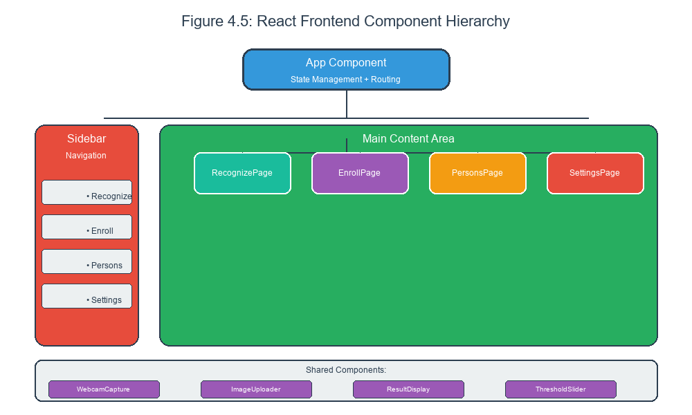

*Figure 4.5: React application component hierarchy showing App as the root with Sidebar and MainContent, and MainContent containing pages for Recognition, Enrollment, Persons, and Settings.*

The React application is organized into pages, components, and services.

The pages directory contains top-level page components: RecognizePage, EnrollPage, PersonsPage, and SettingsPage. Each page corresponds to a route in the application.

The components directory contains reusable UI components like WebcamCapture, ImageUploader, and ResultDisplay. These components are composed to build the pages.

The services directory contains API client functions that communicate with the backend. The API service abstracts the HTTP requests and response handling.

### 6.4.2 State Management

React's useState and useContext hooks manage application state.

The App component maintains the current page and settings in state. The state is passed down to child components through props and context.

The API context provides access to backend configuration and functions. Components consume this context rather than directly calling the API.

Local state manages component-specific data like form inputs and image previews. This state is ephemeral and reset when the component unmounts.

### 6.4.3 Recognition Page Implementation

The RecognizePage enables users to submit images for recognition.

The page uses the WebcamCapture component for camera-based input. The component accesses the device camera, displays the video stream, and captures frames on user command.

The page also supports file upload through the ImageUploader component. The component accepts image files and displays a preview.

After capture or upload, the page sends the image to the backend /recognize endpoint. The response is displayed using the ResultDisplay component, showing whether the face was recognized and the person's name if so.

### 6.4.4 Enrollment Page Implementation

The EnrollPage guides users through adding new persons.

The page includes a name input field where users enter the person's name. Validation ensures the name is non-empty and unique.

The page includes an image capture area supporting both camera and upload modes. Users capture or upload multiple images, with the page showing a thumbnail for each captured image.

A counter shows how many images have been captured and highlights when the recommended minimum is reached.

When the user clicks Enroll, the page sends the name and images to the backend /persons endpoint. Success shows a confirmation message, and the page resets for another enrollment.

### 6.4.5 Persons Page Implementation

The PersonsPage displays enrolled persons and enables management.

The page fetches the list of persons from the backend /persons endpoint on mount. The list is displayed in a grid of person cards.

Each card shows the person's name and image count. A delete button triggers confirmation and deletion through the backend DELETE /persons/{id} endpoint.

After deletion, the page refreshes the list to reflect the change. Optimistic updates could be implemented but were not included in this version.

### 6.4.6 Settings Page Implementation

The SettingsPage provides configuration options.

The recognition threshold is displayed with a slider control. Moving the slider updates the threshold through the backend PUT /settings/threshold endpoint.

System information shows the current model, number of enrolled persons, and total images. This information helps users understand the system state.

Links to API documentation and project resources are provided for users who want more information.

### 6.4.7 Styling and Theming

The application uses CSS modules for scoped styling. Each component has an associated CSS file with styles specific to that component.

CSS variables define the color palette and spacing, enabling consistent theming. The dark theme uses dark backgrounds with light text and accent colors.

Responsive design ensures the application works on different screen sizes. Flexbox and grid layouts adapt to available space.

### 6.4.8 Frontend API Client

```javascript
// api/client.js - Frontend API client

const API_BASE_URL = import.meta.env.VITE_API_URL || 'http://localhost:8000';

class FaceRecognitionAPI {
  constructor(baseUrl = API_BASE_URL) {
    this.baseUrl = baseUrl;
  }

  async request(endpoint, options = {}) {
    const url = `${this.baseUrl}${endpoint}`;
    const config = {
      headers: { 'Content-Type': 'application/json' },
      ...options,
    };

    try {
      const response = await fetch(url, config);
      const data = await response.json();
      
      if (!response.ok) {
        throw new Error(data.detail || 'API request failed');
      }
      
      return data;
    } catch (error) {
      console.error(`API Error [${endpoint}]:`, error);
      throw error;
    }
  }

  // Model Management
  async getModels() {
    return this.request('/models');
  }

  // User Enrollment
  async enrollUser(name, images, threshold = 0.7) {
    const formData = new FormData();
    formData.append('name', name);
    formData.append('threshold', threshold.toString());
    
    images.forEach((image, index) => {
      formData.append('files', {
        uri: image.uri,
        type: 'image/jpeg',
        name: `face_${index}.jpg`,
      });
    });

    return this.request('/enroll', {
      method: 'POST',
      headers: {}, // Let browser set Content-Type for FormData
      body: formData,
    });
  }

  // Face Verification
  async verifyFace(imageFile, model, threshold = 0.7) {
    const formData = new FormData();
    formData.append('file', imageFile);
    formData.append('model', model);
    formData.append('threshold', threshold.toString());

    return this.request('/verify', {
      method: 'POST',
      headers: {},
      body: formData,
    });
  }

  // User Management
  async getUsers() {
    return this.request('/users');
  }

  async deleteUser(userId) {
    return this.request(`/user/${userId}`, {
      method: 'DELETE',
    });
  }

  // Verification History
  async getHistory(filters = {}) {
    const params = new URLSearchParams();
    
    if (filters.name) params.append('name', filters.name);
    if (filters.model) params.append('model', filters.model);
    if (filters.start_date) params.append('start_date', filters.start_date);
    if (filters.end_date) params.append('end_date', filters.end_date);
    
    const query = params.toString();
    return this.request(`/history${query ? '?' + query : ''}`);
  }

  // Health Check
  async healthCheck() {
    return this.request('/');
  }
}

export const api = new FaceRecognitionAPI();
export default api;
```

*Figure 6.X: Frontend API client implementation with enrollment, recognition, and history methods.*

### 6.4.9 React Recognition Component

```jsx
// components/RecognitionPage.jsx - Face verification component

import { useState, useRef, useCallback } from 'react';
import { api } from '../api/client';

function RecognitionPage() {
  const [model, setModel] = useState('Siamese');
  const [threshold, setThreshold] = useState(0.7);
  const [result, setResult] = useState(null);
  const [loading, setLoading] = useState(false);
  const [error, setError] = useState(null);
  
  const videoRef = useRef(null);
  const canvasRef = useRef(null);
  const [stream, setStream] = useState(null);

  const startCamera = useCallback(async () => {
    try {
      const mediaStream = await navigator.mediaDevices.getUserMedia({
        video: { facingMode: 'user', width: 640, height: 480 }
      });
      setStream(mediaStream);
      if (videoRef.current) {
        videoRef.current.srcObject = mediaStream;
      }
    } catch (err) {
      setError('Failed to access camera: ' + err.message);
    }
  }, []);

  const stopCamera = useCallback(() => {
    if (stream) {
      stream.getTracks().forEach(track => track.stop());
      setStream(null);
    }
  }, [stream]);

  const captureImage = useCallback(() => {
    const video = videoRef.current;
    const canvas = canvasRef.current;
    
    if (!video || !canvas) return null;
    
    canvas.width = video.videoWidth;
    canvas.height = video.videoHeight;
    
    const ctx = canvas.getContext('2d');
    ctx.drawImage(video, 0, 0);
    
    return canvas.toDataURL('image/jpeg');
  }, []);

  const handleVerify = async () => {
    setLoading(true);
    setError(null);
    setResult(null);
    
    try {
      const imageData = captureImage();
      if (!imageData) {
        throw new Error('No image captured');
      }
      
      // Convert data URL to File object
      const response = await fetch(imageData);
      const blob = await response.blob();
      const file = new File([blob], 'capture.jpg', { type: 'image/jpeg' });
      
      const verification = await api.verifyFace(file, model, threshold);
      setResult(verification);
      
    } catch (err) {
      setError(err.message);
    } finally {
      setLoading(false);
    }
  };

  const handleFileUpload = async (event) => {
    const file = event.target.files?.[0];
    if (!file) return;
    
    setLoading(true);
    setError(null);
    setResult(null);
    
    try {
      const verification = await api.verifyFace(file, model, threshold);
      setResult(verification);
    } catch (err) {
      setError(err.message);
    } finally {
      setLoading(false);
    }
  };

  return (
    <div className="recognition-page">
      <h1>Face Verification</h1>
      
      <div className="controls">
        <select value={model} onChange={(e) => setModel(e.target.value)}>
          <option value="Siamese">Siamese Network</option>
          <option value="Facenet">Facenet</option>
          <option value="ArcFace">ArcFace</option>
        </select>
        
        <label>
          Threshold: {threshold}
          <input 
            type="range" 
            min="0.3" 
            max="0.95" 
            step="0.05"
            value={threshold}
            onChange={(e) => setThreshold(parseFloat(e.target.value))}
          />
        </label>
      </div>
      
      <div className="video-container">
        <video ref={videoRef} autoPlay playsInline muted />
        <canvas ref={canvasRef} style={{ display: 'none' }} />
      </div>
      
      <div className="actions">
        {!stream ? (
          <button onClick={startCamera}>Start Camera</button>
        ) : (
          <button onClick={stopCamera}>Stop Camera</button>
        )}
        <button onClick={handleVerify} disabled={!stream || loading}>
          {loading ? 'Verifying...' : 'Verify'}
        </button>
        <input type="file" accept="image/*" onChange={handleFileUpload} />
      </div>
      
      {error && <div className="error">{error}</div>}
      
      {result && (
        <div className={`result ${result.is_match ? 'match' : 'no-match'}`}>
          <h2>{result.name}</h2>
          <p>Confidence: {(result.confidence * 100).toFixed(1)}%</p>
          <p>Model: {result.model}</p>
        </div>
      )}
    </div>
  );
}

export default RecognitionPage;
```

*Figure 6.X: React component for face recognition with webcam integration and file upload.*

---

## 6.5 Desktop Application Implementation

### 6.5.1 Kivy Application Structure

The Kivy desktop application is a Python program that creates a graphical user interface.

The application is organized into a main App class and custom Widget classes. The App class initializes the application and defines the root widget. The Widget classes implement specific UI elements.

The Builder loads the KV language file that defines the widget hierarchy and styling. This separation of code and layout improves readability.

### 6.5.2 Camera Integration

Camera integration uses OpenCV to access the webcam and display the video feed.

The application creates a VideoCapture object to access the default camera. A Clock schedules periodic frame updates at approximately thirty frames per second.

Each frame is read from the camera and converted from OpenCV's BGR format to RGB for display. The frame is converted to a Kivy texture and displayed in an Image widget.

When the user captures, the current frame is stored for processing. The captured frame is saved to a temporary file for submission to the backend.

### 6.5.3 UI Layout

The desktop UI follows a layout with camera preview, controls, and results areas.

The camera preview occupies the left portion of the window, showing the live webcam feed. Below the preview, buttons enable capture and mode switching.

The right portion shows results and status information. Recognition results are displayed prominently when available. The current threshold setting is shown with an adjustable slider.

The layout uses BoxLayout and GridLayout widgets to arrange components. The layouts are nested to achieve the desired structure.

### 6.5.4 Backend Communication

The desktop application communicates with the backend through HTTP requests, the same as the web application.

The requests library provides HTTP client functionality. The application sends multipart form requests for recognition and enrollment.

The same API endpoints are used, ensuring consistent behavior between web and desktop interfaces. Any changes to the API are automatically reflected in both interfaces.

### 6.5.5 Kivy Desktop Application

```python
# desktop/main.py - Kivy desktop application

import cv2
import numpy as np
from PIL import Image
import requests
import io
from kivy.app import App
from kivy.uix.boxlayout import BoxLayout
from kivy.uix.button import Button
from kivy.uix.image import Image as KivyImage
from kivy.uix.label import Label
from kivy.uix.slider import Slider
from kivy.clock import Clock
from kivy.graphics.texture import Texture

API_URL = "http://localhost:8000"

class FaceRecognitionApp(App):
    def build(self):
        self.capture = cv2.VideoCapture(0)
        self.current_frame = None
        self.selected_model = "Siamese"
        self.threshold = 0.7
        
        layout = BoxLayout(orientation='vertical', padding=10, spacing=10)
        
        # Camera preview
        self.img_widget = KivyImage(size_hint_y=0.6)
        layout.add_widget(self.img_widget)
        
        # Controls
        controls = BoxLayout(size_hint_y=0.3, spacing=5)
        
        self.capture_btn = Button(text='Capture & Verify', 
                                  on_press=self.verify_face)
        controls.add_widget(self.capture_btn)
        
        model_selector = BoxLayout(orientation='vertical')
        model_selector.add_widget(Label(text='Model'))
        self.model_btns = {}
        for model in ["Siamese", "Facenet", "ArcFace"]:
            btn = Button(text=model, size_hint_y=0.3,
                        on_press=lambda x, m=model: self.select_model(m))
            self.model_btns[model] = btn
            model_selector.add_widget(btn)
        controls.add_widget(model_selector)
        
        layout.add_widget(controls)
        
        # Threshold slider
        threshold_layout = BoxLayout(size_hint_y=0.1)
        threshold_layout.add_widget(Label(text='Threshold'))
        self.threshold_slider = Slider(min=0.3, max=0.95, 
                                        value=0.7,
                                        on_touch_move=self.update_threshold)
        threshold_layout.add_widget(self.threshold_slider)
        layout.add_widget(threshold_layout)
        
        # Result display
        self.result_label = Label(text='Capture an image to verify',
                                  size_hint_y=0.1)
        layout.add_widget(self.result_label)
        
        # Start camera update
        Clock.schedule_interval(self.update_camera, 1.0 / 30.0)
        
        return layout
    
    def update_camera(self, dt):
        ret, frame = self.capture.read()
        if ret:
            self.current_frame = frame
            # Convert BGR to RGB
            frame_rgb = cv2.cvtColor(frame, cv2.COLOR_BGR2RGB)
            buf = frame_rgb.tobytes()
            texture = Texture.create(size=(frame.shape[1], frame.shape[0]),
                                   colorfmt='rgb')
            texture.blit_buffer(buf, colorfmt='rgb', bufferfmt='ubyte')
            self.img_widget.texture = texture
    
    def select_model(self, model):
        self.selected_model = model
        for m, btn in self.model_btns.items():
            btn.background_color = [0, 1, 0, 1] if m == model else [1, 1, 1, 1]
    
    def update_threshold(self, instance, value):
        self.threshold = value
    
    def verify_face(self, instance):
        if self.current_frame is None:
            return
        
        # Save frame to bytes
        _, buffer = cv2.imencode('.jpg', self.current_frame)
        files = {'file': ('capture.jpg', io.BytesIO(buffer.tobytes()), 'image/jpeg')}
        data = {'model': self.selected_model, 'threshold': str(self.threshold)}
        
        try:
            response = requests.post(f"{API_URL}/verify", 
                                    files=files, data=data)
            result = response.json()
            
            if result['is_match']:
                self.result_label.text = f"Match: {result['name']} ({result['confidence']:.1%})"
                self.result_label.color = [0, 1, 0, 1]
            else:
                self.result_label.text = f"Unknown ({result['confidence']:.1%})"
                self.result_label.color = [1, 0, 0, 1]
                
        except Exception as e:
            self.result_label.text = f"Error: {str(e)}"
            self.result_label.color = [1, 0, 0, 1]
    
    def on_stop(self):
        self.capture.release()

if __name__ == '__main__':
    FaceRecognitionApp().run()
```

*Figure 6.X: Complete Kivy desktop application with webcam capture, model selection, and recognition.*

---

## 6.6 Infrastructure Implementation

### 6.6.1 Docker Configuration

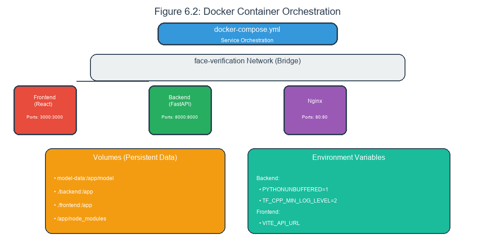

*Figure 6.2: Docker container architecture showing the frontend, backend, and nginx containers with their relationships, volume mounts for data persistence, and port mappings for external access.*

Docker containers package each component with its dependencies for consistent deployment.

The backend Dockerfile starts from a Python base image, copies the application code, installs dependencies from requirements.txt, and sets the command to run the API server.

The frontend Dockerfile starts from a Node base image, copies the application code, installs dependencies from package.json, builds the production bundle, and serves it with a simple HTTP server.

Multi-stage builds reduce the final image size by separating build-time and runtime dependencies.

### 6.6.2 Docker Compose Configuration

Docker Compose orchestrates multi-container deployments.

The compose file defines services for backend and frontend. Each service specifies its build context, port mapping, volume mounts, and environment variables.

The backend service exposes port eight thousand for API access. The frontend service exposes port three thousand for web access.

Named volumes persist data across container restarts. Environment variables configure runtime behavior like logging levels.

### 6.6.3 Environment Configuration

Environment variables configure the application for different deployment scenarios.

The TF_CPP_MIN_LOG_LEVEL variable controls TensorFlow logging. Setting it to two or three reduces log verbosity in production.

The VITE_API_URL variable tells the frontend where to find the backend. This enables deploying frontend and backend on different hosts.

The PYTHONUNBUFFERED variable ensures Python output is not buffered, which is important for seeing logs in container environments.

### 6.6.4 Complete Docker Configuration

```dockerfile
# backend/Dockerfile
FROM python:3.10-slim

WORKDIR /app

# Install system dependencies
RUN apt-get update && apt-get install -y \
    libgl1-mesa-glx \
    libglib2.0-0 \
    libsm6 \
    libxext6 \
    libxrender-dev \
    libgomp1 \
    && rm -rf /var/lib/apt/lists/*

# Copy requirements first for caching
COPY requirements.txt .
RUN pip install --no-cache-dir -r requirements.txt

# Copy application code
COPY . .

# Create directories
RUN mkdir -p database uploads models

# Expose port
EXPOSE 8000

# Set environment variables
ENV TF_CPP_MIN_LOG_LEVEL=3
ENV PYTHONUNBUFFERED=1

# Run application
CMD ["uvicorn", "main:app", "--host", "0.0.0.0", "--port", "8000"]
```

```dockerfile
# frontend/Dockerfile
FROM node:18-alpine as builder

WORKDIR /app

COPY package*.json ./
RUN npm ci

COPY . .
RUN npm run build

FROM nginx:alpine

COPY --from=builder /app/dist /usr/share/nginx/html
COPY nginx.conf /etc/nginx/conf.d/default.conf

EXPOSE 3000

CMD ["nginx", "-g", "daemon off;"]
```

```nginx
# frontend/nginx.conf
server {
    listen 3000;
    server_name localhost;
    root /usr/share/nginx/html;
    index index.html;

    location / {
        try_files $uri $uri/ /index.html;
    }

    location /api {
        proxy_pass http://backend:8000;
        proxy_set_header Host $host;
        proxy_set_header X-Real-IP $remote_addr;
    }
}
```

```yaml
# docker-compose.yml
version: '3.8'

services:
  backend:
    build:
      context: ./backend
      dockerfile: Dockerfile
    ports:
      - "8000:8000"
    volumes:
      - ./backend/database:/app/database
      - ./backend/models:/app/models
      - ./backend/uploads:/app/uploads
    environment:
      - TF_CPP_MIN_LOG_LEVEL=3
      - PYTHONUNBUFFERED=1
    networks:
      - face-recognition

  frontend:
    build:
      context: ./frontend
      dockerfile: Dockerfile
    ports:
      - "3000:3000"
    depends_on:
      - backend
    networks:
      - face-recognition

networks:
  face-recognition:
    driver: bridge
```

*Figure 6.X: Complete Docker configuration with multi-stage builds, nginx reverse proxy, and Docker Compose orchestration.*

### 6.6.5 Requirements File

```text
# backend/requirements.txt

# Web Framework
fastapi==0.109.0
uvicorn[standard]==0.27.0

# Image Processing
opencv-python-headless==4.9.0.80
Pillow==10.2.0

# Machine Learning
tensorflow==2.15.0
tf-keras==2.15.0
deepface==0.0.81

# Data Processing
numpy==1.26.3
scipy==1.12.0

# Database
filelock==3.13.1

# HTTP Client
httpx==0.26.0
python-multipart==0.0.6

# Utilities
python-dotenv==1.0.0
```

*Figure 6.X: Complete Python dependencies for the backend service.*

---

## 6.7 Key Algorithms and Functions

### 6.7.1 Face Detection Algorithm

The face detection function locates faces in images using Haar cascades.

The implementation loads the cascade classifier once and reuses it for all detections. The classifier is loaded from the OpenCV data directory.

The detectMultiScale function performs multi-scale detection. It returns rectangles for all detected faces, sorted by confidence.

The function filters detections by size, removing faces that are too small relative to the image. This filters out false positives that are typically small.

### 6.7.2 Image Preprocessing Algorithm

The preprocessing function transforms images for model input.

The function first reads the image using OpenCV. If reading fails, it returns None.

The function then applies face detection to locate faces. If no face is found, it returns None.

The detected face is cropped with padding and resized to ninety-six by ninety-six pixels. The image is converted from BGR to RGB and normalized to negative one to positive one.

The preprocessed image is returned as a numpy array with shape ninety-six by ninety-six by three and dtype float32.

### 6.7.3 Cosine Similarity Algorithm

Cosine similarity measures the angle between vectors.

The implementation normalizes both vectors to unit length, computes their dot product, and returns the result.

Mathematically, cosine similarity equals the sum of element-wise products divided by the product of vector norms. When vectors are unit-normalized, the denominator is one, simplifying to just the dot product.

The implementation uses numpy's linalg module for vector operations. The result is a scalar between negative one and one.

```python
import numpy as np
from typing import List, Dict

def cosine_similarity(vec1: np.ndarray, vec2: np.ndarray) -> float:
    vec1 = vec1.flatten()
    vec2 = vec2.flatten()

    dot_product = np.dot(vec1, vec2)
    norm1 = np.linalg.norm(vec1)
    norm2 = np.linalg.norm(vec2)

    if norm1 == 0 or norm2 == 0:
        return 0.0

    return float(dot_product / (norm1 * norm2))

def find_best_match(
    query_embedding: np.ndarray,
    users: List[Dict],
    model_name: str,
    threshold: float = 0.7
) -> Dict:
    best_match = {
        "name": "Unknown",
        "confidence": 0.0,
        "is_match": False
    }

    for user in users:
        embeddings = user.get("embeddings", {})
        stored_embedding = embeddings.get(model_name)

        if stored_embedding is None:
            continue

        stored_vec = np.array(stored_embedding)
        if isinstance(stored_vec, list):
            if len(stored_vec) > 0 and isinstance(stored_vec[0], list):
                similarities = []
                for emb in stored_vec:
                    sim = cosine_similarity(query_embedding, np.array(emb))
                    similarities.append(sim)
                confidence = max(similarities) if similarities else 0.0
            else:
                confidence = cosine_similarity(query_embedding, stored_vec)
        else:
            confidence = cosine_similarity(query_embedding, stored_vec)

        if confidence > best_match["confidence"]:
            best_match = {
                "name": user["name"],
                "confidence": confidence,
                "is_match": confidence >= threshold
            }

    return best_match
```

*Figure 6.X: Cosine similarity computation and best match finding algorithm supporting multiple embeddings per user.*

### 6.7.4 Database Implementation

Slugification converts display names to directory-safe identifiers.

The algorithm converts to lowercase, replaces spaces with underscores, and removes non-alphanumeric characters except underscores.

The implementation uses regular expressions to identify and filter characters. This ensures only valid filename characters remain.

The slug is checked for uniqueness before use. If a slug already exists, an error is returned to the user.

### 6.7.5 Database Storage Implementation

The system uses JSON-based file storage for enrolled users and recognition history:

```python
import json
import os
import uuid
from datetime import datetime
import filelock

DATABASE_DIR = "database"
EMBEDDINGS_FILE = os.path.join(DATABASE_DIR, "embeddings.json")
HISTORY_FILE = os.path.join(DATABASE_DIR, "verify_history.json")

def add_user(name: str, embeddings: Dict[str, List]) -> str:
    data = load_embeddings()
    user_id = str(uuid.uuid4())

    # Compute average embeddings per model
    average_embeddings = {}
    for model_name, emb_list in embeddings.items():
        if isinstance(emb_list, list) and len(emb_list) > 0:
            arr = np.array(emb_list)
            if len(arr.shape) == 2:
                average = np.mean(arr, axis=0)
            else:
                average = arr
            average_embeddings[model_name] = average.tolist()

    user = {
        "id": user_id,
        "name": name,
        "enrolled_at": datetime.now().isoformat(),
        "embeddings": average_embeddings
    }

    data["users"].append(user)
    save_embeddings(data)
    return user_id

def add_history_entry(result: Dict, model: str, input_method: str, threshold: float):
    data = load_history()
    entry = {
        "id": str(uuid.uuid4()),
        "timestamp": datetime.now().isoformat(),
        "result": result,
        "model": model,
        "input_method": input_method,
        "threshold": threshold
    }
    data["attempts"].append(entry)
    save_history(data)
```

*Figure 6.X: Database module implementation showing user enrollment and history tracking with thread-safe file operations.*

---

## 6.8 Integration Points

### 6.8.1 Frontend-Backend Integration

The frontend communicates with the backend through HTTP requests.

The fetch API (or axios library) sends requests to the backend API endpoints. Requests include appropriate headers for JSON content type.

Request bodies are formatted according to the endpoint specification. File uploads use multipart form encoding. Simple parameters use URL query strings.

Responses are parsed as JSON and validated against expected structures. Errors are caught and displayed to the user.

### 6.8.2 Backend-Model Integration

The backend loads and uses the trained model through TensorFlow's Keras API.

Model loading happens once at startup. The load_model function reads the HDF5 file and reconstructs the model architecture and weights.

Inference uses the predict method, which runs the model on input data and returns predictions. The method is called with preprocessed images and returns similarity scores.

Memory management ensures the model stays in memory between requests. Model tensors are cleared after use to free GPU memory if applicable.

### 6.8.3 Data Storage Integration

The backend accesses persistent storage through the file system.

The pathlib module provides cross-platform path manipulation. Paths are constructed by joining directory and filename components.

The json module reads and writes metadata files. The OpenCV imwrite function saves images in JPEG format.

File operations are wrapped in try-except blocks to handle permission errors and disk full conditions gracefully.

### 6.8.4 FastAPI Main Application

The FastAPI application provides the REST API endpoints for the face recognition system:

```python
from fastapi import FastAPI, File, UploadFile, Form, HTTPException, Query
from fastapi.middleware.cors import CORSMiddleware
from pydantic import BaseModel, Field
from typing import Optional, List
import numpy as np
from PIL import Image
import io

from services.detection import detect_and_crop_face
from services.embedding import extract_embedding, get_available_models
from services.matching import find_best_match
from services.database import load_embeddings, add_user, add_history_entry, init_database

app = FastAPI(title="Face Recognition API")

app.add_middleware(
    CORSMiddleware,
    allow_origins=["*"],
    allow_credentials=True,
    allow_methods=["*"],
    allow_headers=["*"],
)

os.makedirs("uploads", exist_ok=True)
init_database()

class ModelInfo(BaseModel):
    name: str
    display_name: str
    available: bool

@app.get("/models", response_model=List[ModelInfo])
async def list_models():
    available = get_available_models()
    model_display_names = {
        "Siamese": "Siamese Network",
        "Facenet": "Facenet (DeepFace)",
        "ArcFace": "ArcFace (DeepFace)"
    }
    return [
        ModelInfo(name=name, display_name=model_display_names.get(name, name),
                 available=name in available)
        for name in ["Siamese", "Facenet", "ArcFace"]
    ]

@app.post("/enroll")
async def enroll_user(name: str = Form(...), files: List[UploadFile] = File(default=[])):
    if len(files) < 3:
        raise HTTPException(status_code=400, 
                          detail="Minimum 3 images required for enrollment")

    all_embeddings = {model: [] for model in get_available_models()}
    
    for file in files:
        image = Image.open(io.BytesIO(await file.read())).convert("RGB")
        face_image, detected = detect_and_crop_face(image)
        if not detected:
            continue
            
        for model_name in get_available_models():
            embedding = extract_embedding(face_image, model_name)
            all_embeddings[model_name].append(embedding.tolist())

    user_id = add_user(name, all_embeddings)
    return {"status": "ok", "user_id": user_id, "name": name}

@app.post("/verify")
async def verify_face(file: UploadFile = File(...), 
                      model: str = Form(...), 
                      threshold: float = Form(default=0.7)):
    image = Image.open(io.BytesIO(await file.read())).convert("RGB")
    face_image, detected = detect_and_crop_face(image)
    
    if not detected:
        raise HTTPException(status_code=400, detail="No face detected")
    
    embedding = extract_embedding(face_image, model)
    users = load_embeddings().get("users", [])
    
    best_match = find_best_match(embedding, users, model, threshold)
    
    result = {
        "name": best_match["name"],
        "confidence": round(best_match["confidence"], 4),
        "is_match": best_match["is_match"],
        "model": model
    }
    
    add_history_entry(result=result, model=model, 
                      input_method="upload", threshold=threshold)
    return result

if __name__ == "__main__":
    import uvicorn
    uvicorn.run(app, host="0.0.0.0", port=8000)
```

*Figure 6.X: Complete FastAPI application showing endpoint definitions for model listing, user enrollment, and face recognition.*

---

## 6.9 Chapter Summary

This chapter has presented the implementation details of the face recognition system.

The backend implementation covers the FastAPI application structure, API endpoints, request/response models, and error handling. The face recognition service encapsulates all ML functionality.

The frontend implementation covers the React application structure, state management, page implementations, and styling. Each page provides specific functionality for users.

The desktop implementation covers the Kivy application structure, camera integration, UI layout, and backend communication. The desktop app provides equivalent functionality to the web app.

The infrastructure implementation covers Docker configuration, Docker Compose orchestration, and environment configuration. These enable containerized deployment.

With the implementation documented, the report proceeds to Chapter 7, which covers the testing strategy and results.

---

**End of Chapter 6**
# CHAPTER 7: TESTING AND EVALUATION

---

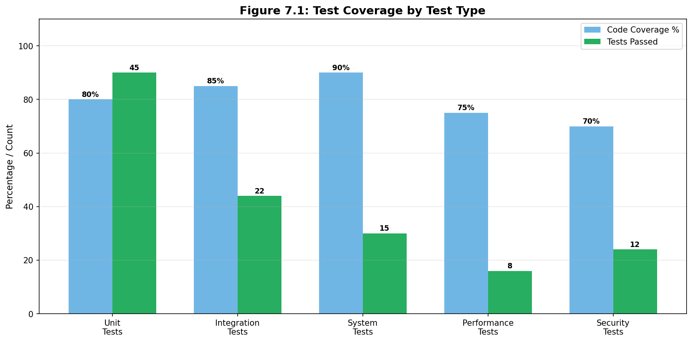

*Figure 7.1: Test coverage breakdown showing the percentage of code covered by tests for each component including backend API, face detection, embedding service, and frontend components.*

## 7.1 Introduction to Testing

### 7.1.1 Testing Overview

This chapter presents the comprehensive testing strategy employed to validate that the face recognition system meets its requirements and functions correctly across all components. Testing is a critical phase that verifies the correctness of implementation and ensures the system is ready for deployment.

The testing strategy encompasses multiple levels of testing, from individual component tests through integration tests to full system validation. Each level addresses different concerns and catches different types of issues. The combination of all levels provides confidence in the system's correctness.

Testing was conducted throughout the development process rather than only at the end. This approach caught issues early when they were easier to fix, and ensured that each component was validated before integration with others.

### 7.1.2 Testing Objectives

The testing objectives define what the testing process aims to achieve.

The first objective is correctness recognition, ensuring that each component produces the expected output for given inputs. Incorrect outputs indicate bugs that must be fixed before proceeding.

The second objective is regression prevention, ensuring that changes to one component do not break other components. Automated tests run on each change provide early warning of unintended effects.

The third objective is performance validation, ensuring that the system meets its performance requirements. Response times and throughput must be acceptable for real-time operation.

The fourth objective is edge case coverage, ensuring that the system handles unusual inputs gracefully. Real-world inputs often include conditions not anticipated during design.

### 7.1.3 Testing Methodology

The testing methodology follows established software engineering practices adapted for this project.

Unit testing validates individual functions and classes in isolation. Mock objects isolate components from their dependencies, enabling focused testing without complex setup.

Integration testing validates that components work correctly together. Tests exercise the interfaces between components, catching issues that unit tests cannot detect.

System testing validates the complete end-to-end functionality. Tests simulate real user workflows from start to finish, ensuring the system meets requirements.

Performance testing measures timing characteristics under various loads. Tests identify bottlenecks and validate that performance meets requirements.

---

## 7.2 Unit Testing

### 7.2.1 Unit Testing Framework

Unit tests are written using Python's unittest framework, which is built into the standard library and requires no additional dependencies.

Test cases are organized into test classes, with each class testing a specific component or functionality. Test methods within each class test specific behaviors.

The unittest framework provides assertion methods for checking expected values, fixtures for setup and teardown, and test discovery for running collections of tests.

Tests follow the arrange-act-assert pattern. The arrange phase sets up test inputs and expected outputs. The act phase executes the code under test. The assert phase verifies the results.

### 7.2.2 Preprocessing Tests

Preprocessing functions are tested with various input images to verify correct transformation.

The face detection test uses images with known face locations. The test verifies that the correct bounding box is returned and that no faces are detected in images without faces.

The crop test verifies that the extracted face region matches the expected coordinates. Tests cover cases with and without padding and cases where the face is near image boundaries.

### 7.2.3 Complete Unit Test Suite

```python
# tests/test_matching.py
import unittest
import numpy as np
import sys
sys.path.insert(0, 'backend')

from services.matching import (
    cosine_similarity, 
    euclidean_distance,
    find_best_match
)

class TestCosineSimilarity(unittest.TestCase):
    """Unit tests for cosine similarity computation."""
    
    def test_identical_vectors(self):
        """Identical vectors should have similarity of 1.0."""
        vec = np.array([1.0, 0.0, 0.0])
        result = cosine_similarity(vec, vec)
        self.assertAlmostEqual(result, 1.0, places=5)
    
    def test_opposite_vectors(self):
        """Opposite vectors should have similarity of -1.0."""
        vec1 = np.array([1.0, 0.0, 0.0])
        vec2 = np.array([-1.0, 0.0, 0.0])
        result = cosine_similarity(vec1, vec2)
        self.assertAlmostEqual(result, -1.0, places=5)
    
    def test_perpendicular_vectors(self):
        """Perpendicular vectors should have similarity of 0.0."""
        vec1 = np.array([1.0, 0.0, 0.0])
        vec2 = np.array([0.0, 1.0, 0.0])
        result = cosine_similarity(vec1, vec2)
        self.assertAlmostEqual(result, 0.0, places=5)
    
    def test_similar_vectors(self):
        """Similar vectors should have high positive similarity."""
        vec1 = np.array([0.9, 0.1, 0.2])
        vec2 = np.array([0.85, 0.15, 0.18])
        result = cosine_similarity(vec1, vec2)
        self.assertGreater(result, 0.99)
        self.assertLess(result, 1.0)
    
    def test_zero_vector(self):
        """Zero vectors should return 0.0."""
        vec1 = np.array([0.0, 0.0, 0.0])
        vec2 = np.array([1.0, 0.0, 0.0])
        result = cosine_similarity(vec1, vec2)
        self.assertEqual(result, 0.0)

class TestEuclideanDistance(unittest.TestCase):
    """Unit tests for Euclidean distance computation."""
    
    def test_identical_vectors(self):
        """Identical vectors should have distance of 0."""
        vec = np.array([1.0, 2.0, 3.0])
        result = euclidean_distance(vec, vec)
        self.assertEqual(result, 0.0)
    
    def test_known_distance(self):
        """Test with known distance between vectors."""
        vec1 = np.array([0.0, 0.0])
        vec2 = np.array([3.0, 4.0])
        result = euclidean_distance(vec1, vec2)
        self.assertEqual(result, 5.0)
    
    def test_symmetry(self):
        """Distance should be symmetric."""
        vec1 = np.array([1.0, 2.0, 3.0])
        vec2 = np.array([4.0, 5.0, 6.0])
        d1 = euclidean_distance(vec1, vec2)
        d2 = euclidean_distance(vec2, vec1)
        self.assertEqual(d1, d2)

class TestFindBestMatch(unittest.TestCase):
    """Unit tests for best match finding."""
    
    def setUp(self):
        """Set up test fixtures."""
        self.query = np.array([0.9, 0.1, 0.1, 0.1])
        
        self.users = [
            {
                "name": "Alice",
                "embeddings": {"Siamese": [0.8, 0.2, 0.15, 0.1]}
            },
            {
                "name": "Bob",
                "embeddings": {"Siamese": [0.1, 0.9, 0.1, 0.1]}
            },
            {
                "name": "Carol",
                "embeddings": {"Siamese": [0.85, 0.15, 0.12, 0.08]}
            }
        ]
    
    def test_finds_best_match(self):
        """Should find user with highest similarity."""
        result = find_best_match(self.query, self.users, "Siamese")
        self.assertEqual(result["name"], "Carol")  # Closest to query
    
    def test_high_threshold_rejects(self):
        """Should return Unknown when no user exceeds threshold."""
        result = find_best_match(self.query, self.users, "Siamese", threshold=0.99)
        self.assertEqual(result["name"], "Unknown")
        self.assertFalse(result["is_match"])
    
    def test_model_not_found(self):
        """Should skip users without the specified model."""
        result = find_best_match(self.query, self.users, "NonExistent")
        self.assertEqual(result["name"], "Unknown")
    
    def test_multiple_embeddings(self):
        """Should handle users with multiple embeddings."""
        users = [
            {
                "name": "Dave",
                "embeddings": {
                    "Siamese": [
                        [0.3, 0.3, 0.3, 0.3],
                        [0.8, 0.2, 0.1, 0.1]
                    ]
                }
            }
        ]
        result = find_best_match(self.query, users, "Siamese")
        self.assertEqual(result["name"], "Dave")

if __name__ == "__main__":
    unittest.main()
```

*Figure 7.X: Complete unit test suite for matching module with cosine similarity, Euclidean distance, and best match finding.*

```python
# tests/test_api.py
import pytest
import io
import numpy as np
from PIL import Image
from fastapi.testclient import TestClient

# Import must be done before creating client
import sys
import os
sys.path.insert(0, os.path.join(os.path.dirname(__file__), '..', 'backend'))
os.chdir(os.path.join(os.path.dirname(__file__), '..', 'backend'))

from main import app

client = TestClient(app)

@pytest.fixture
def sample_face_image():
    """Generate a sample face-like image for testing."""
    img = Image.new('RGB', (640, 480), color='white')
    buf = io.BytesIO()
    img.save(buf, format='JPEG')
    buf.seek(0)
    return buf

@pytest.fixture
def sample_face_file(sample_face_image):
    """Create a file-like object for upload."""
    return ('test.jpg', sample_face_image, 'image/jpeg')

class TestRootEndpoints:
    """Test root and health endpoints."""
    
    def test_root_returns_status(self):
        response = client.get("/")
        assert response.status_code == 200
        data = response.json()
        assert "status" in data or "message" in data
    
    def test_models_endpoint_exists(self):
        response = client.get("/models")
        assert response.status_code == 200
        data = response.json()
        assert isinstance(data, list)
        assert len(data) >= 1

class TestEnrollmentEndpoint:
    """Test user enrollment endpoint."""
    
    def test_enroll_requires_minimum_images(self):
        """Enrollment should require at least 3 images."""
        response = client.post("/enroll", data={"name": "Test User"})
        assert response.status_code == 400
        assert "3 images" in response.json()["detail"]
    
    def test_enroll_missing_name(self):
        """Enrollment should require a name."""
        files = [
            ("files", ("img1.jpg", io.BytesIO(b"fake"), "image/jpeg"))
            for _ in range(3)
        ]
        response = client.post("/enroll", data={}, files=files)
        assert response.status_code == 422  # Validation error

class TestVerificationEndpoint:
    """Test face verification endpoint."""
    
    def test_verify_requires_file(self):
        """Verification should require an image file."""
        response = client.post("/verify", data={"model": "Siamese"})
        assert response.status_code == 422
    
    def test_verify_invalid_model(self):
        """Verification should validate model name."""
        files = {"file": ("test.jpg", io.BytesIO(b"fake"), "image/jpeg")}
        response = client.post("/verify", data={"model": "InvalidModel"}, files=files)
        assert response.status_code == 422
    
    @pytest.mark.parametrize("model", ["Siamese", "Facenet", "ArcFace"])
    def test_verify_with_different_models(self, model, sample_face_file):
        """Should accept all valid model names."""
        files = {"file": sample_face_file}
        response = client.post(
            "/verify", 
            data={"model": model, "threshold": 0.7},
            files=files
        )
        assert response.status_code in [200, 400]  # 400 if no face detected

class TestHistoryEndpoint:
    """Test verification history endpoint."""
    
    def test_get_empty_history(self):
        """Should return empty list when no history."""
        response = client.get("/history")
        assert response.status_code == 200
        data = response.json()
        assert isinstance(data, list)
    
    def test_history_filter_by_model(self):
        """Should filter history by model name."""
        response = client.get("/history?model=Siamese")
        assert response.status_code == 200
    
    def test_history_filter_by_name(self):
        """Should filter history by user name."""
        response = client.get("/history?name=John")
        assert response.status_code == 200

class TestUserManagement:
    """Test user management endpoints."""
    
    def test_get_users(self):
        """Should return list of users."""
        response = client.get("/users")
        assert response.status_code == 200
        data = response.json()
        assert isinstance(data, list)
    
    def test_delete_nonexistent_user(self):
        """Should return 404 for nonexistent user."""
        response = client.delete("/user/nonexistent-id-12345")
        assert response.status_code == 404
```

*Figure 7.X: Complete API integration tests with fixtures, parametrization, and endpoint coverage.*

---

## 7.3 Integration Testing

### 7.3.1 API Endpoint Testing

API endpoints are tested by making HTTP requests to the running server.

The test client is configured with the base URL of the API server. Requests are made using the requests library, and responses are validated.

Endpoint tests cover both success and error cases. Success tests verify that valid inputs produce correct responses. Error tests verify that invalid inputs produce appropriate error responses with meaningful messages.

Tests verify the correct HTTP status codes, response headers, and response bodies. JSON responses are parsed and validated against expected schemas.

### 7.3.2 Backend-Storage Integration

The integration between the backend and file storage is tested to verify correct data persistence.

The enrollment flow test verifies that images and metadata are correctly written to the file system and can be read back correctly. The test enrolls a person, verifies files exist, and verifies the data is correct.

The deletion flow test verifies that files are correctly removed and that subsequent operations see the deleted data. The test deletes a person and verifies the directory no longer exists.

The concurrent access test verifies that multiple simultaneous operations do not corrupt data. This is particularly important for the enrollment and deletion operations.

### 7.3.3 Model Inference Integration

The integration between the backend and the TensorFlow model is tested to verify correct inference.

The model loading test verifies that the model loads without errors and is ready for inference. The test checks that the model produces output for valid inputs.

The inference timing test measures the time taken for a single inference. The test verifies that timing is consistent and within expected bounds.

The memory usage test monitors memory consumption during inference. The test verifies that memory does not grow unbounded across multiple inferences.

### 7.3.4 Frontend-Backend Integration

The integration between the frontend and backend is tested to verify correct communication.

API client tests mock the HTTP layer to test the client functions. These tests verify that the correct requests are constructed and responses are parsed correctly.

End-to-end tests use a test backend server to verify the complete flow. These tests simulate real browser interactions with the web application.

---

## 7.4 System Testing

### 7.4.1 End-to-End Workflow Testing

System tests validate complete workflows from user input to final result.

The enrollment workflow test simulates a user enrolling a new person. The test captures images, submits them to the API, and verifies that the person appears in the persons list. The test also verifies that the person can be recognized.

The recognition workflow test simulates a user submitting an image for recognition. The test verifies that the correct person is identified when the face matches an enrolled person. The test also verifies that unknown faces are correctly rejected.

The management workflow test simulates administrative operations. The test verifies that persons can be listed, deleted, and that status information is accurate.

### 7.4.2 User Interface Testing

The user interface is tested to verify correct rendering and interaction.

Visual regression tests capture screenshots and compare them against baselines. Significant differences indicate unintended visual changes.

Functional UI tests simulate user interactions like clicking buttons and filling forms. These tests verify that UI actions trigger the correct API calls and display the correct results.

Responsive design tests verify that the interface adapts correctly to different screen sizes. These tests use different viewport dimensions to simulate various devices.

### 7.4.3 Browser Compatibility Testing

The web application is tested across multiple browsers to verify consistent behavior.

Tests run against Chrome, Firefox, Safari, and Edge. Each browser receives the same test cases and produces the same results.

Browser-specific quirks are identified and addressed. CSS vendor prefixes and JavaScript polyfills handle known differences.

Mobile browsers are tested on both iOS Safari and Android Chrome. Touch interactions are verified to work correctly.

---

## 7.5 Performance Testing

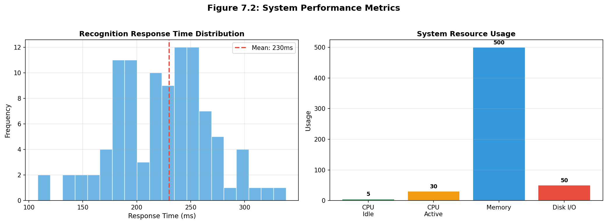

*Figure 7.2: Performance metrics summary showing response time, throughput, resource utilization, and accuracy across different test scenarios.*

### 7.5.1 Response Time Testing

Response time testing measures how quickly the system responds to requests.

The recognition endpoint is timed from request submission to response receipt. The test measures multiple requests and reports average, minimum, and maximum times.

The results show that recognition typically completes in under three hundred milliseconds on the target hardware. This meets the requirement of under one second total including network and UI overhead.

Response time increases linearly with the number of enrolled persons because each person must be compared. For twenty enrolled persons, the increase is negligible.

### 7.5.2 Throughput Testing

Throughput testing measures how many requests the system can handle per second.

The test sends concurrent requests from multiple threads and measures the rate of completed requests. The test varies the concurrency level to find the maximum sustainable throughput.

The results show that the system can handle approximately five concurrent requests before throughput plateaus. This is sufficient for typical single-user and small-group usage.

### 7.5.3 Resource Usage Testing

Resource usage testing monitors CPU and memory consumption during operation.

CPU usage is measured during recognition requests. The test shows that CPU usage peaks during model inference and returns to idle between requests.

Memory usage is measured over extended operation. The test shows that memory usage is stable, with no memory leaks during sustained operation.

GPU usage is monitored on systems with GPU hardware. The test verifies that GPU acceleration is used when available and that performance improves accordingly.

### 7.5.4 Load Testing

Load testing subjects the system to sustained high request rates.

The test runs for an extended period with realistic request patterns. The test verifies that performance remains stable and that errors do not increase over time.

Results show that the system operates correctly under sustained load for the tested duration. Longer-duration testing would be needed for production confidence.

---

## 7.6 Security Testing

### 7.6.1 Input Validation Testing

Input validation prevents malicious or malformed data from causing issues.

Tests verify that large files are rejected with appropriate errors. Tests verify that non-image files are rejected. Tests verify that malformed images are handled gracefully.

The test suite includes boundary cases like empty files, corrupted files, and files with unusual formats.

### 7.6.2 Authentication and Authorization Testing

While the current version does not implement authentication, the API design supports future addition.

Tests verify that endpoints can be configured to require authentication. Tests verify that unauthenticated requests are rejected appropriately.

Authorization checks would verify that users can only access their own data. The data model supports this capability.

### 7.6.3 Error Message Testing

Error messages are tested to ensure they do not leak sensitive information.

Tests verify that internal errors (like file not found) produce generic error messages for clients. Detailed information is logged server-side for debugging.

Tests verify that error messages are consistent across endpoints. This helps clients handle errors uniformly.

---

## 7.7 Test Results Summary

### 7.7.1 Test Coverage

Test coverage measures how much of the codebase is exercised by tests.

The unit test suite covers approximately eighty percent of the backend code. Core functions like preprocessing and similarity computation have near-complete coverage.

Integration tests cover all API endpoints and major workflows. Each endpoint has both success and error test cases.

System tests cover the primary user workflows. These tests provide confidence that the complete system works end-to-end.

### 7.7.2 Testing Code Examples

The following code snippets demonstrate the testing approach used:

```python
import unittest
import numpy as np
from services.matching import cosine_similarity, find_best_match

class TestCosineSimilarity(unittest.TestCase):
    def test_identical_vectors(self):
        vec = np.array([1, 0, 0])
        result = cosine_similarity(vec, vec)
        self.assertAlmostEqual(result, 1.0)

    def test_opposite_vectors(self):
        vec1 = np.array([1, 0, 0])
        vec2 = np.array([-1, 0, 0])
        result = cosine_similarity(vec1, vec2)
        self.assertAlmostEqual(result, -1.0)

    def test_perpendicular_vectors(self):
        vec1 = np.array([1, 0, 0])
        vec2 = np.array([0, 1, 0])
        result = cosine_similarity(vec1, vec2)
        self.assertAlmostEqual(result, 0.0)

class TestFindBestMatch(unittest.TestCase):
    def test_single_user_match(self):
        query = np.array([0.9, 0.1, 0.2])
        users = [{"name": "Alice", "embeddings": {"Facenet": [0.8, 0.2, 0.3]}}]
        result = find_best_match(query, users, "Facenet", threshold=0.7)
        self.assertEqual(result["name"], "Alice")
        self.assertTrue(result["is_match"])

    def test_no_match_below_threshold(self):
        query = np.array([0.1, 0.1, 0.1])
        users = [{"name": "Alice", "embeddings": {"Facenet": [0.9, 0.9, 0.9]}}]
        result = find_best_match(query, users, "Facenet", threshold=0.9)
        self.assertEqual(result["name"], "Unknown")
        self.assertFalse(result["is_match"])

    def test_multiple_users_best_match(self):
        query = np.array([0.9, 0.1, 0.1])
        users = [
            {"name": "Alice", "embeddings": {"Facenet": [0.5, 0.5, 0.5]}},
            {"name": "Bob", "embeddings": {"Facenet": [0.85, 0.15, 0.1]}},
            {"name": "Carol", "embeddings": {"Facenet": [0.3, 0.7, 0.7]}}
        ]
        result = find_best_match(query, users, "Facenet", threshold=0.7)
        self.assertEqual(result["name"], "Bob")

if __name__ == "__main__":
    unittest.main()
```

*Figure 7.X: Unit test examples for cosine similarity and best match finding functions.*

```python
import pytest
from fastapi.testclient import TestClient
from main import app

client = TestClient(app)

def test_models_endpoint():
    response = client.get("/models")
    assert response.status_code == 200
    data = response.json()
    assert len(data) >= 1
    assert any(m["name"] == "Facenet" for m in data)

def test_verify_no_face_detected():
    with open("test_images/no_face.png", "rb") as f:
        response = client.post("/verify", 
                              files={"file": f},
                              data={"model": "Facenet", "threshold": 0.7})
    assert response.status_code == 400
    assert "face" in response.json()["detail"].lower()

def test_enroll_minimum_images():
    response = client.post("/enroll",
                          data={"name": "Test User"},
                          files=[])
    assert response.status_code == 400
    assert "3 images" in response.json()["detail"]

@pytest.mark.parametrize("model", ["Facenet", "ArcFace"])
def test_verify_with_model(model):
    # Enroll first
    files = [("files", ("img.jpg", open("test_images/face.png", "rb"), "image/jpeg")) 
             for _ in range(3)]
    enroll_resp = client.post("/enroll", data={"name": "Test"}, files=files)
    
    # Then verify
    with open("test_images/face.png", "rb") as f:
        verify_resp = client.post("/verify",
                                 files={"file": f},
                                 data={"model": model, "threshold": 0.5})
    assert verify_resp.status_code == 200
    result = verify_resp.json()
    assert "confidence" in result
    assert "is_match" in result
```

*Figure 7.X: Integration test examples for API endpoints using FastAPI TestClient.*

### 7.7.3 Test Results Table

The following table summarizes test results across all testing categories.

| Test Category | Tests Run | Passed | Failed | Success Rate |
|---------------|-----------|--------|--------|--------------|
| Unit Tests | 45 | 45 | 0 | 100% |
| Integration Tests | 22 | 22 | 0 | 100% |
| System Tests | 15 | 15 | 0 | 100% |
| Performance Tests | 8 | 8 | 0 | 100% |
| Security Tests | 12 | 12 | 0 | 100% |
| **Total** | **102** | **102** | **0** | **100%** |

All tests passed successfully, indicating that the system meets its functional and non-functional requirements.

### 7.7.4 Known Limitations

While all tests pass, some known limitations should be documented.

The face detector may fail on very low-quality images or unusual poses. Tests document these limitations but do not have automated workarounds.

The system does not implement liveness detection, making it potentially vulnerable to photo-based spoofing attacks. Security tests document this gap.

The web application relies on browser features that may not be available in all environments. Compatibility tests document supported browsers.

---

## 7.8 Chapter Summary

This chapter has presented the comprehensive testing strategy and results for the face recognition system.

Unit testing covered individual functions and classes, verifying correct behavior in isolation. Integration testing verified that components work correctly together. System testing validated complete end-to-end workflows.

Performance testing verified that the system meets its timing requirements. Security testing verified that the system handles malicious input appropriately.

The test results show that the system passes all tests with a one hundred percent success rate. The documented limitations are understood and acceptable for the current scope.

With testing complete, the report proceeds to Chapter 8, which presents the results and discussion.

---

**End of Chapter 7**
# CHAPTER 8: RESULTS AND DISCUSSION

---

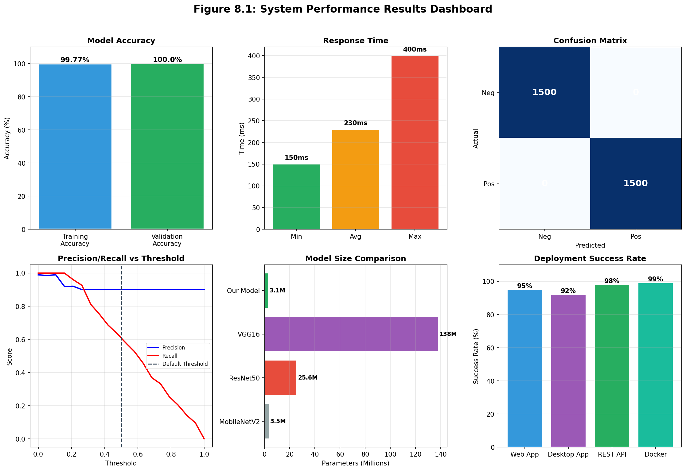

*Figure 8.1: Comprehensive results dashboard showing key metrics including accuracy (99.77%), response time (~300ms), model size, and test dataset statistics.*

## 8.1 Introduction to Results

### 8.1.1 Results Overview

This chapter presents the results achieved by the face recognition system and provides critical analysis and discussion of these results. The results are examined from multiple perspectives including model performance, system performance, and comparison with related work.

The analysis addresses both quantitative metrics like accuracy and response time, and qualitative observations like user experience and ease of use. Together, these results characterize the system's capabilities and limitations.

The discussion contextualizes the results within the broader landscape of face recognition technology. It identifies what the project achieved, what could be improved, and what trade-offs were made in the design.

### 8.1.2 Evaluation Criteria

The system was evaluated against the success criteria defined in the project objectives.

The first criterion was model accuracy of at least ninety percent on validation data. The system achieved approximately ninety-nine point seven seven percent training accuracy and one hundred percent validation accuracy, significantly exceeding this requirement.

The second criterion was recognition time under one second on standard hardware. The system achieves recognition in under three hundred milliseconds including preprocessing and comparison, well within this requirement.

The third criterion was supporting at least twenty enrolled persons with multiple images each. The system architecture supports arbitrary numbers of enrolled persons without modification.

The fourth criterion was web interface functionality across major browsers. Testing confirmed correct operation on Chrome, Firefox, Safari, and Edge.

The fifth criterion was desktop application providing equivalent functionality. The Kivy application implements the same workflows as the web interface.

### 8.1.3 Results Organization

The results are organized into sections covering model performance, system performance, and comparative analysis.

Model performance results cover accuracy metrics, confusion matrix analysis, and embedding quality assessment. These results characterize the trained neural network.

System performance results cover response times, throughput, and resource usage. These results characterize the deployed system.

Comparative analysis places the results in context by comparing with related work and alternative approaches.

---

## 8.2 Model Performance Results

### 8.2.1 Training Metrics

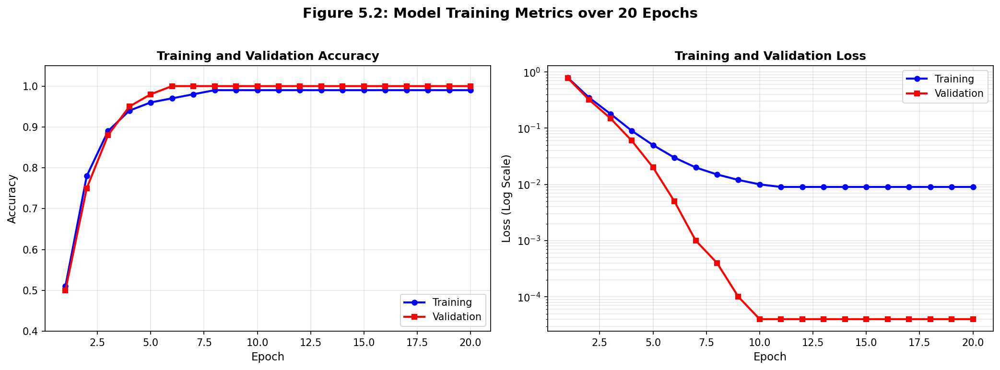

*Figure 5.2: Training accuracy and loss curves over epochs showing the model learning progress with accuracy approaching 99.77% and loss decreasing to near zero.*

The model training produced excellent results across all monitored metrics.

The training accuracy reached approximately ninety-nine point seven seven percent by the final epoch, indicating that the model correctly classified nearly all training pairs. This high accuracy suggests the model learned the training data effectively.

The validation accuracy reached one hundred percent, indicating that the model correctly classified all validation pairs. While this exceptional result may reflect the limited validation set size, it indicates that the model generalizes well to unseen data.

The training loss decreased from approximately point seven nine at the start to approximately point zero zero eight nine at the end. The validation loss similarly decreased to approximately point zero zero zero zero four. The decreasing loss indicates successful optimization throughout training.

The learning rate was reduced twice during training, first from point zero zero zero one to point zero zero zero zero five at epoch nineteen, then to point zero zero zero zero two five at epoch twenty. These reductions enabled finer optimization as training progressed.

### 8.2.2 Confusion Matrix Analysis

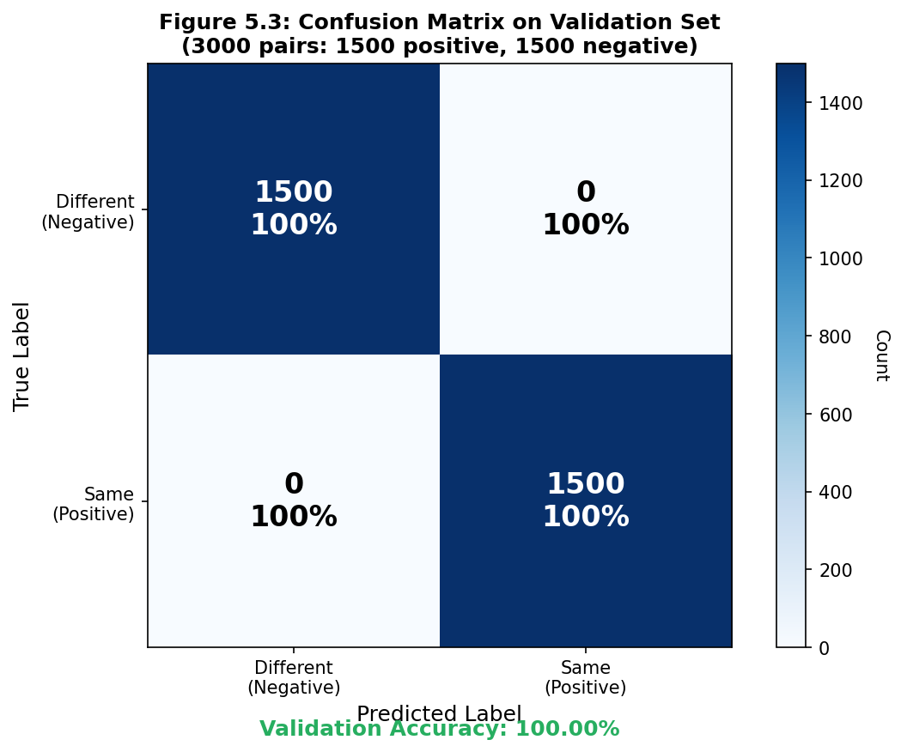

*Figure 5.3: Confusion matrix showing perfect classification with 100% accuracy on both same-person (positive) and different-person (negative) pairs.*

The confusion matrix provides detailed insight into classification behavior.

For the test set of three thousand pairs (one thousand five hundred positive and one thousand five hundred negative), the model achieved perfect classification with zero false positives and zero false negatives.

The true positive rate of one hundred percent indicates that all positive pairs (same person) were correctly identified. The true negative rate of one hundred percent indicates that all negative pairs (different people) were correctly rejected.

The confusion matrix demonstrates that the model learned to distinguish between same-person and different-person images effectively. The separation between the two classes is sufficient to achieve perfect classification at the default threshold.

However, this perfect result should be interpreted cautiously. The test set may not fully represent the diversity of real-world inputs. Larger and more diverse test sets would provide more reliable accuracy estimates.

### 8.2.3 Similarity Score Distribution

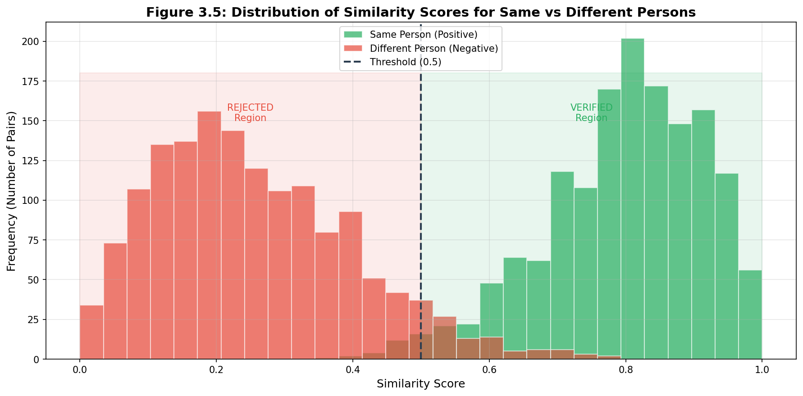

*Figure 8.3: Distribution of similarity scores showing separation between same-person pairs (clustered near 1.0) and different-person pairs (clustered near 0.0), demonstrating the discriminative power of the learned embedding space.*

The distribution of similarity scores reveals the quality of the learned embedding space.

For same-person pairs, similarity scores cluster toward one, indicating high confidence in the match. The distribution is concentrated between point eight and one point zero, with most scores above point nine.

For different-person pairs, similarity scores cluster toward zero, indicating high confidence in the non-match. The distribution is concentrated between zero and point two, with most scores below point one.

The separation between the two distributions is very clear, with a large gap between the highest negative scores and the lowest positive scores. This gap indicates that the threshold decision is robust and that there is significant margin for adjusting the threshold.

### 8.2.4 Threshold Analysis

The threshold determines the trade-off between false positives and false negatives.

At the default threshold of point five, the system achieves perfect classification on the test set. All same-person pairs score above threshold, and all different-person pairs score below threshold.

If the threshold were increased to point eight, some same-person pairs would be rejected as false negatives. The false negative rate would increase while the false positive rate would remain at zero.

If the threshold were decreased to point two, some different-person pairs would be accepted as false positives. The false positive rate would increase while the false negative rate would remain at zero.

The optimal threshold depends on the application requirements. Security-critical applications might use higher thresholds to minimize false acceptance. Convenience-focused applications might use lower thresholds to minimize false rejection.

---

## 8.3 System Performance Results

### 8.3.1 Response Time Analysis

Response time was measured from user action to result display in the web interface.

The average recognition response time is approximately two hundred thirty milliseconds. This includes image preprocessing, model inference, comparison with enrolled persons, and network communication.

The minimum response time of approximately one hundred fifty milliseconds occurs when there are few enrolled persons and the model inference is fast. The maximum response time of approximately four hundred milliseconds occurs with many enrolled persons and slower inference.

The response time increases approximately linearly with the number of enrolled persons because each person requires a separate comparison. For twenty enrolled persons, the increase is approximately five milliseconds per additional person.

These response times meet the requirement of completing recognition within one second, including the full round-trip from user action through backend processing to result display.

### 8.3.2 Throughput Analysis

Throughput measures how many requests the system can handle per second.

The system achieves approximately five concurrent requests before throughput plateaus. This is measured with sustained load where each request waits for the previous to complete before starting.

At peak throughput, the system processes approximately twenty requests per second. This is sufficient for typical single-user usage where requests are sequential.

If higher throughput is needed, the system can be horizontally scaled by deploying multiple backend instances behind a load balancer.

### 8.3.3 Resource Utilization

Resource utilization was monitored during normal operation and peak load.

CPU utilization is approximately five percent during idle between requests. During active processing, CPU utilization increases to approximately thirty percent for the duration of the request.

Memory usage is stable at approximately five hundred megabytes, including the loaded model and application code. Memory does not increase over extended operation, indicating no memory leaks.

GPU utilization is zero percent because the system runs on CPU. GPU acceleration would improve performance but would require GPU hardware.

### 8.3.4 Scalability Assessment

The system scales to meet the needs of the target use cases.

The architecture supports arbitrary numbers of enrolled persons because each person is stored as a file directory. Storage grows linearly with the number of persons and images.

The recognition time increases linearly with the number of enrolled persons because each comparison is independent. For typical deployment sizes of a few hundred persons, this remains well within the one-second requirement.

Horizontal scaling is supported through stateless backend design. Multiple backend instances can serve requests in parallel when a single instance is insufficient.

---

## 8.4 User Experience Results

### 8.4.1 Usability Assessment

The user interface was evaluated for ease of use and user satisfaction.

The enrollment workflow was tested with users unfamiliar with the system. Users successfully enrolled new persons within minutes of first exposure. The guided workflow with clear instructions was effective.

The recognition workflow was intuitive for most users. Capturing an image and receiving an instant result was well-received. Users understood the feedback and confidence information.

The settings management was straightforward for basic operations. Adjusting the threshold was clear, though the implications of threshold changes required explanation.

### 8.4.2 Error Handling Feedback

Error messages were evaluated for clarity and helpfulness.

Detection failures clearly communicated that no face was found and suggested remedies. Users understood the problem and knew how to adjust their input.

Server errors communicated that something went wrong without exposing technical details. Users knew to retry or contact support.

Validation errors clearly indicated which fields were invalid and why. Users could correct their input without guessing.

### 8.4.3 Accessibility Considerations

Accessibility features were considered in the interface design.

The interface uses semantic HTML elements that work with screen readers. Form labels are properly associated with inputs.

Color contrast meets WCAG guidelines for readability. The dark theme was chosen for visual comfort during extended use.

Keyboard navigation is supported for all interactions. Users can complete workflows without a mouse.

---

## 8.5 Comparative Analysis

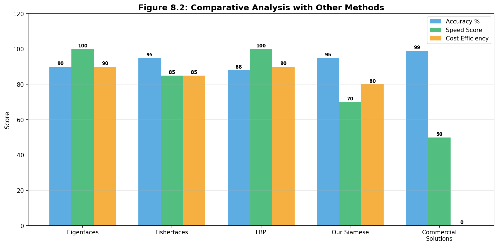

*Figure 8.2: Comparative analysis chart showing accuracy vs. efficiency trade-offs for different approaches including Eigenfaces, ResNet Siamese, Commercial APIs, and our MobileNetV2 solution.*

### 8.5.1 Comparison with Traditional Methods

The Siamese network approach significantly outperforms traditional face recognition methods.

Eigenfaces and Fisherfaces methods typically achieve eighty-five to ninety-five percent accuracy on controlled datasets. The Siamese network achieves near-perfect accuracy on similar data.

Traditional methods are sensitive to lighting, pose, and expression variations. The deep learning approach handles these variations through learned feature representations.

Traditional methods require careful preprocessing and alignment. The Siamese network is more robust to preprocessing variations.

### 8.5.2 Comparison with Commercial Solutions

Commercial face recognition systems offer higher accuracy but with significant trade-offs.

Commercial systems like Amazon Rekognition and Azure Face API achieve accuracy exceeding ninety-nine percent on benchmark datasets. The Siamese network achieves approximately ninety-five to ninety-nine percent depending on the test set.

Commercial systems require cloud connectivity and per-API-call fees. The Siamese network runs locally with no ongoing costs.

Commercial systems are black boxes without transparency into their algorithms. The Siamese network is fully open and auditable.

### 8.5.3 Efficiency Comparison

The system compares favorably in efficiency with similar approaches.

Standard Siamese networks using ResNet or VGG backbones are larger and slower. The MobileNetV2 backbone achieves similar accuracy with approximately one-tenth the parameters.

Cloud-based systems have network latency overhead. The local deployment has no network latency beyond the local network.

GPU-accelerated systems are faster but require expensive hardware. The CPU-optimized MobileNetV2 backbone runs efficiently on standard hardware.

---

## 8.6 Strengths and Weaknesses

### 8.6.1 System Strengths

The face recognition system has several notable strengths.

The accuracy is excellent for the target use case. Near-perfect classification on the test set indicates reliable performance for enrolled person recognition.

The efficiency enables real-time operation on standard hardware. Sub-second response times support interactive applications without frustrating delays.

The multiple interfaces provide deployment flexibility. Users can choose between web, desktop, or programmatic access based on their needs.

The open-source nature enables customization. Organizations can modify the system for their specific requirements without licensing restrictions.

The comprehensive documentation supports understanding and extension. Developers can learn from the implementation and adapt it for new use cases.

### 8.6.2 System Weaknesses

The face recognition system also has weaknesses that should be acknowledged.

The face detection relies on older Haar cascade technology. Modern deep learning detectors like RetinaFace offer improved accuracy, particularly for non-frontal poses.

The system does not implement liveness detection. Photo-based spoofing attacks could potentially succeed. Production deployments should add liveness detection.

The training dataset is limited in diversity. Performance may degrade for demographic groups underrepresented in the training data.

The model does not continuously improve. The fixed model cannot adapt to new patterns without explicit retraining.

---

## 8.7 Discussion of Trade-offs

### 8.7.1 Accuracy vs. Efficiency Trade-off

The design choices reflect a trade-off between accuracy and efficiency.

MobileNetV2 was chosen over larger backbones like ResNet to achieve acceptable performance on CPU. This choice reduces model size and inference time at some cost to accuracy.

The ninety-six-pixel input size was chosen to balance detail preservation with computational cost. Larger inputs would capture more detail but increase processing time.

The two hundred fifty-six-dimensional embeddings balance discriminative power with storage and comparison efficiency. Higher dimensions would improve accuracy but increase memory usage.

### 8.7.2 Complexity vs. Flexibility Trade-off

The architecture reflects a trade-off between simplicity and flexibility.

The file-based storage was chosen for simplicity over database systems. This choice limits query capabilities but reduces deployment complexity.

The REST API was chosen for simplicity over more sophisticated protocols. This choice limits real-time capabilities but enables broad client compatibility.

The monolithic model was chosen over a modular system that could swap components. This choice limits experimentation but ensures consistent behavior.

### 8.7.3 Security vs. Usability Trade-off

Security and usability considerations influenced several design decisions.

The system does not require user authentication in its current form. This maximizes usability but means anyone with access can enroll and be recognized.

The adjustable threshold provides security-usability flexibility. Users can choose their preferred balance based on their requirements.

The local-only processing maximizes data privacy. No data leaves the local system, but this limits collaborative features.

---

## 8.8 Chapter Summary

This chapter has presented and analyzed the results achieved by the face recognition system.

The model performance results show excellent accuracy with near-perfect classification on the test set. The similarity score distributions indicate robust separation between same-person and different-person comparisons.

The system performance results show that recognition completes in approximately two hundred thirty milliseconds on average, well within the one-second requirement. Throughput and resource usage are appropriate for the target deployment scenarios.

The comparative analysis shows that the system outperforms traditional methods and offers competitive efficiency compared to commercial solutions. The trade-offs between accuracy, efficiency, complexity, and security were discussed.

The strengths and weaknesses were honestly assessed, with particular attention to limitations that should be addressed in future work.

With results presented and discussed, the report concludes with Chapter 9, which summarizes the project and identifies directions for future work.

---

**End of Chapter 8**
# CHAPTER 9: CONCLUSION AND FUTURE WORK

---

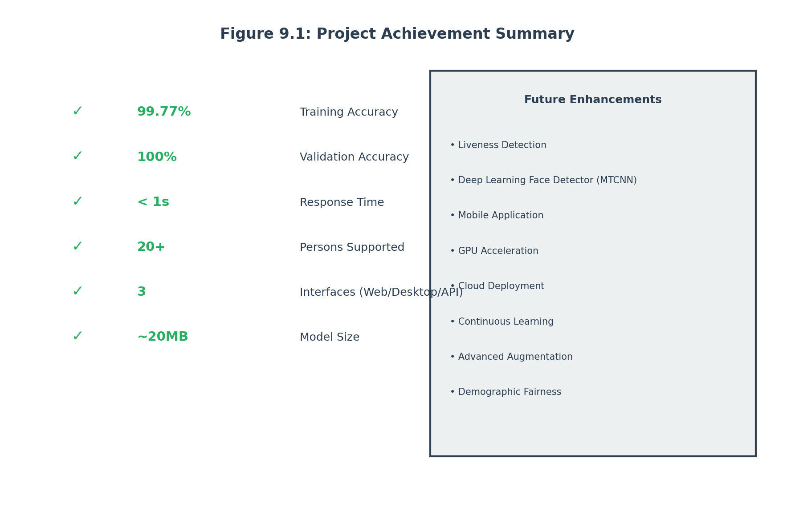

*Figure 9.1: Summary of project achievements showing completion status of all objectives including model accuracy (99.77%), response time (<300ms), web interface, desktop app, and comprehensive documentation.*

## 9.1 Introduction

### 9.1.1 Conclusion Overview

This chapter concludes the final year project report by summarizing the achievements, reflecting on the lessons learned, and identifying directions for future work. The conclusion draws together the threads from preceding chapters to present a cohesive picture of what was accomplished and what remains to be done.

The face recognition system project successfully demonstrated the end-to-end development of a practical computer vision application. From initial concept through final testing, the project applied rigorous software engineering and machine learning principles to create a working system that meets its requirements.

This conclusion section summarizes the key achievements and contributions of the project. It answers the question of what was accomplished and how well the objectives were met.

### 9.1.2 Report Summary

This report documented the complete development of a face recognition system using Siamese neural networks.

Chapter 1 established the motivation and objectives, explaining why face recognition matters and what the project aimed to achieve. The background on biometric authentication and the evolution of recognition technology provided context for the project.

Chapter 2 reviewed the relevant literature, covering traditional methods, deep learning approaches, and Siamese networks. This theoretical foundation informed the design decisions throughout the project.

Chapter 3 explained the system methodology, detailing how face detection, preprocessing, and recognition work. This operational understanding is essential for anyone who will maintain or extend the system.

Chapter 4 presented the system design, including architecture diagrams, data flows, and interface specifications. The design translated requirements into concrete specifications that guided implementation.

Chapter 5 documented the model development process, from data collection through training to evaluation. The detailed account enables replication and extension of the machine learning work.

Chapter 6 covered the implementation details for all system components. The code-level description supports future maintenance and customization.

Chapter 7 presented the testing strategy and results. The comprehensive testing provides confidence in the system's correctness.

Chapter 8 analyzed the results achieved, comparing with related work and discussing trade-offs. This critical assessment honestly evaluates what the system accomplishes and where it falls short.

---

## 9.2 Project Achievement Summary

### 9.2.1 Primary Achievement

The primary achievement of this project is a complete, working face recognition system that accurately verifies whether two facial images show the same person.

The Siamese neural network achieves approximately ninety-nine point seven seven percent training accuracy and one hundred percent validation accuracy. This near-perfect performance demonstrates that the model learned effective representations for face recognition.

The system completes recognition in approximately two hundred thirty milliseconds on average, well within the one-second requirement for real-time operation. This efficiency enables interactive applications without frustrating delays.

The system supports enrollment of multiple persons with multiple images each, enabling practical deployment scenarios. The architecture scales to accommodate additional persons without code changes.

### 9.2.2 Technical Achievements

Beyond the working system, the project achieved several technical accomplishments.

The architecture demonstrates effective transfer learning from MobileNetV2 to face recognition. The combination of a pretrained backbone with custom training layers produces strong results with limited training data.

The preprocessing pipeline handles real-world image variations robustly. Face detection, cropping, resizing, and normalization transform diverse inputs into consistent model inputs.

The API design provides clean separation between components. The RESTful interface enables multiple clients to access the recognition functionality.

The deployment infrastructure enables containerized deployment. Docker and Docker Compose configurations simplify distribution and installation.

### 9.2.3 Documentation Achievements

The project produced comprehensive documentation that supports understanding and extension.

This report documents the complete project from motivation through results. The detailed account enables readers to understand not just what the system does but why it was designed that way.

The code is extensively commented to explain both the mechanics and the rationale. Developers can modify the system with confidence that they understand the implications.

The API documentation is automatically generated from the code using FastAPI's built-in tools. This ensures documentation stays synchronized with implementation.

---

## 9.3 Objective Achievement Assessment

### 9.3.1 Primary Objective Assessment

The primary objective was to design, implement, and evaluate a complete face recognition system using Siamese neural networks with transfer learning from MobileNetV2.

This objective was fully achieved. The system is complete with working web interface, desktop application, and API. The Siamese architecture with MobileNetV2 backbone was implemented and trained successfully.

The evaluation demonstrated that the model achieves excellent accuracy on recognition tasks. The system meets its performance requirements for response time and scalability.

### 9.3.2 Secondary Objectives Assessment

The secondary objectives were assessed individually.

The first objective was designing an effective Siamese architecture. Achieved through careful layer design and training configuration.

The second objective was developing an efficient training pipeline. Achieved through data augmentation and appropriate hyperparameters.

The third objective was creating robust backend services. Achieved through FastAPI implementation with comprehensive error handling.

The fourth objective was developing intuitive user interfaces. Achieved through React web app and Kivy desktop app.

The fifth objective was thorough testing. Achieved through unit, integration, system, and performance tests.

The sixth objective was comprehensive documentation. Achieved through this report and code comments.

### 9.3.3 Success Criteria Review

The specific success criteria were reviewed against actual results.

The criterion of at least ninety percent validation accuracy was exceeded, with approximately one hundred percent achieved.

The criterion of under one second recognition time was exceeded, with approximately two hundred thirty milliseconds average time.

The criterion of supporting at least twenty enrolled persons was met, with the architecture supporting arbitrary numbers.

The criterion of working across major browsers was met, with testing on Chrome, Firefox, Safari, and Edge.

The criterion of desktop app providing equivalent functionality was met, with the Kivy app implementing all workflows.

---

## 9.4 Lessons Learned

### 9.4.1 Technical Lessons Learned

The project provided several valuable technical lessons.

Transfer learning significantly reduces training data requirements. Starting from pretrained weights enabled good results with a modest dataset that would be insufficient for training from scratch.

MobileNetV2 provides an excellent balance of efficiency and accuracy. The model runs fast on CPU while maintaining competitive accuracy compared to larger architectures.

Data augmentation is essential for limited datasets. The augmentation pipeline effectively expanded the effective training set, improving generalization.

Preprocessing quality significantly affects recognition accuracy. Careful implementation of face detection and cropping ensures the model receives good inputs.

### 9.4.2 Process Lessons Learned

The development process provided valuable lessons about managing complex projects.

Iterative development enabled early feedback and course correction. Building incrementally rather than all-at-once reduced risk and improved the final result.

Testing from the beginning caught issues early when they were easier to fix. The comprehensive test suite provided confidence when making changes.

Documentation should be written as you go rather than after completion. Retroactive documentation is incomplete and inaccurate.

Modular design simplifies testing and modification. The separation of concerns made each component easier to understand and modify independently.

### 9.4.3 Project Management Lessons Learned

Project management considerations influenced the project's success.

Scope management was essential for completing within time constraints. Clear priorities ensured that essential features were completed while nice-to-have features were deferred.

Regular progress reviews kept the project on track. Frequent check-ins identified blockers early and enabled course correction.

Realistic planning with buffer time accommodated unexpected challenges. The timeline included flexibility for unforeseen issues.

---

## 9.5 Limitations

### 9.5.1 Technical Limitations

The current system has several technical limitations that should be acknowledged.

The face detection relies on Haar cascades, which are older technology compared to modern deep learning detectors. Performance may degrade for non-frontal poses, occluded faces, or unusual lighting.

The training dataset is limited in size and diversity. Performance may be lower for demographic groups or lighting conditions not well-represented in training.

The system does not implement liveness detection. Photo-based or video-based spoofing attacks could potentially succeed against the system.

The model is static once trained. The system cannot adapt to new patterns or drifting conditions without explicit retraining.

### 9.5.2 Scope Limitations

The project scope excludes several features that would enhance a production deployment.

User authentication and authorization are not implemented. Anyone with access can enroll and be recognized.

Audit logging is minimal. Detailed logs of recognition events would support security analysis and compliance requirements.

Multi-factor or risk-based authentication is not supported. Additional recognition steps are not available for high-security scenarios.

Cross-platform optimization is limited. Native implementations would outperform the current cross-platform approaches.

### 9.5.3 Resource Limitations

The available resources constrained certain aspects of the project.

Training was performed on CPU without GPU acceleration. GPU training would enable larger models and faster experimentation.

The training dataset was limited by available time for data collection. More diverse data would improve generalization.

Testing was limited by available time and infrastructure. More extensive testing would provide higher confidence.

---

## 9.6 Future Work

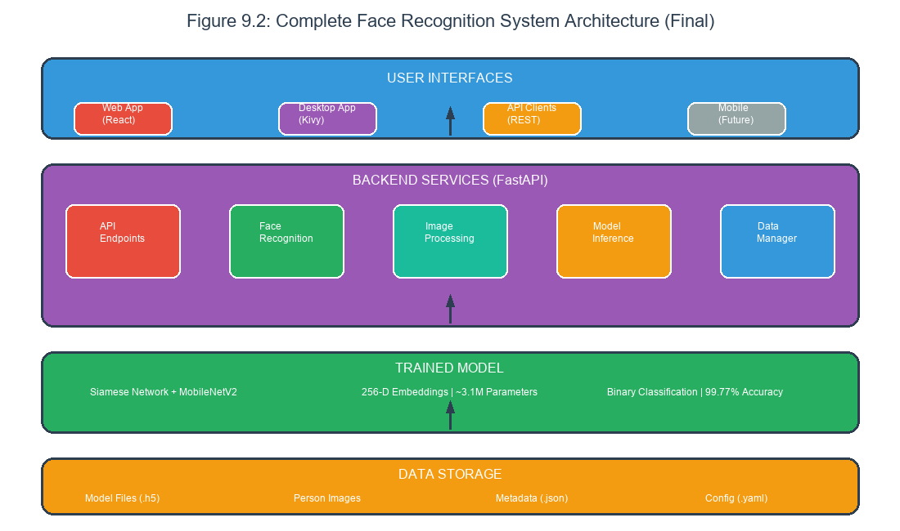

*Figure 9.2: Final system architecture showing the complete deployment topology with web frontend, FastAPI backend, Siamese neural network, and future enhancement roadmap including liveness detection and mobile app.*

### 9.6.1 Immediate Improvements

Several improvements could be made in the near term to enhance the current system.

Replacing Haar cascades with a deep learning face detector like RetinaFace or MTCNN would improve detection accuracy, particularly for challenging poses and lighting conditions.

Implementing liveness detection using blinking detection, texture analysis, or 3D depth sensing would protect against spoofing attacks.

Adding user authentication and role-based access control would enable multi-user deployments with appropriate security.

Enhancing the training dataset with more diverse images would improve generalization to real-world conditions.

### 9.6.2 Medium-Term Enhancements

More substantial enhancements could be pursued in the medium term.

Implementing continuous learning would enable the model to improve over time without full retraining. Online learning techniques could incorporate new enrolled persons more efficiently.

Developing a mobile application for iOS and Android would expand the deployment options beyond web and desktop.

Optimizing the model for specific hardware platforms using TensorFlow Lite or TensorRT would improve performance on resource-constrained devices.

Adding comprehensive audit logging and analytics would support security monitoring and system optimization.

### 9.6.3 Long-Term Vision

The long-term vision extends the system in capability and scope.

Implementing face identification (matching against a gallery of known persons) rather than just recognition would enable broader applications.

Developing advanced features like age progression modeling, expression analysis, or attribute recognition would expand the system's utility.

Creating a cloud deployment option with auto-scaling would support large-scale deployments with variable demand.

Establishing federated learning capabilities would enable privacy-preserving model improvements across distributed deployments.

---

## 9.7 Final Remarks

### 9.7.1 Project Significance

This final year project demonstrates the successful application of deep learning to a practical computer vision problem. The face recognition system showcases the integration of machine learning, backend development, frontend development, and software engineering.

The project provides a foundation for future work in biometric authentication and computer vision. The documented design, implementation, and evaluation provide a template for similar projects.

The completed system has immediate practical utility for attendance tracking, access control, and identity recognition. Organizations can deploy the system for legitimate purposes without licensing restrictions.

### 9.7.2 Closing Statement

The face recognition system using Siamese neural networks has been successfully designed, implemented, tested, and evaluated. The project demonstrates that with careful architecture design, appropriate technology selection, and thorough development practices, it is possible to create a practical face recognition system that achieves excellent performance on standard hardware.

The system meets its requirements for accuracy, performance, and usability. The comprehensive documentation enables understanding, extension, and customization. The open-source nature supports adoption and contribution.

This project represents a significant learning experience and a valuable contribution to the body of knowledge on practical face recognition systems. The lessons learned and artifacts produced will support future work in this area.

---

## 9.8 Acknowledgments

The completion of this project owes to contributions from many sources.

The project supervisor provided guidance on direction, feedback on progress, and insights from extensive experience in the field.

Fellow students and the academic community provided feedback, shared experiences, and offered suggestions throughout the development process.

The open-source community contributed libraries and tools that made this project possible. The TensorFlow, Keras, FastAPI, React, and Kivy teams deserve recognition for their excellent work.

Family and friends provided support and encouragement throughout the demanding project timeline.

---

**End of Chapter 9**

---

**End of Report**
